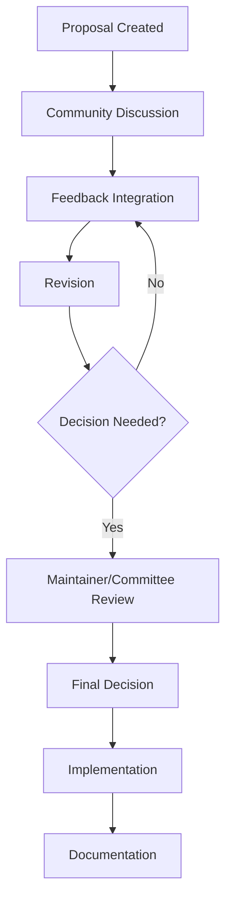
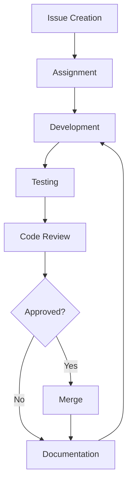
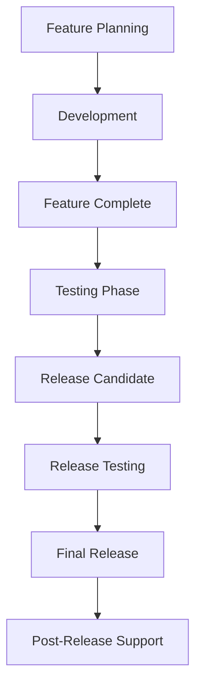
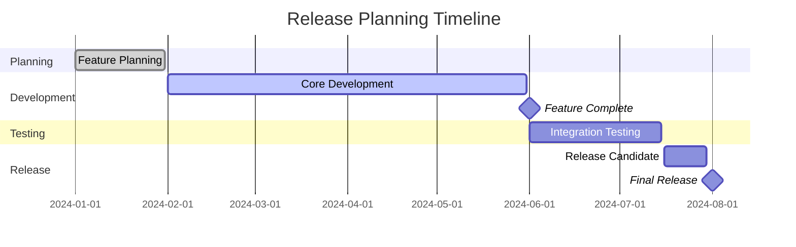

# Community Governance and Decision-Making Processes

## Table of Contents
1. [Overview](#overview)
2. [Community Structure](#community-structure)
3. [Decision-Making Framework](#decision-making-framework)
4. [Leadership Roles](#leadership-roles)
5. [Voting Procedures](#voting-procedures)
6. [Conflict Resolution](#conflict-resolution)
7. [Code of Conduct](#code-of-conduct)
8. [Community Processes](#community-processes)
9. [Project Governance](#project-governance)
10. [Release Management](#release-management)
11. [Community Engagement](#community-engagement)
12. [Mentorship Programs](#mentorship-programs)
13. [Communication Guidelines](#communication-guidelines)
14. [Enforcement Procedures](#enforcement-procedures)
15. [Appendices](#appendices)

## Overview

The MultiOS project operates under a community-driven governance model that ensures transparent, inclusive, and meritocratic decision-making. This document outlines the structures, processes, and principles that guide our community's operation and development.

### Governance Philosophy

- **Transparency**: All decisions and discussions should be open and accessible
- **Inclusivity**: Welcome and value contributions from diverse backgrounds
- **Meritocracy**: Recognize and promote based on contributions and expertise
- **Collaboration**: Foster cooperation and constructive dialogue
- **Accountability**: Leaders and maintainers are accountable to the community
- **Evolution**: Governance structures should adapt to community needs

### Core Principles

#### 1. Open Participation
- Anyone can participate in discussions and decision-making
- No barriers to contribution based on experience level
- Clear pathways for new contributors to become involved
- Multiple channels for community engagement

#### 2. Respectful Communication
- Professional and constructive discourse
- Inclusive language that welcomes all participants
- Active listening and consideration of different viewpoints
- Constructive feedback focused on ideas, not individuals

#### 3. Merit-Based Recognition
- Contributions are valued regardless of background
- Advancement based on demonstrated commitment and expertise
- Recognition of both code and non-code contributions
- Equal opportunities for all community members

#### 4. Shared Responsibility
- Distributed ownership of project aspects
- Collective responsibility for project success
- Shared decision-making power
- Mutual support and collaboration

## Community Structure

### Community Tiers

#### 1. Community Members
All individuals who actively participate in the project through any channel.

**Rights and Responsibilities:**
- Participate in community discussions
- Submit issues and pull requests
- Attend community meetings
- Access community resources
- Follow community guidelines

**How to Become a Member:**
- Participate in any community activity
- Make a contribution to the project
- Join community communication channels

#### 2. Contributors
Individuals who have made sustained contributions to the project.

**Additional Rights:**
- Vote on community proposals
- Propose new initiatives
- Mentor new contributors
- Access to contributor-only resources

**Criteria for Recognition:**
- Multiple meaningful contributions
- Demonstrated commitment to project goals
- Positive community interaction
- Technical competence in relevant areas

#### 3. Maintainers
Trusted members responsible for specific project areas or subsystems.

**Additional Responsibilities:**
- Code review and approval
- Technical guidance and mentoring
- Project direction input
- Community moderation
- Release preparation

**Criteria for Selection:**
- Deep understanding of project areas
- Consistent high-quality contributions
- Strong communication skills
- Demonstrated leadership qualities

#### 4. Steering Committee
Senior community members who guide overall project direction.

**Responsibilities:**
- Strategic planning and vision
- Cross-project coordination
- Conflict resolution
- Policy development
- Community representation

**Selection Process:**
- Nomination by existing committee members
- Community review and feedback
- Formal election by community vote
- Service term of 2 years

### Organizational Structure

```
                        Steering Committee
                              |
       ┌─────────────────────┼─────────────────────┐
       │                     │                     │
  Core Maintainers      Feature Teams         Special Interest
       │                     │                     │
  ┌────┼────┐          ┌─────┼─────┐         ┌─────┼─────┐
  │    │    │          │     │     │         │     │     │
 Rust  Py   JS     Kernel   Docs  Tests    Security  Perf  Compat
```

#### Core Maintainers
Responsible for the main codebase areas:
- **Kernel Maintainers**: Operating system core functionality
- **Rust Maintainers**: Rust-based components and tooling
- **Python Maintainers**: Python-based tools and utilities
- **JavaScript Maintainers**: Web interface and related components

#### Feature Teams
Cross-functional teams focused on specific features or initiatives:
- **Platform Support**: Multi-platform compatibility
- **Documentation**: Technical writing and user guides
- **Testing**: Quality assurance and automated testing
- **Security**: Security features and vulnerability management

#### Special Interest Groups (SIGs)
Autonomous groups focused on specific technical areas:
- **Security SIG**: Security research and implementation
- **Performance SIG**: Performance optimization and profiling
- **Compatibility SIG**: Cross-platform and compatibility testing
- **Embedded SIG**: Embedded and resource-constrained systems

### Communication Structure

#### Primary Communication Channels
- **GitHub Discussions**: Technical discussions and proposals
- **Slack/Discord**: Real-time chat and collaboration
- **Mailing Lists**: Formal announcements and important discussions
- **Video Calls**: Regular community meetings and planning sessions
- **Blog/Newsletter**: Monthly project updates and highlights

#### Communication Hierarchy
```
Steering Committee
    │
    ├── Core Maintainers
    │   ├── Feature Teams
    │   │   ├── Contributors
    │   │   └── Community Members
    │   └── SIGs
    │       └── Specialized Contributors
    └── External Community
        ├── Users
        ├── Researchers
        └── Industry Partners
```

## Decision-Making Framework

### Decision Types

#### 1. Technical Decisions
Affecting code, architecture, or technical implementation.

**Examples:**
- API changes or additions
- Architecture modifications
- Technology stack decisions
- Performance optimizations
- Security implementations

**Process:**
1. Technical RFC (Request for Comments)
2. Core maintainer review
3. Technical discussion and feedback
4. Core maintainer decision
5. Implementation and documentation

#### 2. Project Direction Decisions
Affecting project goals, roadmap, or major initiatives.

**Examples:**
- New feature development priorities
- Platform support decisions
- Release schedule and planning
- Resource allocation
- Partnership decisions

**Process:**
1. Proposal document creation
2. Community discussion period
3. Maintainer review and input
4. Steering committee decision
5. Public announcement and documentation

#### 3. Community Governance Decisions
Affecting community processes, policies, or structures.

**Examples:**
- Governance model changes
- Code of conduct updates
- Voting procedure modifications
- Role definitions and responsibilities
- Conflict resolution process changes

**Process:**
1. Governance proposal
2. Community feedback period
3. Community discussion and debate
4. Community vote
5. Implementation and transition

#### 4. Policy Decisions
Affecting community guidelines, standards, or requirements.

**Examples:**
- Contribution guidelines updates
- Code review standards
- Testing requirements
- Documentation standards
- Release management processes

**Process:**
1. Policy proposal
2. Stakeholder input collection
3. Impact assessment
4. Maintainer approval
5. Implementation and monitoring

### Decision-Making Process

#### RFC (Request for Comments) Process

All significant decisions go through the RFC process:



#### RFC Template
```markdown
# RFC: [Title]

## Summary
Brief description of the proposed change.

## Motivation
Why is this change needed? What problem does it solve?

## Detailed Design
Detailed explanation of the proposed solution.

## Drawbacks
What are the potential negative consequences?

## Alternatives
What other approaches were considered?

## Unresolved Questions
What still needs to be decided?

## Implementation Plan
How will this be implemented?

## Testing Strategy
How will this be tested?

## Migration Plan
How will existing users be affected?
```

### Consensus Building

#### Consensus Model
The MultiOS project uses a "rough consensus" model:

- **Active Participation**: Encouraged from all community members
- **Good Faith Effort**: Assume positive intentions from all participants
- **Technical Merit**: Decisions based on technical merit, not seniority
- **Time-Bound**: Set clear deadlines for decision-making
- **Appeal Process**: Allow for appeals and reconsideration

#### Consensus Levels
1. **Strong Consensus**: Near-unanimous agreement
2. **Consensus**: General agreement with minor concerns
3. **Working Consensus**: Agreement to proceed with implementation
4. **No Consensus**: Insufficient agreement to proceed

#### Consensus Building Process
1. **Discussion Phase**: Open discussion of the proposal
2. **Concern Raising**: Identify and address concerns
3. **Alternative Exploration**: Consider alternative solutions
4. **Refinement**: Improve the proposal based on feedback
5. **Decision Point**: Determine if consensus has been reached

## Leadership Roles

### Role Definitions

#### Steering Committee Members
**Responsibilities:**
- Strategic project direction
- Cross-team coordination
- Conflict resolution
- Community representation
- Resource allocation decisions

**Qualifications:**
- Deep understanding of project goals
- Proven leadership in open source
- Excellent communication skills
- Commitment to community values
- Technical expertise in relevant areas

**Selection Criteria:**
- Community nominations
- Track record of contributions
- Leadership experience
- Diversity and representation
- Commitment to project success

#### Core Maintainers
**Responsibilities:**
- Code review and approval
- Technical architecture decisions
- Mentorship and guidance
- Release management
- Community support

**Qualifications:**
- Strong technical skills
- Deep project knowledge
- Good communication skills
- Collaborative attitude
- Commitment to quality

**Selection Process:**
- Nomination by existing maintainers
- Community feedback period
- Technical assessment
- Final approval by steering committee

#### Feature Team Leads
**Responsibilities:**
- Team coordination and planning
- Feature development oversight
- Cross-team communication
- Resource management
- Progress reporting

**Qualifications:**
- Project knowledge
- Leadership skills
- Technical competence
- Communication abilities
- Time commitment

### Role Expectations

#### Time Commitment
- **Steering Committee**: 5-10 hours per week
- **Core Maintainers**: 10-15 hours per week
- **Feature Team Leads**: 5-8 hours per week
- **Contributors**: Variable, self-directed

#### Performance Expectations
- **Response Time**: Timely responses to community inquiries
- **Code Quality**: High standards for reviewed code
- **Communication**: Clear and constructive interactions
- **Mentorship**: Active support for new contributors
- **Documentation**: Contribution to project documentation

#### Accountability Measures
- **Regular Reviews**: Performance and contribution reviews
- **Peer Feedback**: 360-degree feedback from community
- **Community Surveys**: Regular community satisfaction surveys
- **Transparent Reporting**: Public reporting of activities and decisions

## Voting Procedures

### Voting Bodies

#### 1. Full Community Vote
**Participants**: All community members
**Scope**: Major governance changes, steering committee elections
**Quorum**: 30% of active community members
**Threshold**: 66% approval required

#### 2. Maintainer Vote
**Participants**: All maintainers
**Scope**: Technical decisions, release approvals, policy changes
**Quorum**: 50% of current maintainers
**Threshold**: 60% approval required

#### 3. Steering Committee Vote
**Participants**: Steering committee members
**Scope**: Strategic decisions, conflict resolution, resource allocation
**Quorum**: 66% of committee members
**Threshold**: 75% approval required

### Voting Process

#### Proposal Submission
```markdown
# Voting Proposal: [Title]

## Proposal
Clear statement of what is being voted on.

## Background
Context and rationale for the proposal.

## Options
- Option A: [Description]
- Option B: [Description]
- Option C: [Description]

## Voting Period
Start: [Date and Time]
End: [Date and Time]

## Quorum Requirements
- Community: 30% participation
- Maintainers: 50% participation
- Committee: 66% participation

## Decision Criteria
- Community: 66% approval
- Maintainers: 60% approval
- Committee: 75% approval
```

#### Voting Timeline
1. **Announcement** (3 days before voting)
2. **Discussion Period** (5 days)
3. **Voting Period** (7 days)
4. **Results Announcement** (1 day)
5. **Appeal Period** (3 days)

#### Voting Methods
- **Electronic Voting**: Secure online voting platform
- **Ranked Choice**: For multiple option decisions
- **Simple Majority**: For yes/no decisions
- **Weighted Voting**: Based on expertise for technical decisions

### Special Voting Procedures

#### Emergency Votes
For urgent decisions requiring immediate action:
- **Trigger**: Critical security issues, legal matters, system failures
- **Timeline**: 24-48 hours maximum
- **Process**: Streamlined voting with reduced notice
- **Criteria**: Emergency must be clearly demonstrated

#### Recalls
For removing leaders who are not fulfilling responsibilities:
- **Grounds**: Violation of code of conduct, neglect of duties, conflict of interest
- **Process**: Community petition followed by vote
- **Threshold**: 75% community approval required

## Conflict Resolution

### Conflict Types

#### 1. Technical Disputes
Disagreements about technical approaches or implementations.

**Resolution Process:**
1. **Direct Discussion**: Encourage parties to resolve directly
2. **Mediation**: Neutral maintainer mediation
3. **Technical Review**: RFC process with expert review
4. **Final Decision**: Core maintainer decision if needed

#### 2. Interpersonal Conflicts
Disagreements between community members.

**Resolution Process:**
1. **Private Discussion**: Private conversation encouraged
2. **Mediation**: Community moderator mediation
3. **Formal Mediation**: Professional mediator if needed
4. **Code of Conduct**: Enforcement if necessary

#### 3. Governance Disputes
Disagreements about governance processes or decisions.

**Resolution Process:**
1. **Community Discussion**: Open community forum
2. **Governance Review**: Steering committee review
3. **Formal Appeal**: Appeal process for decisions
4. **Community Vote**: Final community decision

### Resolution Framework

#### Mediator Selection
- **Neutral Party**: Uninvolved community member
- **Technical Expertise**: Relevant domain knowledge
- **Communication Skills**: Proven mediation ability
- **Impartial**: No personal stake in the outcome

#### Mediation Process
1. **Mediator Assignment**: Selection of qualified mediator
2. **Initial Meeting**: Understanding of all perspectives
3. **Individual Sessions**: Private discussions with each party
4. **Joint Session**: Facilitated discussion
5. **Resolution Agreement**: Formal agreement on resolution
6. **Follow-up**: Monitoring of implementation

#### Escalation Path
```
Direct Resolution
        ↓
Community Moderator
        ↓
Steering Committee
        ↓
External Mediator
        ↓
Community Vote
```

### Conflict Prevention

#### Communication Guidelines
- **Assume Good Faith**: Start with assumption of positive intent
- **Focus on Issues**: Address problems, not personalities
- **Use "I" Statements**: Express personal perspectives
- **Active Listening**: Understand before responding
- **Respectful Language**: Maintain professional tone

#### Regular Check-ins
- **Team Retrospectives**: Regular team health checks
- **Community Surveys**: Regular community satisfaction surveys
- **One-on-Ones**: Regular conversations between leaders and contributors
- **Feedback Loops**: Continuous improvement processes

## Code of Conduct

### Our Pledge

We as members, contributors, and leaders pledge to make participation in our community a harassment-free experience for everyone, regardless of age, body size, visible or invisible disability, ethnicity, sex characteristics, gender identity and expression, level of experience, education, socio-economic status, nationality, personal appearance, race, religion, or sexual identity and orientation.

### Standards

#### Expected Behavior
- Using welcoming and inclusive language
- Being respectful of differing viewpoints and experiences
- Gracefully accepting constructive criticism
- Focusing on what is best for the community
- Showing empathy towards other community members
- Supporting and encouraging new contributors
- Participating in an authentic and active way

#### Unacceptable Behavior
- The use of sexualized language or imagery
- Trolling, insulting or derogatory comments
- Public or private harassment
- Publishing others' private information without permission
- Other conduct which could reasonably be considered inappropriate
- Discriminatory language or actions
- Retaliation against those who report violations

### Enforcement Responsibilities

#### Community Leaders
Community leaders are responsible for clarifying and enforcing our standards of acceptable behavior and will take appropriate and fair corrective action in response to any behavior that they deem inappropriate, threatening, offensive, or harmful.

#### Scope
This Code of Conduct applies within all community spaces, and also applies when an individual is officially representing the community in public spaces.

#### Enforcement
Instances of abusive, harassing, or otherwise unacceptable behavior may be reported to the community leaders responsible for enforcement.

### Enforcement Guidelines

#### 1. Correction
**Community Impact**: Use of inappropriate language or other behavior deemed unprofessional or unwelcome.

**Consequence**: A private, written warning providing clarity around the nature of the violation and an explanation of why the behavior was inappropriate.

#### 2. Warning
**Community Impact**: A violation through a single incident or series of actions.

**Consequence**: A warning with consequences for continued behavior.

#### 3. Temporary Suspension
**Community Impact**: A serious violation of community standards, including sustained inappropriate behavior.

**Consequence**: A temporary ban from any interaction with the community for a specified period of time.

#### 4. Permanent Ban
**Community Impact**: Demonstrating a pattern of violation of community standards, or sustained inappropriate behavior.

**Consequence**: A permanent ban from any interaction with the community.

## Community Processes

### Contribution Workflow

#### New Contributor Onboarding
1. **Welcome Package**: Introduction to project and community
2. **Mentor Assignment**: Pairing with experienced contributor
3. **First Contribution**: Guided first contribution experience
4. **Community Introduction**: Introduction to community channels
5. **Skill Assessment**: Identification of areas for development
6. **Growth Planning**: Personalized development plan

#### Contribution Process


### Issue Management

#### Issue Triage Process
1. **Initial Triage**: Automated classification and labeling
2. **Priority Assessment**: Impact and urgency evaluation
3. **Assignment**: Assignment to appropriate team member
4. **Response Time**: Initial response within 48 hours
5. **Status Updates**: Regular status updates
6. **Resolution Tracking**: Progress monitoring and reporting

#### Issue Labels
**Priority Levels:**
- `priority:critical` - System-breaking issues
- `priority:high` - Major functionality issues
- `priority:medium` - Normal issues
- `priority:low` - Minor issues

**Issue Types:**
- `type:bug` - Bug reports
- `type:enhancement` - Feature requests
- `type:documentation` - Documentation issues
- `type:question` - Questions and support
- `type:discussion` - Community discussions

**Status Labels:**
- `status:triage` - Under initial assessment
- `status:assigned` - Assigned to team member
- `status:in-progress` - Actively being worked on
- `status:review` - Under code review
- `status:blocked` - Blocked by dependencies
- `status:resolved` - Successfully resolved

### Pull Request Process

#### Review Process
1. **Automated Checks**: CI/CD pipeline validation
2. **Review Assignment**: Assignment to qualified reviewers
3. **Code Review**: Technical and style review
4. **Testing Review**: Test coverage and quality assessment
5. **Documentation Review**: Documentation completeness check
6. **Final Approval**: Maintainer approval for merge

#### Review Criteria
- **Code Quality**: Clean, maintainable, and well-documented code
- **Test Coverage**: Appropriate test coverage for changes
- **Performance Impact**: No significant performance regressions
- **Security Considerations**: Security implications addressed
- **Backward Compatibility**: No breaking changes without notice

### Release Process

#### Release Planning


#### Release Types
- **Major Releases** (X.0.0): New features, breaking changes
- **Minor Releases** (X.Y.0): New features, bug fixes
- **Patch Releases** (X.Y.Z): Bug fixes only
- **Release Candidates**: Pre-release testing versions

## Project Governance

### Strategic Planning

#### Annual Planning Process
1. **Community Survey**: Input from all community members
2. **Technical Assessment**: Evaluation of current state and capabilities
3. **Strategic Goals**: Definition of annual objectives
4. **Resource Planning**: Resource allocation and budget planning
5. **Roadmap Creation**: Detailed development roadmap
6. **Community Review**: Community feedback and approval

#### Planning Documents
- **Vision Statement**: Long-term project vision
- **Mission Statement**: Current project mission
- **Strategic Goals**: Annual objectives
- **Development Roadmap**: Feature and release timeline
- **Resource Plan**: Budget and resource allocation

### Resource Management

#### Budget Allocation
- **Development Tools**: Development environment and tooling
- **Infrastructure**: Servers, CI/CD, hosting services
- **Documentation**: Documentation tools and platforms
- **Community Events**: Conferences, meetups, community building
- **Security**: Security audits and vulnerability management

#### Human Resources
- **Core Team**: Full-time development team
- **Contractors**: Specialized skills and expertise
- **Community Support**: Volunteer coordination and management
- **Mentorship**: Mentorship and training programs

### Intellectual Property

#### Licensing Strategy
- **Core Project**: MIT License for maximum compatibility
- **Documentation**: Creative Commons for educational use
- **Trademark Policy**: Trademark usage guidelines
- **Patent Policy**: Patent disclosure and licensing

#### Contribution Policy
- **Developer Certificate of Origin**: Required for all contributions
- **Licensing Agreement**: Contributor licensing agreement
- **IP Assignment**: Intellectual property assignment for core team
- **Third-Party Code**: Third-party component management

## Release Management

### Release Strategy

#### Release Cycle
- **Major Releases**: Every 12-18 months
- **Minor Releases**: Every 3-4 months
- **Patch Releases**: As needed for critical fixes
- **LTS Releases**: Long-term support releases every 2 years

#### Release Planning


### Quality Assurance

#### Testing Requirements
- **Unit Testing**: Minimum 80% code coverage
- **Integration Testing**: Critical path coverage
- **Performance Testing**: Performance regression testing
- **Security Testing**: Vulnerability scanning and testing
- **Compatibility Testing**: Multi-platform compatibility

#### Release Checklist
- [ ] All features complete and tested
- [ ] Documentation updated and reviewed
- [ ] Security audit completed
- [ ] Performance benchmarks met
- [ ] Backward compatibility verified
- [ ] Migration guide prepared
- [ ] Release notes drafted
- [ ] Community announcement prepared

### Post-Release

#### Monitoring and Support
- **Issue Monitoring**: Active monitoring of release issues
- **Community Support**: Community support and assistance
- **Performance Monitoring**: Performance metrics tracking
- **Security Monitoring**: Security vulnerability monitoring

#### Feedback Collection
- **User Surveys**: Regular user satisfaction surveys
- **Community Feedback**: Community feedback collection
- **Issue Analysis**: Analysis of reported issues
- **Performance Metrics**: Key performance indicator tracking

## Community Engagement

### Outreach Programs

#### Educational Initiatives
- **Workshop Series**: Regular technical workshops
- **Tutorial Content**: Comprehensive tutorial creation
- **Video Series**: Educational video content
- **Webinars**: Regular webinar series
- **Documentation**: High-quality documentation creation

#### Academic Partnerships
- **University Programs**: Partnership with academic institutions
- **Student Projects**: Support for student capstone projects
- **Research Collaboration**: Collaboration with research institutions
- **Internship Programs**: Summer internship programs

#### Industry Engagement
- **Corporate Partnerships**: Partnership with technology companies
- **Advisory Board**: Industry advisory board
- **Technology Transfer**: Technology transfer and commercialization
- **Standards Participation**: Participation in industry standards

### Community Building

#### Events and Meetups
- **Annual Conference**: Project annual conference
- **Local Meetups**: Local community meetups
- **Virtual Events**: Online community events
- **Code Sprints**: Collaborative development events
- **Hackathons**: Community hackathons

#### Recognition Programs
- **Contributor Awards**: Recognition of outstanding contributors
- **Mentorship Recognition**: Recognition of mentors
- **Documentation Awards**: Recognition of documentation contributors
- **Community Awards**: Recognition of community builders

### Communication Strategy

#### External Communication
- **Blog Posts**: Regular blog content
- **Social Media**: Active social media presence
- **Press Releases**: Major announcement press releases
- **Conference Talks**: Speaking at industry conferences
- **Podcast Appearances**: Podcast interviews and discussions

#### Internal Communication
- **Newsletters**: Regular community newsletters
- **Community Updates**: Weekly community updates
- **Team Meetings**: Regular team and community meetings
- **Feedback Sessions**: Regular feedback collection sessions

## Mentorship Programs

### Mentor-Mentee Program

#### Program Structure
1. **Mentor Matching**: Careful matching of mentors and mentees
2. **Goal Setting**: Collaborative goal setting and planning
3. **Regular Meetings**: Scheduled mentor-mentee meetings
4. **Skill Development**: Structured skill development plans
5. **Progress Tracking**: Regular progress monitoring
6. **Program Completion**: Structured program completion

#### Mentor Responsibilities
- **Regular Communication**: Consistent communication with mentee
- **Skill Guidance**: Guidance on technical and professional skills
- **Project Support**: Support with project contributions
- **Career Advice**: Career development guidance
- **Community Integration**: Help with community integration

#### Mentee Responsibilities
- **Active Participation**: Active participation in program
- **Goal Commitment**: Commitment to defined goals
- **Regular Meetings**: Attendance at scheduled meetings
- **Skill Development**: Dedicated effort to skill development
- **Community Engagement**: Active community engagement

### Skill Development Programs

#### Technical Skills
- **Programming Fundamentals**: Core programming concepts
- **System Design**: System architecture and design
- **Testing**: Testing methodologies and practices
- **Documentation**: Technical writing skills
- **Code Review**: Code review and quality assurance

#### Professional Skills
- **Communication**: Effective communication skills
- **Leadership**: Leadership and team management
- **Project Management**: Project planning and execution
- **Collaboration**: Collaborative work practices
- **Time Management**: Time management and productivity

### Career Development

#### Career Paths
- **Technical Contributor**: Individual contributor track
- **Team Lead**: Team leadership track
- **Architecture**: Systems architecture track
- **Community Management**: Community leadership track
- **Documentation**: Technical writing track

#### Development Resources
- **Training Materials**: Comprehensive training materials
- **Certification Programs**: Internal certification programs
- **Conference Attendance**: Support for conference attendance
- **Skill Assessment**: Regular skill assessment and planning
- **Career Planning**: Individual career development planning

## Communication Guidelines

### Communication Principles

#### Clarity
- **Clear Language**: Use clear, simple language
- **Structured Communication**: Organize information logically
- **Context Provision**: Provide necessary context
- **Action Items**: Clear action items and next steps
- **Summary**: Regular summaries and follow-ups

#### Respect
- **Inclusive Language**: Use inclusive and respectful language
- **Cultural Sensitivity**: Be sensitive to cultural differences
- **Professional Tone**: Maintain professional communication
- **Constructive Feedback**: Focus on constructive feedback
- **Appreciation**: Regular expression of appreciation

#### Transparency
- **Open Communication**: Open and transparent communication
- **Decision Rationale**: Explain decision-making rationale
- **Information Sharing**: Share relevant information widely
- **Process Visibility**: Make processes visible and understandable
- **Feedback Channels**: Multiple channels for feedback

### Communication Channels

#### Asynchronous Communication
- **GitHub Discussions**: Technical discussions and proposals
- **Email Lists**: Formal announcements and discussions
- **Forum**: Community forum for general discussions
- **Documentation**: Project documentation
- **Blog**: Project blog and announcements

#### Synchronous Communication
- **Video Calls**: Regular community meetings
- **Chat**: Real-time chat for collaboration
- **Office Hours**: Regular office hours with maintainers
- **Workshops**: Technical workshops and training
- **Pair Programming**: Collaborative programming sessions

### Meeting Guidelines

#### Meeting Structure
1. **Agenda**: Clear agenda distributed in advance
2. **Time Management**: Respect for time and schedules
3. **Participation**: Encouragement of participation from all
4. **Documentation**: Meeting notes and action items
5. **Follow-up**: Clear follow-up on decisions and action items

#### Meeting Types
- **Community Meetings**: Monthly community-wide meetings
- **Team Meetings**: Regular team coordination meetings
- **Planning Meetings**: Project planning and roadmap meetings
- **Retrospectives**: Regular retrospectives and feedback sessions
- **Workshops**: Technical workshops and training sessions

## Enforcement Procedures

### Violation Reporting

#### Reporting Process
1. **Incident Documentation**: Document the incident thoroughly
2. **Report Submission**: Submit report through appropriate channel
3. **Initial Assessment**: Initial assessment by community leaders
4. **Investigation**: Investigation of the reported incident
5. **Resolution**: Implementation of appropriate resolution
6. **Follow-up**: Follow-up to ensure resolution effectiveness

#### Reporting Channels
- **Email**: Private email to community leaders
- **Anonymous Form**: Anonymous reporting form
- **Direct Message**: Direct message to trusted community member
- **Community Leaders**: Direct contact with community leaders
- **External Contact**: External mediator contact information

### Investigation Process

#### Investigation Steps
1. **Initial Review**: Initial review of the reported incident
2. **Information Gathering**: Gathering of relevant information
3. **Interviews**: Interviews with involved parties
4. **Evidence Review**: Review of available evidence
5. **Conclusion**: Conclusion about incident and appropriate action
6. **Action Implementation**: Implementation of appropriate action

#### Investigation Principles
- **Fairness**: Fair and impartial investigation
- **Confidentiality**: Confidential handling of sensitive information
- **Documentation**: Thorough documentation of process
- **Timeliness**: Timely resolution of issues
- **Transparency**: Appropriate level of transparency

### Sanction Implementation

#### Sanction Types
- **Warning**: Formal warning about behavior
- **Temporary Suspension**: Temporary suspension from community
- **Permanent Ban**: Permanent removal from community
- **Role Removal**: Removal of leadership or maintainer roles
- **Public Apology**: Requirement for public apology

#### Sanction Process
1. **Decision**: Decision on appropriate sanction
2. **Notification**: Notification to affected party
3. **Implementation**: Implementation of sanction
4. **Documentation**: Documentation of sanction and rationale
5. **Appeal Process**: Appeal process availability
6. **Monitoring**: Monitoring of compliance

### Appeal Process

#### Appeal Grounds
- **Procedural Error**: Error in the investigation or decision process
- **New Evidence**: Discovery of new relevant evidence
- **Disproportionate Response**: Response seen as disproportionate
- **Bias**: Evidence of bias in the investigation

#### Appeal Process
1. **Appeal Submission**: Formal appeal submission
2. **Review**: Review by different community leaders
3. **Investigation**: Additional investigation if needed
4. **Decision**: Final decision on appeal
5. **Notification**: Notification of appeal decision
6. **Implementation**: Implementation of appeal decision

## Appendices

### A. Templates and Forms

#### RFC Template
```markdown
# RFC: [Title]

## Summary
[Brief description]

## Motivation
[Why this is needed]

## Detailed Design
[Technical details]

## Drawbacks
[Potential issues]

## Alternatives
[Other approaches considered]

## Unresolved Questions
[Open questions]

## Implementation Plan
[How this will be implemented]

## Testing Strategy
[Testing approach]

## Migration Plan
[Migration considerations]
```

#### Voting Proposal Template
```markdown
# Voting Proposal: [Title]

## Proposal
[What is being voted on]

## Background
[Context and rationale]

## Options
- Option A: [Description]
- Option B: [Description]

## Voting Period
[Start and end dates]

## Quorum Requirements
[Quorum and approval thresholds]

## Decision Criteria
[How decision will be made]
```

#### Incident Report Template
```markdown
# Incident Report

## Incident Details
- Date: [Date of incident]
- Time: [Time of incident]
- Location: [Where it occurred]
- Reported by: [Who reported it]

## Incident Description
[Detailed description of what happened]

## Parties Involved
[Names and roles of people involved]

## Witnesses
[Names of people who witnessed the incident]

## Evidence
[Any evidence related to the incident]

## Previous Incidents
[Any previous related incidents]

## Recommended Action
[Recommended resolution]
```

### B. Contact Information

#### Community Leaders
- **Steering Committee**: steering@multios.org
- **Technical Lead**: tech-lead@multios.org
- **Community Manager**: community@multios.org
- **Security Team**: security@multios.org

#### Emergency Contacts
- **Code of Conduct Issues**: conduct@multios.org
- **Security Issues**: security@multios.org
- **Legal Issues**: legal@multios.org
- **Press Inquiries**: press@multios.org

### C. Resources

#### Learning Resources
- [MultiOS Documentation](https://docs.multios.org)
- [Contributor Guide](https://contribute.multios.org)
- [Development Setup](https://dev.multios.org)
- [API Reference](https://api.multios.org)

#### Community Resources
- [Community Forum](https://forum.multios.org)
- [GitHub Discussions](https://github.com/multios/community)
- [Community Chat](https://chat.multios.org)
- [Community Wiki](https://wiki.multios.org)

#### Tools and Services
- [Issue Tracker](https://github.com/multios/multios/issues)
- [Pull Request Tracker](https://github.com/multios/multios/pulls)
- [Project Board](https://github.com/multios/multios/projects)
- [Release Notes](https://github.com/multios/multios/releases)

---

This document serves as the foundation for community governance in the MultiOS project. All community members are expected to understand and follow these guidelines to ensure a positive, productive, and inclusive community environment.