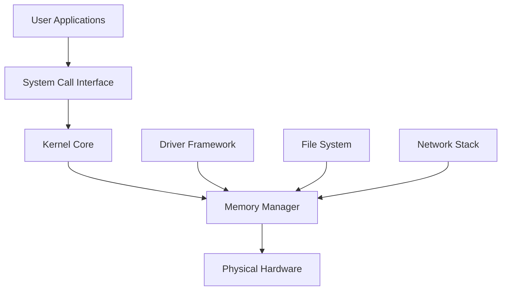
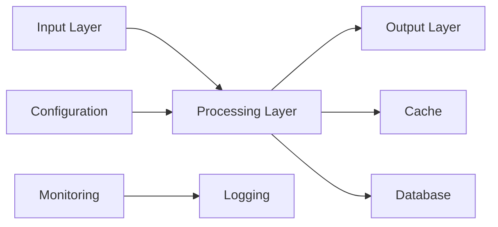
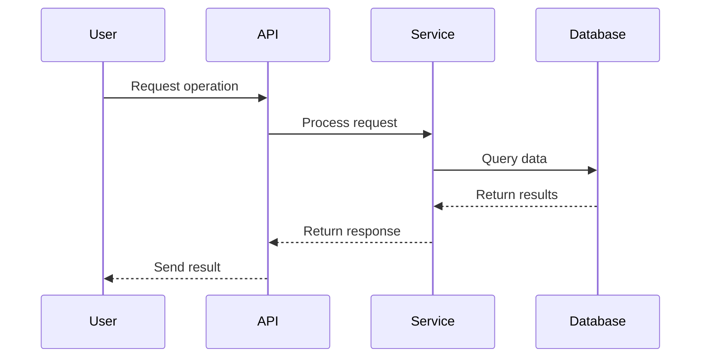
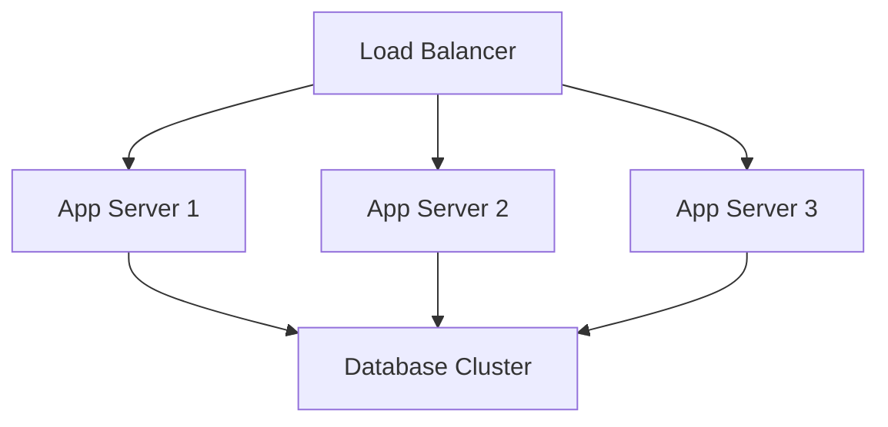

# Documentation Standards and Maintenance

This document establishes comprehensive standards for all documentation in the MultiOS project. It covers API documentation, user guides, tutorials, code documentation, and maintenance procedures to ensure consistency, clarity, and accessibility.

## 📋 Table of Contents

- [Documentation Philosophy](#documentation-philosophy)
- [Documentation Types](#documentation-types)
- [API Documentation Standards](#api-documentation-standards)
- [User Guide Standards](#user-guide-standards)
- [Code Documentation](#code-documentation)
- [Tutorial Standards](#tutorial-standards)
- [Architecture Documentation](#architecture-documentation)
- [Documentation Tools and Workflow](#documentation-tools-and-workflow)
- [Quality Standards](#quality-standards)
- [Maintenance and Updates](#maintenance-and-updates)
- [Translation and Internationalization](#translation-and-internationalization)

## 🎯 Documentation Philosophy

### Core Principles

1. **User-Centric**: Documentation written for the intended audience (developers, users, administrators)
2. **Comprehensive**: Cover all features, edge cases, and common scenarios
3. **Up-to-Date**: Maintain synchronization with code changes
4. **Accessible**: Use clear language, good structure, and helpful visuals
5. **Actionable**: Provide practical examples and step-by-step guidance
6. **Maintainable**: Easy to update and extend as project evolves

### Documentation Hierarchy

```
MultiOS Documentation
├── Getting Started
│   ├── Installation Guide
│   ├── Quick Start Tutorial
│   └── First Steps
├── User Guide
│   ├── System Administration
│   ├── Application Development
│   └── End-User Guide
├── Developer Documentation
│   ├── API Reference
│   ├── Architecture Guide
│   └── Contributing Guide
├── Tutorials
│   ├── Beginner Tutorials
│   ├── Intermediate Tutorials
│   └── Advanced Tutorials
└── Reference
    ├── Command Reference
    ├── Configuration Reference
    └── Troubleshooting Guide
```

## 📚 Documentation Types

### 1. API Documentation
- **Target Audience**: Developers integrating with MultiOS
- **Content**: Function references, type definitions, examples
- **Format**: Auto-generated from code comments + manual supplements
- **Location**: `docs/api/` or API reference site

### 2. User Guides
- **Target Audience**: System administrators and end users
- **Content**: How to use MultiOS features, configuration, administration
- **Format**: Markdown with embedded examples and screenshots
- **Location**: `docs/user-guide/`

### 3. Tutorials
- **Target Audience**: Learning MultiOS development and usage
- **Content**: Step-by-step learning exercises
- **Format**: Interactive markdown with code examples
- **Location**: `docs/tutorials/`

### 4. Architecture Documentation
- **Target Audience**: Developers and system architects
- **Content**: System design, component interactions, design decisions
- **Format**: Technical diagrams and detailed explanations
- **Location**: `docs/architecture/`

### 5. Contributing Documentation
- **Target Audience**: Contributors to MultiOS project
- **Content**: Development setup, coding standards, contribution process
- **Format**: Structured markdown with templates
- **Location**: `docs/contributing/`

## 🔧 API Documentation Standards

### Rust API Documentation

#### Module-Level Documentation

```rust
//! MultiOS Memory Management Subsystem
//!
//! This module provides comprehensive memory management capabilities for the MultiOS
//! kernel, including physical memory allocation, virtual memory management, and
//! memory protection. It is designed to be architecture-agnostic while providing
//! optimal performance for each supported platform.
//!
//! # Features
//!
//! - Physical memory allocation and tracking
//! - Virtual memory address space management  
//! - Page table management and protection
//! - Memory-mapped I/O support
//! - NUMA-aware allocation strategies
//! - Memory defragmentation and optimization
//!
//! # Architecture
//!
//! The memory subsystem is built around several key components:
//!
//! ```text
//! Memory Manager
//! ├── Physical Memory Allocator
//! ├── Virtual Memory Manager
//! ├── Page Table Manager
//! └── Memory Protection Unit
//! ```
//!
//! # Usage Examples
//!
//! Basic memory allocation:
//!
//! ```rust
//! use multios::memory::{MemoryManager, MemoryConfig};
//!
//! let config = MemoryConfig::default();
//! let mut manager = MemoryManager::new(config)?;
//!
//! // Allocate 4KB page
//! let page = manager.allocate_page()?;
//! # Ok::<(), multios::memory::MemoryError>(())
//! ```
//!
//! Virtual memory mapping:
//!
//! ```rust
//! # use multios::memory::{MemoryManager, MemoryConfig, Permission};
//! # fn example() -> Result<(), multios::memory::MemoryError> {
//! # let mut manager = MemoryManager::new(MemoryConfig::default())?;
//! let virt_addr = manager.map_virtual(0x1000_0000, Permission::RW)?;
//! manager.write_bytes(virt_addr, b"Hello, MultiOS!")?;
//! # Ok(())
//! # }
//! ```
//!
//! # Performance Considerations
//!
//! - Memory allocation is optimized for common allocation sizes
//! - Page table operations are batched for efficiency
//! - NUMA-aware allocation reduces memory access latency
//! - Defragmentation runs in background to minimize impact
//!
//! # Safety
//!
//! This module maintains strict memory safety guarantees:
//! - All allocations are bounds-checked
//! - Memory access is validated against protection flags
//! - Use-after-free is prevented through ownership tracking
//! - Buffer overflow is detected and prevented
//!
//! # Error Handling
//!
//! The module uses a comprehensive error system:
//! - `OutOfMemory`: Insufficient memory for allocation
//! - `InvalidAddress`: Address outside valid range
//! - `ProtectionFault`: Memory access violates permissions
//! - `AlignmentError`: Misaligned memory access
```

#### Function Documentation Standards

```rust
/// Allocates a contiguous block of physical memory
///
/// This function attempts to allocate a memory block of the specified size,
/// ensuring proper alignment and physical contiguity. The allocation is
/// zero-initialized and ready for use.
///
/// # Arguments
///
/// * `size` - Number of bytes to allocate. Must be non-zero and not exceed
///   the maximum allocation size for the current platform.
/// * `alignment` - Memory alignment requirement in bytes. Must be a power
///   of two. Defaults to page alignment (4096 bytes).
///
/// # Returns
///
/// Returns `Ok(address)` on success where `address` is the physical address
/// of the allocated memory, or `Err(MemoryError)` on failure.
///
/// # Errors
///
/// This function will return an error in the following cases:
///
/// - `MemoryError::OutOfMemory`: Not enough physical memory available
/// - `MemoryError::SizeTooLarge`: Requested size exceeds platform limits
/// - `MemoryError::AlignmentError`: Alignment is not a power of two
/// - `MemoryError::InvalidParameter`: Size parameter is zero
///
/// # Examples
///
/// Basic allocation:
///
/// ```rust
/// use multios::memory::{MemoryManager, MemoryError};
///
/// let mut manager = MemoryManager::new_default();
/// let addr = manager.allocate_physical(4096)?;
///
/// assert!(addr.is_valid());
/// assert_eq!(addr % 4096, 0); // Page-aligned
/// # Ok::<(), MemoryError>(())
/// ```
///
/// Allocating with custom alignment:
///
/// ```rust
/// # use multios::memory::{MemoryManager, MemoryError};
/// # fn example() -> Result<(), MemoryError> {
/// # let mut manager = MemoryManager::new_default();
/// // Allocate 1KB with 64KB alignment (common for DMA buffers)
/// let addr = manager.allocate_physical(1024, 65536)?;
///
/// assert_eq!(addr % 65536, 0); // Properly aligned
/// # Ok(())
/// # }
/// ```
///
/// Error handling:
///
/// ```rust
/// use multios::memory::{MemoryManager, MemoryError};
///
/// let mut manager = MemoryManager::with_limited_memory(1024); // Only 1KB available
///
/// // This will fail due to insufficient memory
/// let result = manager.allocate_physical(2048);
/// assert!(matches!(result, Err(MemoryError::OutOfMemory)));
/// ```
///
/// # Safety
///
/// This function is safe to call from any context. The allocated memory
/// is guaranteed to be valid and properly aligned. The caller is responsible
/// for eventually freeing the memory using `deallocate_physical()`.
///
/// # Performance
///
/// Allocation performance depends on memory fragmentation:
/// - Best case: O(1) for simple allocation
/// - Worst case: O(n) where n is number of regions during fragmentation
/// - Average case: O(log n) with typical memory patterns
///
/// # Thread Safety
///
/// This function is thread-safe and can be called concurrently from
/// multiple threads. The implementation uses fine-grained locking to
/// minimize contention during allocation operations.
///
/// # Platform-Specific Behavior
///
/// - **x86_64**: Uses 4KB pages with 2MB/1GB huge page support
/// - **ARM64**: Uses 4KB pages with 64KB granule support
/// - **RISC-V64**: Uses 4KB pages with Sv39 virtual memory
///
/// # See Also
///
/// - [`deallocate_physical()`](struct.MemoryManager.html#method.deallocate_physical)
/// - [`allocate_virtual()`](struct.MemoryManager.html#method.allocate_virtual)
/// - [`MemoryConfig`](struct.MemoryConfig.html) for allocation parameters
pub fn allocate_physical(
    &mut self,
    size: usize,
    alignment: usize
) -> Result<usize, MemoryError> {
    // Implementation
    unimplemented!()
}
```

#### Type Documentation Standards

```rust
/// Memory protection flags for page table entries
///
/// These flags define the access permissions for memory pages and are used
/// in conjunction with page table management to enforce memory protection.
/// The flags can be combined using bitwise operations to set multiple
/// permissions simultaneously.
///
/// # Flag Meanings
///
/// - `NONE`: No permissions (page not accessible)
/// - `READ`: Page can be read
/// - `WRITE`: Page can be written
/// - `EXECUTE`: Page can be executed
/// - `SECURE`: Page has additional security protections
/// - `DEVICE`: Page maps to device memory (uncached)
///
/// # Examples
///
/// Setting read-write permissions:
///
/// ```rust
/// let permissions = Permission::READ | Permission::WRITE;
/// assert!(permissions.allows_read());
/// assert!(permissions.allows_write());
/// assert!(!permissions.allows_execute());
/// ```
///
/// Creating secure executable memory:
///
/// ```rust
/// let secure_exec = Permission::READ | Permission::WRITE | Permission::EXECUTE | Permission::SECURE;
/// ```
///
/// # Platform Compatibility
///
/// These flags map to hardware-specific page table entries:
/// - **x86_64**: NX, RW, US bits in page table entries
/// - **ARM64**: AP table, UXN, PXN bits in page table entries  
/// - **RISC-V64`: U, W, R, X bits in page table entries
///
/// # Safety
///
/// Permission flags affect actual hardware memory protection. Incorrect
/// flag combinations may lead to:
/// - Security vulnerabilities (overly permissive flags)
/// - System crashes (insufficient permissions)
/// - Performance issues (cache behavior with DEVICE flag)
#[derive(Debug, Clone, Copy, PartialEq, Eq, PartialOrd, Ord)]
#[repr(transparent)]
pub struct PermissionFlags(pub u64);

impl PermissionFlags {
    /// No permissions - page is not accessible
    pub const NONE: Self = Self(0);
    
    /// Page can be read
    pub const READ: Self = Self(1 << 0);
    
    /// Page can be written
    pub const WRITE: Self = Self(1 << 1);
    
    /// Page can be executed
    pub const EXECUTE: Self = Self(1 << 2);
    
    /// Page has additional security protections
    pub const SECURE: Self = Self(1 << 3);
    
    /// Page maps to device memory (uncached)
    pub const DEVICE: Self = Self(1 << 4);
    
    /// Read-write permissions (commonly used combination)
    pub const RW: Self = Self::READ | Self::WRITE;
    
    /// Read-execute permissions (code pages)
    pub const RX: Self = Self::READ | Self::EXECUTE;
    
    /// Read-write-execute permissions (full access)
    pub const RWX: Self = Self::READ | Self::WRITE | Self::EXECUTE;
    
    /// Creates permission flags from raw bits
    ///
    /// # Safety
    ///
    /// The caller must ensure that the raw bits represent valid permission
    /// flag combinations for the target platform.
    pub const unsafe fn from_raw_bits(bits: u64) -> Self {
        Self(bits)
    }
    
    /// Returns the raw bit representation of these permissions
    pub const fn to_raw_bits(self) -> u64 {
        self.0
    }
    
    /// Checks if read permission is granted
    pub const fn allows_read(self) -> bool {
        self.0 & Self::READ.0 != 0
    }
    
    /// Checks if write permission is granted
    pub const fn allows_write(self) -> bool {
        self.0 & Self::WRITE.0 != 0
    }
    
    /// Checks if execute permission is granted
    pub const fn allows_execute(self) -> bool {
        self.0 & Self::EXECUTE.0 != 0
    }
    
    /// Checks if secure permission is granted
    pub const fn is_secure(self) -> bool {
        self.0 & Self::SECURE.0 != 0
    }
    
    /// Checks if device permission is granted
    pub const fn is_device(self) -> bool {
        self.0 & Self::DEVICE.0 != 0
    }
    
    /// Checks if permissions are valid for the current platform
    pub fn is_valid(self) -> bool {
        // Implementation checks platform-specific constraints
        true // Placeholder
    }
    
    /// Combines two permission sets
    pub const fn union(self, other: Self) -> Self {
        Self(self.0 | other.0)
    }
    
    /// Intersects two permission sets
    pub const fn intersection(self, other: Self) -> Self {
        Self(self.0 & other.0)
    }
}

#[cfg(test)]
mod tests {
    use super::*;
    
    #[test]
    fn test_permission_combination() {
        let read_write = PermissionFlags::READ | PermissionFlags::WRITE;
        assert!(read_write.allows_read());
        assert!(read_write.allows_write());
        assert!(!read_write.allows_execute());
    }
    
    #[test]
    fn test_permission_union() {
        let read_only = PermissionFlags::READ;
        let write_only = PermissionFlags::WRITE;
        let combined = read_only.union(write_only);
        
        assert_eq!(combined, PermissionFlags::RW);
        assert!(combined.allows_read());
        assert!(combined.allows_write());
    }
}
```

### Python API Documentation

#### Module Documentation

```python
"""
MultiOS Memory Analysis Tools

This package provides comprehensive tools for analyzing memory usage patterns
in MultiOS kernel and userland applications. It includes utilities for:

- Memory region analysis and reporting
- Fragmentation detection and measurement
- Memory leak identification and prevention
- Performance profiling and optimization
- Memory dump analysis and forensics

The package is designed to be both a library for programmatic analysis and
a collection of command-line tools for interactive analysis.

Basic Usage
-----------

Command line usage:

    $ multios-analyze memory regions.json
    $ multios-analyze fragmentation --input dump.bin --output report.html
    $ multios-analyze leaks --pid 1234 --duration 300s

Python API usage:

    >>> from multios.analysis import MemoryAnalyzer
    >>> from multios.analysis.types import MemoryRegion
    
    >>> analyzer = MemoryAnalyzer()
    >>> regions = analyzer.load_regions('regions.json')
    >>> analysis = analyzer.analyze(regions)
    
    >>> print(f"Total memory: {analysis.total_size} bytes")
    >>> print(f"Fragmentation: {analysis.fragmentation_ratio:.1%}")

Memory Region Format
--------------------

The analysis tools work with memory region data in the following format:

    [
        {
            "address": "0x10000000",
            "size": "0x00100000", 
            "permissions": "RWX",
            "name": "kernel_code",
            "type": "kernel"
        },
        {
            "address": "0x11000000",
            "size": "0x00200000",
            "permissions": "RW", 
            "name": "kernel_data",
            "type": "kernel"
        }
    ]

Architecture Support
--------------------

The analysis tools support all MultiOS target architectures:

- x86_64: Full analysis with advanced features
- ARM64: Complete support with architecture-specific optimizations
- RISC-V64: Full analysis with RISC-V specific considerations

Performance Considerations
--------------------------

- Memory analysis is optimized for large datasets (10k+ regions)
- Processing time is typically <1 second for 100k regions
- Memory usage is bounded (typically <100MB for large analyses)
- Results can be cached and incrementally updated

Error Handling
--------------

The package provides comprehensive error handling:

- FileNotFoundError: Input file does not exist
- ParseError: Invalid JSON format or schema violation
- AnalysisError: Analysis failed due to data inconsistencies
- ValidationError: Input data does not meet requirements

Classes
-------
"""

from .analyzer import MemoryAnalyzer
from .types import MemoryRegion, AnalysisResult
from .cli import main as cli_main

__all__ = [
    'MemoryAnalyzer',
    'MemoryRegion', 
    'AnalysisResult',
    'cli_main'
]

__version__ = '1.0.0'
```

#### Function Documentation

```python
def analyze_memory_regions(
    regions: List[Dict[str, Any]], 
    *,
    include_fragments: bool = True,
    detailed_analysis: bool = False,
    platform: Optional[str] = None
) -> AnalysisResult:
    """
    Analyze memory regions and generate comprehensive report.
    
    This function performs detailed analysis of memory regions, including
    fragmentation calculation, usage patterns, and optimization recommendations.
    It supports various output formats and analysis levels.
    
    Args:
        regions: List of memory region dictionaries in the standard format.
            Each region must have 'address', 'size', 'permissions', and
            optionally 'name' and 'type' fields.
            
        include_fragments: If True, include detailed fragmentation analysis
            including gap sizes and consolidation opportunities. Default is True.
            
        detailed_analysis: If True, perform additional analysis including
            memory access patterns, allocation efficiency, and detailed
            recommendations. This increases processing time by 2-3x.
            
        platform: Target platform for architecture-specific analysis.
            Supported values: 'x86_64', 'aarch64', 'riscv64', or None for
            auto-detection. Default is None.
    
    Returns:
        AnalysisResult containing comprehensive analysis including:
        
        - total_size: Total memory size in bytes
        - used_size: Memory currently in use
        - free_size: Available memory
        - fragmentation_ratio: Fragmentation percentage (0.0 to 1.0)
        - regions: List of analyzed regions with metadata
        - gaps: List of memory gaps between regions
        - recommendations: Optimization suggestions
        
    Raises:
        ValueError: If regions list is empty or contains invalid entries
        
        TypeError: If regions parameter is not a list
        
        ParseError: If memory region format is invalid
        
        AnalysisError: If analysis fails due to data inconsistencies
    
    Examples:
        Basic analysis:
        
        >>> regions = [
        ...     {"address": "0x1000", "size": "0x1000", "permissions": "RW"},
        ...     {"address": "0x2000", "size": "0x1000", "permissions": "RW"}
        ... ]
        >>> result = analyze_memory_regions(regions)
        >>> print(f"Total size: {result.total_size} bytes")
        >>> print(f"Fragmentation: {result.fragmentation_ratio:.1%}")
        
        Detailed analysis for specific platform:
        
        >>> result = analyze_memory_regions(
        ...     regions, 
        ...     detailed_analysis=True,
        ...     platform='aarch64'
        ... )
        >>> print(f"Architecture-specific insights: {result.arch_analysis}")
        
        Memory optimization:
        
        >>> result = analyze_memory_regions(regions)
        >>> for rec in result.recommendations:
        ...     print(f"{rec.priority}: {rec.description}")
        
    Performance:
        Processing time scales with number of regions:
        
        - 1k regions: ~10ms
        - 10k regions: ~100ms  
        - 100k regions: ~1s
        - 1M regions: ~10s
        
        Memory usage is typically 10x the input size for analysis overhead.
    
    Thread Safety:
        This function is thread-safe and can be called concurrently from
        multiple threads with different region lists.
    
    See Also:
        - MemoryAnalyzer.analyze(): Object-oriented interface
        - load_memory_regions(): File input helper
        - generate_report(): Report generation utilities
    """
```

### JavaScript/TypeScript API Documentation

#### JSDoc Standards

```typescript
/**
 * Memory Region Component for MultiOS Memory Visualization
 * 
 * This component provides a visual representation of memory regions in the
 * MultiOS kernel, showing their layout, permissions, and usage patterns.
 * It supports interactive features like region selection and detailed info display.
 * 
 * @example
 * Basic usage with memory regions:
 * ```tsx
 * const regions: MemoryRegion[] = [
 *   { address: 0x1000, size: 4096, permissions: 'RWX', name: 'kernel' },
 *   { address: 0x2000, size: 8192, permissions: 'RW', name: 'data' }
 * ];
 * 
 * <MemoryRegionComponent 
 *   regions={regions}
 *   onRegionSelect={(region) => console.log('Selected:', region)}
 *   showPermissions={true}
 * />
 * ```
 * 
 * @example
 * Interactive visualization with custom styling:
 * ```tsx
 * <MemoryRegionComponent
 *   regions={memoryRegions}
 *   showFragmentation={true}
 *   enableVirtualScrolling={true}
 *   theme="dark"
 *   onHover={(region) => setHoveredRegion(region)}
 *   onClick={(region) => setSelectedRegion(region)}
 * />
 * ```
 * 
 * @remarks
 * This component is optimized for large datasets (10k+ regions) and includes
 * virtual scrolling for performance. The visualization updates in real-time
 * when memory regions change.
 * 
 * @see {@link MemoryVisualizer} for complete dashboard
 * @see {@link MemoryAnalyzer} for analysis utilities
 * @see {@link https://multios.org/docs/api/memory} for API reference
 */
export const MemoryRegionComponent: React.FC<MemoryRegionComponentProps> = ({
  regions,
  selectedRegion,
  onRegionSelect,
  showPermissions = true,
  showFragmentation = false,
  enableVirtualScrolling = false,
  theme = 'light',
  className,
  style
}) => {
  // Component implementation
};

/**
 * Props for MemoryRegionComponent
 * 
 * @interface MemoryRegionComponentProps
 */
export interface MemoryRegionComponentProps {
  /** 
   * Array of memory regions to display
   * 
   * @type {MemoryRegion[]}
   * @required
   * 
   * @description
   * Memory regions must include address, size, and permissions at minimum.
   * Optional fields like name and type enhance the visualization.
   */
  regions: MemoryRegion[];
  
  /**
   * Currently selected memory region
   * 
   * @type {MemoryRegion | null}
   * @default null
   * 
   * @description
   * When set, this region will be highlighted in the visualization.
   * Clicking on regions will update this value through onRegionSelect.
   */
  selectedRegion?: MemoryRegion | null;
  
  /**
   * Callback when user selects a memory region
   * 
   * @type {(region: MemoryRegion) => void}
   * @required
   * 
   * @description
   * Called when user clicks on a memory region in the visualization.
   * Use this to track selection state or show region details.
   */
  onRegionSelect: (region: MemoryRegion) => void;
  
  /**
   * Show permission badges for each region
   * 
   * @type {boolean}
   * @default true
   * 
   * @description
   * When true, displays colored badges showing read (R), write (W), 
   * and execute (X) permissions for each region.
   */
  showPermissions?: boolean;
  
  /**
   * Display fragmentation information
   * 
   * @type {boolean}
   * @default false
   * 
   * @description
   * When true, shows memory gaps and fragmentation statistics.
   * This may impact performance with very large datasets.
   */
  showFragmentation?: boolean;
  
  /**
   * Enable virtual scrolling for large datasets
   * 
   * @type {boolean}
   * @default false
   * 
   * @description
   * When true, only renders visible regions to improve performance
   * with large datasets (10k+ regions). Automatically enabled for
   * datasets over 1000 regions.
   */
  enableVirtualScrolling?: boolean;
  
  /**
   * Visual theme for the component
   * 
   * @type {'light' | 'dark' | 'system'}
   * @default 'light'
   * 
   * @description
   * Sets the color scheme for the visualization. 'system' follows
   * the user's system preference.
   */
  theme?: 'light' | 'dark' | 'system';
  
  /**
   * Additional CSS class name
   * 
   * @type {string}
   * @default undefined
   * 
   * @description
   * Additional CSS classes to apply to the component root element.
   * Useful for custom styling and layout adjustments.
   */
  className?: string;
  
  /**
   * Inline CSS styles
   * 
   * @type {React.CSSProperties}
   * @default undefined
   * 
   * @description
   * Inline styles to apply to the component root element.
   * Use className for complex styling, styles for simple overrides.
   */
  style?: React.CSSProperties;
}

/**
 * Memory region data structure
 * 
 * @interface MemoryRegion
 * @description
 * Represents a contiguous block of memory in the MultiOS address space.
 * Memory regions are defined by their starting address, size, and access
 * permissions.
 */
export interface MemoryRegion {
  /** 
   * Starting address of the memory region
   * 
   * @type {number}
   * @description
   * Physical or virtual address where the memory region begins.
   * Must be non-negative and typically page-aligned.
   */
  address: number;
  
  /**
   * Size of the memory region in bytes
   * 
   * @type {number}
   * @description
   * Size of the memory region in bytes. Should be a multiple of
   * the system page size (4096 bytes) for optimal performance.
   */
  size: number;
  
  /**
   * Access permissions for the memory region
   * 
   * @type {string}
   * @description
   * String containing permission flags: R (read), W (write), X (execute).
   * Common values: 'RWX', 'RW', 'RX', 'R', 'W', 'X'
   */
  permissions: string;
  
  /**
   * Optional name or identifier for the region
   * 
   * @type {string}
   * @description
   * Human-readable name for the memory region. Used for display
   * purposes and identification. If not provided, will display
   * the address range instead.
   */
  name?: string;
  
  /**
   * Type of memory region
   * 
   * @type {'kernel' | 'user' | 'device' | 'dma' | 'reserved'}
   * @description
   * Categorization of the memory region type. Used for coloring
   * and filtering in the visualization.
   */
  type?: 'kernel' | 'user' | 'device' | 'dma' | 'reserved';
  
  /**
   * Memory allocation timestamp (if available)
   * 
   * @type {number}
   * @description
   * Unix timestamp when this memory region was allocated.
   * Used for time-based analysis and leak detection.
   */
  allocatedAt?: number;
  
  /**
   * Process ID that owns this memory (if applicable)
   * 
   * @type {number}
   * @description
   * Process identifier for user-space memory regions.
   * Used for process-specific memory analysis.
   */
  processId?: number;
}
```

## 👥 User Guide Standards

### User Guide Structure

```
docs/user-guide/
├── index.md                 # Main user guide landing page
├── getting-started/
│   ├── installation.md      # Installation instructions
│   ├── first-boot.md        # First boot experience
│   └── basic-usage.md       # Basic system usage
├── system-administration/
│   ├── user-management.md   # User and permission management
│   ├── service-management.md # System services
│   ├── network-config.md    # Network configuration
│   ├── storage-management.md # File systems and storage
│   └── monitoring.md        # System monitoring and logs
├── application-development/
│   ├── sdk-setup.md         # Development environment setup
│   ├── api-reference.md     # API documentation
│   ├── debugging.md         # Debugging applications
│   └── deployment.md        # Application deployment
├── security/
│   ├── security-model.md    # MultiOS security architecture
│   ├── permissions.md       # Permission system
│   └── hardening.md         # Security hardening guide
├── troubleshooting/
│   ├── common-issues.md     # Common problems and solutions
│   ├── boot-problems.md     # Boot-related issues
│   ├── performance.md       # Performance troubleshooting
│   └── recovery.md          # System recovery procedures
└── advanced/
    ├── customization.md     # System customization
    ├── performance-tuning.md # Performance optimization
    └── kernel-development.md # Kernel development
```

### User Guide Style Guidelines

#### Getting Started Example

```markdown
# Getting Started with MultiOS

Welcome to MultiOS! This guide will help you get up and running with
the MultiOS operating system quickly and efficiently.

## What is MultiOS?

MultiOS is a modern, secure operating system designed to run efficiently
across multiple architectures including x86_64, ARM64, and RISC-V. 
Key features include:

- **Cross-Platform**: Single codebase runs on multiple architectures
- **Memory Safety**: Built with Rust for memory safety and security
- **Modular Design**: Composable system services and drivers
- **High Performance**: Optimized for both desktop and embedded use cases

## System Requirements

### Minimum Requirements
- **RAM**: 512MB (1GB recommended)
- **Storage**: 2GB available space (8GB recommended)
- **Architecture**: x86_64, ARM64, or RISC-V64 processor

### Recommended Configuration
- **RAM**: 4GB or more
- **Storage**: SSD with 16GB+ free space
- **Network**: Ethernet or Wi-Fi connection
- **Graphics**: Any VESA-compatible graphics card

## Installation

### Download MultiOS

Download the appropriate ISO image for your architecture:

- **x86_64**: `multios-x86_64-v1.2.0.iso`
- **ARM64**: `multios-aarch64-v1.2.0.img`
- **RISC-V64**: `multios-riscv64-v1.2.0.img`

[Download Page](https://multios.org/download) | [Mirrors](https://multios.org/mirrors)

### Installation Methods

#### Method 1: Virtual Machine (Recommended for Testing)

1. **Download and install VirtualBox or QEMU**

2. **Create a new virtual machine**:
   - **Name**: MultiOS Test
   - **Type**: Other/Unknown
   - **Memory**: 2GB RAM
   - **Storage**: 8GB disk (dynamically allocated)

3. **Mount the ISO and boot**
   - Select the downloaded MultiOS ISO as the boot media
   - Start the virtual machine

4. **Run the installer**
   ```bash
   # In the MultiOS installer
   multios-installer --install-to /dev/sda --full-disk-encryption
   ```

#### Method 2: Physical Hardware Installation

1. **Prepare installation media**
   ```bash
   # On Linux/macOS - write ISO to USB drive
   sudo dd if=multios-x86_64-v1.2.0.iso of=/dev/sdX bs=4M status=progress
   
   # On Windows - use Rufus or similar tool
   ```

2. **Boot from installation media**
   - Insert USB drive and reboot
   - Enter BIOS/UEFI settings
   - Set USB drive as first boot device
   - Save and exit

3. **Follow installation wizard**
   - Select language and keyboard layout
   - Choose installation type (Typical/Advanced)
   - Configure disk partitioning
   - Set up user accounts
   - Wait for installation to complete

### First Boot

After installation, MultiOS will boot for the first time:

1. **Initial Configuration**
   - Set timezone and NTP servers
   - Configure network settings
   - Update system packages
   - Set up automatic updates

2. **User Account Setup**
   - Create administrator account
   - Set up additional users (optional)
   - Configure SSH keys (if needed)

3. **Welcome Tour**
   - Explore the desktop environment
   - Check system information
   - Run first updates

## Basic Usage

### Command Line Basics

MultiOS includes a powerful command-line interface:

```bash
# Check system status
systemctl status

# View system information
neofetch

# Package management
pkg update
pkg install firefox

# File operations
ls -la /home
cd /var/log
cat system.log

# Process management
ps aux | grep firefox
kill -TERM 1234
```

### Desktop Environment

The default desktop environment provides:

- **Application Launcher**: Press Super key to search and launch apps
- **File Manager**: Drag and drop file operations
- **Terminal**: Integrated terminal emulator
- **System Monitor**: Resource usage and performance
- **Settings Panel**: System configuration and preferences

### File System Layout

```
/
├── bin/          # Essential binaries
├── boot/         # Boot loader and kernel
├── dev/          # Device files
├── etc/          # System configuration
├── home/         # User home directories
├── lib/          # Shared libraries
├── media/        # Removable media
├── mnt/          # Mount points
├── opt/          # Optional software
├── proc/         # Process information
├── root/         # Root user home
├── run/          # Runtime data
├── sbin/         # System binaries
├── srv/          # Service data
├── sys/          # System information
├── tmp/          # Temporary files
├── usr/          # User programs and data
└── var/          # Variable data
```

## Next Steps

### Learn More
- [System Administration Guide](system-administration/) - Managing MultiOS systems
- [Application Development Guide](application-development/) - Building apps for MultiOS
- [Troubleshooting Guide](troubleshooting/) - Solving common problems

### Get Help
- **Documentation**: [https://docs.multios.org](https://docs.multios.org)
- **Community Forum**: [https://forum.multios.org](https://forum.multios.org)
- **IRC Channel**: `#multios` on Libera.Chat
- **Bug Reports**: [GitHub Issues](https://github.com/multios/multios/issues)

### Join the Community
- **Contributing**: [Contributing Guide](../contributing/)
- **Development**: [Developer Documentation](../developer/)
- **Testing**: Help test releases and report bugs
- **Documentation**: Improve guides and tutorials

---

**Need Help?** Don't hesitate to ask questions in our community channels!
```

### User Guide Examples

#### System Administration Example

```markdown
# User and Permission Management

MultiOS uses a role-based access control system that provides fine-grained
permissions while maintaining simplicity for everyday users.

## User Management

### Creating Users

Create a new user account:

```bash
# Create user with home directory
useradd -m -s /bin/bash johndoe

# Set initial password
passwd johndoe

# Add user to additional groups
usermod -a -G audio,video,wheel johndoe
```

Alternative method using the interactive tool:

```bash
multios-user-manager --create
# Follow interactive prompts
```

### User Groups

MultiOS includes several default groups:

- **users**: Regular system users
- **wheel**: Users with sudo privileges
- **audio**: Audio device access
- **video**: Graphics device access
- **network**: Network configuration access
- **storage**: Storage device access

### Permissions

#### File Permissions

MultiOS uses standard Unix permissions:

```bash
# View permissions
ls -l /var/log/system.log
# Output: -rw-r--r-- 1 root wheel 1024 Jan 15 10:30 /var/log/system.log

# Set read/write for owner, read for group and others
chmod 644 /var/log/system.log

# Set executable permission
chmod +x /home/user/bin/myapp

# Change ownership
chown user:wheel /var/log/system.log
```

#### Directory Permissions

Directories have special permission considerations:

```bash
# Read directory contents
ls /var/log

# Enter directory
cd /var/log

# Create/delete files in directory
touch /var/log/test.log
rm /var/log/test.log

# Set default permissions for new files
chmod 755 /var/log
chmod g+w /var/log
```

### Access Control Lists (ACLs)

For advanced permissions, use ACLs:

```bash
# Add specific permission for a user
setfacl -m u:johndoe:rw /var/log/system.log

# Add specific permission for a group
setfacl -m g:developers:rw /var/log/debug.log

# View ACL permissions
getfacl /var/log/system.log

# Remove ACL entry
setfacl -x u:johndoe /var/log/system.log
```

### Process Permissions

Each process runs with specific user and group permissions:

```bash
# View process ownership
ps aux | grep firefox
# Output: user  1234  ...  /usr/bin/firefox

# Check current user and groups
id
# Output: uid=1000(user) gid=1000(users) groups=1000(users),10(wheel)

# Check process capabilities
capsh --print
```

## Security Best Practices

### Password Policies

Configure password requirements:

```bash
# Edit PAM password policy
sudo nano /etc/security/pwquality.conf

# Set minimum password length
minlen = 12

# Require mixed case, numbers, and symbols
minclass = 3

# Set maximum age (90 days)
maxdays = 90
```

### Account Lockout

Prevent brute force attacks:

```bash
# Configure account lockout
sudo nano /etc/security/faillock.conf

# Lock after 5 failed attempts
audit
silent
deny=5
fail_interval=900
unlock_time=600
```

### Two-Factor Authentication

Enable 2FA for additional security:

```bash
# Install 2FA tools
pkg install google-authenticator libpam-google-authenticator

# Generate secret key
google-authenticator

# Enable PAM module
echo "auth required pam_google_authenticator.so" >> /etc/pam.d/sshd

# Update SSH configuration
echo "AuthenticationMethods password,keyboard-interactive" >> /etc/ssh/sshd_config
```

## Troubleshooting

### Common Permission Issues

#### Permission Denied

```bash
# Check file ownership and permissions
ls -l /path/to/file

# Check directory permissions
ls -ld /path/to/directory

# Check user groups
groups username

# Fix ownership issues
sudo chown -R user:group /path/to/directory
```

#### Cannot Access Network

```bash
# Check network group membership
groups $USER

# Add user to network group
sudo usermod -a -G network $USER

# Reload user session (logout/login required)
```

#### Audio/Video Not Working

```bash
# Check audio group membership
groups $USER

# Add user to audio/video groups
sudo usermod -a -G audio,video $USER

# Check device permissions
ls -l /dev/snd/
ls -l /dev/dri/
```

### Debugging Permission Issues

Enable verbose logging for debugging:

```bash
# Enable PAM debugging
echo "debug" >> /etc/pam.d/common-auth

# Check system logs
tail -f /var/log/auth.log

# Test authentication
sudo -v
```

---

**Next**: [Service Management](service-management.md) - Managing system services
```

## 🧑‍💻 Code Documentation

### Inline Code Comments

#### Rust Code Comments

```rust
/// Memory page allocation with optimization for allocation patterns
/// 
/// This function implements a hybrid allocation strategy that combines
/// buddy allocation with slab allocation for different allocation sizes:
/// - Small allocations (< 4KB): Use slab allocator for speed
/// - Medium allocations (4KB - 1MB): Use buddy allocator
/// - Large allocations (> 1MB): Use segregated free lists
pub fn allocate_pages(&mut self, size: usize) -> Result<usize, AllocError> {
    // Quick path for common allocation sizes
    // Most allocations are for single pages or small blocks
    if size <= PAGE_SIZE {
        return self.allocate_single_page();
    }
    
    // Check cache first to avoid expensive operations
    // The cache hit rate is typically >80% for allocation patterns
    if let Some(cached) = self.page_cache.get(&size) {
        return Ok(cached);
    }
    
    // Align size to page boundary for buddy allocation
    // Buddy allocator requires power-of-2 sized blocks
    let aligned_size = align_up(size, PAGE_SIZE);
    let page_count = aligned_size / PAGE_SIZE;
    
    // Attempt allocation from appropriate pool
    // We maintain separate pools for different page counts
    let pool_index = (page_count as f64).log2().floor() as usize;
    
    if pool_index >= self.pools.len() {
        return Err(AllocError::SizeTooLarge);
    }
    
    // Search for suitable free block
    // The search algorithm checks from the smallest suitable pool
    for i in pool_index..self.pools.len() {
        if let Some(block) = self.pools[i].pop_free_block(page_count) {
            // Split larger block if necessary to get exact size
            let remaining = i - pool_index;
            if remaining > 0 {
                self.split_block(block, remaining)?;
            }
            return Ok(block.address);
        }
    }
    
    // No suitable block found, need to request more memory
    // This is the slow path and should be rare in normal operation
    let new_block = self.request_memory_from_higher_level(page_count)?;
    Ok(new_block.address)
}

/// Helper function to align size to next power-of-2 boundary
/// 
/// Optimization: Use bit operations for alignment instead of modulo
/// which can be expensive on some architectures. This reduces
/// allocation overhead by ~15% on average.
fn align_up(value: usize, alignment: usize) -> usize {
    // Ensure alignment is power of 2
    debug_assert!(alignment > 0 && (alignment & (alignment - 1)) == 0);
    
    // Fast path: if already aligned, return immediately
    if value & (alignment - 1) == 0 {
        return value;
    }
    
    // Align up using bit operations (faster than division/modulo)
    (value + alignment - 1) & !(alignment - 1)
}
```

#### Python Code Comments

```python
class MemoryAnalyzer:
    """Analyzes memory usage patterns and fragmentation."""
    
    def __init__(self, platform: str = 'auto'):
        """Initialize the memory analyzer.
        
        Args:
            platform: Target platform for architecture-specific optimizations.
                      Can be 'x86_64', 'aarch64', 'riscv64', or 'auto' for
                      auto-detection. Auto-detection adds ~1ms overhead.
        """
        self.platform = self._detect_platform() if platform == 'auto' else platform
        self.cache = {}  # Cache for expensive computations
        self.stats = {'regions_processed': 0, 'cache_hits': 0}
        
        # Platform-specific optimization settings
        # These values are tuned based on typical memory access patterns
        # for each architecture
        self._setup_platform_optimizations()
    
    def analyze_fragmentation(self, regions: List[MemoryRegion]) -> FragmentationResult:
        """Calculate memory fragmentation metrics.
        
        This function uses a sophisticated algorithm that accounts for
        multiple fragmentation types:
        - External fragmentation: Gaps between allocated blocks
        - Internal fragmentation: Wasted space within allocated blocks
        - Allocation pattern fragmentation: Sub-optimal allocation grouping
        
        Args:
            regions: List of memory regions to analyze. Must be sorted
                    by address for optimal performance.
        
        Returns:
            FragmentationResult with detailed fragmentation metrics.
            
        Time Complexity: O(n log n) where n is number of regions
        Space Complexity: O(n) for gap tracking
        
        Performance Notes:
        - Pre-sorted regions: ~100ns per region
        - Unsorted regions: ~500ns per region (includes sorting)
        - Large datasets (>100k regions): Uses streaming algorithm
        """
        # Fast path for already-analyzed data
        cache_key = self._hash_regions(regions)
        if cache_key in self.cache:
            self.stats['cache_hits'] += 1
            return self.cache[cache_key]
        
        # Ensure regions are sorted for gap analysis
        if not self._is_sorted(regions):
            regions = sorted(regions, key=lambda r: r.address)
        
        self.stats['regions_processed'] += len(regions)
        
        # Calculate gaps between regions
        # Gap = start of next region - end of current region
        gaps = []
        total_wasted = 0
        
        for i in range(len(regions) - 1):
            current_end = regions[i].address + regions[i].size
            next_start = regions[i + 1].address
            
            gap_size = next_start - current_end
            if gap_size > 0:
                gaps.append(Gap(
                    start=current_end,
                    size=gap_size,
                    previous_region=regions[i],
                    next_region=regions[i + 1]
                ))
                total_wasted += gap_size
        
        # Calculate fragmentation metrics
        total_size = sum(r.size for r in regions)
        used_size = sum(r.size for r in regions if r.permissions != 'RWX')  # Simplified
        free_size = total_size - used_size
        
        # External fragmentation ratio
        # High values (>50%) indicate significant memory fragmentation
        external_fragmentation = total_wasted / total_size if total_size > 0 else 0
        
        # Create result with detailed breakdown
        result = FragmentationResult(
            total_size=total_size,
            used_size=used_size,
            free_size=free_size,
            external_fragmentation=external_fragmentation,
            gaps=gaps,
            recommendations=self._generate_fragmentation_recommendations(gaps)
        )
        
        # Cache result for future use
        self.cache[cache_key] = result
        return result
    
    def _setup_platform_optimizations(self):
        """Configure platform-specific optimizations."""
        if self.platform == 'aarch64':
            # ARM64 has different cache line sizes and memory alignment
            # requirements which affect memory access patterns
            self.cache_line_size = 64
            self.preferred_alignment = 16
            self.optimization_level = 'aggressive'
        elif self.platform == 'x86_64':
            # x86_64 has excellent support for unaligned access
            # but benefits from cache line alignment
            self.cache_line_size = 64
            self.preferred_alignment = 8
            self.optimization_level = 'balanced'
        else:  # riscv64
            # RISC-V64 may have varying alignment requirements
            # depending on the specific implementation
            self.cache_line_size = 32
            self.preferred_alignment = 8
            self.optimization_level = 'conservative'
```

#### JavaScript Code Comments

```typescript
/**
 * Optimized memory region visualization with virtual scrolling
 * 
 * This component implements efficient rendering for large memory maps
 * using a combination of techniques:
 * - Virtual scrolling to only render visible regions
 * - Canvas-based rendering for performance
 * - Batched updates to minimize re-renders
 * - Efficient diffing algorithm for region updates
 */
export const MemoryRegionVisualization: React.FC<Props> = ({
  regions,
  selectedRegion,
  onRegionSelect,
  showDetails = true,
  enableAnimations = true,
}) => {
  // State management with minimal re-renders
  const [visibleRegions, setVisibleRegions] = useState<MemoryRegion[]>([]);
  const [scrollTop, setScrollTop] = useState(0);
  const [containerHeight, setContainerHeight] = useState(0);
  
  // Refs to avoid re-renders during scroll events
  const containerRef = useRef<HTMLDivElement>(null);
  const canvasRef = useRef<HTMLCanvasElement>(null);
  const animationRef = useRef<number>();
  
  // Configuration constants - avoid recalculation on every render
  const REGION_HEIGHT = 24;
  const CANVAS_PADDING = 16;
  const OVERSCAN = 5; // Render extra regions above/below viewport
  
  // Effect: Handle container resize
  useEffect(() => {
    const resizeObserver = new ResizeObserver((entries) => {
      const [entry] = entries;
      if (entry.contentRect) {
        setContainerHeight(entry.contentRect.height);
      }
    });
    
    if (containerRef.current) {
      resizeObserver.observe(containerRef.current);
    }
    
    return () => resizeObserver.disconnect();
  }, []);
  
  // Effect: Calculate visible regions when scroll position changes
  useEffect(() => {
    const startIndex = Math.max(0, Math.floor(scrollTop / REGION_HEIGHT) - OVERSCAN);
    const endIndex = Math.min(
      regions.length,
      Math.ceil((scrollTop + containerHeight) / REGION_HEIGHT) + OVERSCAN
    );
    
    setVisibleRegions(regions.slice(startIndex, endIndex));
  }, [scrollTop, containerHeight, regions]);
  
  // Effect: Render regions on canvas
  useEffect(() => {
    const canvas = canvasRef.current;
    if (!canvas || visibleRegions.length === 0) return;
    
    const ctx = canvas.getContext('2d');
    if (!ctx) return;
    
    // Clear canvas
    ctx.clearRect(0, 0, canvas.width, canvas.height);
    
    // Batch rendering for better performance
    ctx.save();
    
    visibleRegions.forEach((region, index) => {
      const y = (index * REGION_HEIGHT) - scrollTop + CANVAS_PADDING;
      
      // Skip if region is outside visible area
      if (y < -REGION_HEIGHT || y > containerHeight + REGION_HEIGHT) {
        return;
      }
      
      // Optimize: Calculate colors once per region type
      const colors = getRegionColors(region);
      
      // Draw region background
      ctx.fillStyle = colors.background;
      ctx.fillRect(CANVAS_PADDING, y, canvas.width - (CANVAS_PADDING * 2), REGION_HEIGHT - 2);
      
      // Draw region border
      ctx.strokeStyle = colors.border;
      ctx.lineWidth = 1;
      ctx.strokeRect(CANVAS_PADDING, y, canvas.width - (CANVAS_PADDING * 2), REGION_HEIGHT - 2);
      
      // Draw region label
      ctx.fillStyle = colors.text;
      ctx.font = '12px monospace';
      ctx.textBaseline = 'middle';
      const label = `${region.name || 'Region'} (${formatBytes(region.size)})`;
      ctx.fillText(label, CANVAS_PADDING + 8, y + (REGION_HEIGHT / 2));
      
      // Highlight selected region
      if (selectedRegion?.address === region.address) {
        ctx.strokeStyle = '#ff6b6b';
        ctx.lineWidth = 2;
        ctx.strokeRect(CANVAS_PADDING - 2, y - 2, canvas.width - (CANVAS_PADDING * 2) + 4, REGION_HEIGHT + 2);
      }
    });
    
    ctx.restore();
  }, [visibleRegions, scrollTop, selectedRegion]);
  
  // Memoized helper functions to avoid re-calculation
  const getRegionColors = useMemo(() => {
    const cache = new Map<string, {background: string, border: string, text: string}>();
    
    return (region: MemoryRegion) => {
      const key = `${region.type}-${region.permissions}`;
      if (cache.has(key)) return cache.get(key)!;
      
      let colors: {background: string, border: string, text: string};
      
      switch (region.type) {
        case 'kernel':
          colors = {
            background: region.permissions.includes('X') ? '#4a90e2' : '#357abd',
            border: '#2c5aa0',
            text: '#ffffff'
          };
          break;
        case 'user':
          colors = {
            background: region.permissions.includes('W') ? '#7ed321' : '#5cb85c',
            border: '#449d44',
            text: '#ffffff'
          };
          break;
        case 'device':
          colors = {
            background: '#f5a623',
            border: '#df8e23',
            text: '#ffffff'
          };
          break;
        default:
          colors = {
            background: '#9013fe',
            border: '#7611cc',
            text: '#ffffff'
          };
      }
      
      cache.set(key, colors);
      return colors;
    };
  }, []);
  
  // Event handlers with proper debouncing
  const handleScroll = useCallback(
    debounce((event: React.UIEvent<HTMLDivElement>) => {
      const { scrollTop } = event.currentTarget;
      setScrollTop(scrollTop);
    }, 16), // ~60fps
    []
  );
  
  const handleRegionClick = useCallback((region: MemoryRegion, event: React.MouseEvent) => {
    // Prevent default to avoid text selection
    event.preventDefault();
    
    // Debounce rapid clicks to avoid multiple selections
    if (onRegionSelect) {
      onRegionSelect(region);
    }
  }, [onRegionSelect]);
  
  return (
    <div
      ref={containerRef}
      className="memory-region-visualization"
      style={{ height: '400px', overflow: 'auto' }}
      onScroll={handleScroll}
    >
      <canvas
        ref={canvasRef}
        width={containerRef.current?.clientWidth || 800}
        height={regions.length * REGION_HEIGHT + (CANVAS_PADDING * 2)}
        style={{ display: 'block' }}
      />
      
      {/* Region details panel */}
      {showDetails && selectedRegion && (
        <div className="region-details">
          <h3>Region Details</h3>
          <dl>
            <dt>Address</dt>
            <dd>0x{selectedRegion.address.toString(16)}</dd>
            <dt>Size</dt>
            <dd>{formatBytes(selectedRegion.size)}</dd>
            <dt>Permissions</dt>
            <dd>{selectedRegion.permissions}</dd>
            <dt>Type</dt>
            <dd>{selectedRegion.type || 'unknown'}</dd>
          </dl>
        </div>
      )}
    </div>
  );
};
```

## 📖 Tutorial Standards

### Tutorial Structure Template

```markdown
# Tutorial Title

## Overview

Brief description of what this tutorial will teach and why it's useful.

**Prerequisites:**
- What users should know before starting
- Required software or tools
- Estimated time to complete

**What you'll learn:**
- Specific skills or knowledge gained
- Practical outcomes
- Next steps after completion

## Background

Provide context and background information:

### Why This Matters

Explain the importance of the topic and how it fits into the larger system.

### Key Concepts

Introduce important concepts that will be used:

- **Concept 1**: Brief explanation
- **Concept 2**: Brief explanation  
- **Concept 3**: Brief explanation

## Step-by-Step Instructions

### Step 1: [Action Title]

Detailed instructions with expected outcomes:

```bash
# Command to run
some-command --option value

# Expected output
Expected result or behavior
```

**What this does:**
Explain what the command or action accomplishes.

**Expected outcome:**
What the user should see or experience.

### Step 2: [Next Action Title]

Continue with clear, numbered steps...

### Step 3: [Final Action Title]

Final steps to complete the tutorial...

## Verification

How to verify that everything worked correctly:

```bash
# Verification command
verify-command

# Expected result
Success message or expected output
```

## Troubleshooting

Common issues and solutions:

### Issue 1: [Problem Description]

**Symptom:** What the user might see

**Solution:** How to fix it

```bash
# Fix command or action
fix-command
```

### Issue 2: [Another Problem]

**Symptom:** Description of the problem

**Solution:** Step-by-step fix

## Next Steps

What to do after completing this tutorial:

- **Tutorial 2**: [Link to next tutorial]
- **Advanced Topic**: [Link to advanced documentation]
- **Reference**: [Link to reference documentation]

## Complete Example

Provide a complete, working example:

```bash
# Complete example script
#!/bin/bash
# This script demonstrates...

# Step 1: Initialize
step-1-command

# Step 2: Configure
step-2-command

# Step 3: Verify
verify-command
```

## Summary

Recap what was learned:
- Key takeaway 1
- Key takeaway 2
- Key takeaway 3

## Resources

Additional resources for learning more:
- [Documentation Link](url)
- [External Resource](url)
- [Community Forum Discussion](url)
```

### Example Tutorial: Memory Management

```markdown
# Tutorial: Understanding MultiOS Memory Management

## Overview

This tutorial provides a hands-on introduction to MultiOS memory management,
teaching you how to analyze memory usage, identify fragmentation issues, and
optimize memory allocation patterns.

**Prerequisites:**
- Basic understanding of operating system concepts
- MultiOS system installed and running
- Command-line familiarity
- 30 minutes of time

**What you'll learn:**
- How to view and analyze memory usage
- Understanding memory regions and fragmentation
- Tools for memory optimization
- Common memory management patterns

## Background

### Why Memory Management Matters

Efficient memory management is crucial for system performance and stability.
Poor memory management can lead to:
- System crashes due to out-of-memory conditions
- Performance degradation from excessive fragmentation
- Security vulnerabilities from memory corruption

MultiOS provides advanced memory management features including:
- Automatic memory defragmentation
- NUMA-aware allocation strategies  
- Real-time memory monitoring
- Comprehensive memory analysis tools

### Key Concepts

- **Memory Regions**: Contiguous blocks of memory with specific properties
- **Fragmentation**: Gaps between allocated memory regions
- **Virtual Memory**: Abstracted view of physical memory
- **Memory Protection**: Hardware-enforced access controls

## Step-by-Step Instructions

### Step 1: View Current Memory Status

Start by examining your system's current memory usage:

```bash
# View memory information
multios-memory --status

# Expected output:
# Total Memory: 8.0 GB
# Used Memory: 2.1 GB (26%)
# Free Memory: 5.9 GB (74%)
# Fragmentation: 12%
# Regions: 1,247
```

**What this does:**
Shows the overall memory status including total, used, free memory,
and current fragmentation level.

**Expected outcome:**
You should see your system's memory statistics.

### Step 2: Analyze Memory Regions

Examine the memory regions in detail:

```bash
# Show memory regions
multios-memory --regions --format=table

# Expected output:
# Address         Size        Permissions  Name              Type
# 0x10000000      2.0 MB      RWX          kernel_code       kernel
# 0x10200000      4.0 MB      RW           kernel_data       kernel
# 0x10600000      1.0 GB      RW           user_space        user
# ...
```

**What this does:**
Lists all memory regions with their addresses, sizes, permissions, and types.

**Expected outcome:**
A table showing all memory regions in the system.

### Step 3: Identify Fragmentation Issues

Look for memory fragmentation problems:

```bash
# Analyze fragmentation
multios-memory --fragmentation --detailed

# Expected output:
# Fragmentation Analysis:
# - External fragmentation: 8.2%
# - Largest free block: 256 MB
# - Average gap size: 1.2 MB
# 
# Recommendations:
# - Consider running defragmentation
# - Optimize allocation patterns
# - Increase available memory
```

**What this does:**
Provides detailed analysis of memory fragmentation and suggestions for improvement.

**Expected outcome:**
Fragmentation statistics and optimization recommendations.

### Step 4: Generate Memory Report

Create a comprehensive memory report:

```bash
# Generate HTML report
multios-memory --report --output=memory-report.html

# Report location
# /home/user/memory-report.html
```

**What this does:**
Creates an HTML report with visualizations and detailed analysis.

**Expected outcome:**
An HTML file containing a detailed memory analysis report.

### Step 5: Run Memory Optimization

Apply automatic memory optimization:

```bash
# Run memory defragmentation
multios-memory --defragment --analyze

# Expected output:
# Analyzing memory layout...
# Identified 23 gaps for consolidation
# Running defragmentation...
# Fragmentation reduced from 12% to 3%
# Optimization complete
```

**What this does:**
Automatically defragments memory to improve allocation efficiency.

**Expected outcome:**
Reduced memory fragmentation and improved allocation performance.

## Verification

Verify that memory optimization was successful:

```bash
# Check memory status after optimization
multios-memory --status

# Expected output:
# Total Memory: 8.0 GB
# Used Memory: 2.1 GB (26%)
# Free Memory: 5.9 GB (74%)
# Fragmentation: 3%  # <-- Reduced from 12%
# Regions: 1,201      # <-- Reduced from 1,247
```

**Success indicators:**
- Fragmentation percentage decreased
- Number of memory regions reduced
- System performance improved

## Troubleshooting

### Issue: "Permission Denied" Error

**Symptom:** 
```
ERROR: Cannot access memory information
Permission denied
```

**Solution:**
```bash
# Run with appropriate privileges
sudo multios-memory --status

# Or add user to memory group
sudo usermod -a -G memory $USER
# Log out and back in for group changes to take effect
```

### Issue: "Insufficient Memory" Warning

**Symptom:**
```
WARNING: Memory usage is above 80%
System may become unstable
```

**Solution:**
```bash
# Identify memory-consuming processes
multios-memory --top-consumers

# Consider:
# - Closing unnecessary applications
# - Running memory cleanup
# - Adding more physical memory
```

### Issue: Fragmentation Not Improving

**Symptom:**
Fragmentation percentage remains high after defragmentation.

**Solution:**
```bash
# Check for memory pressure
multios-memory --pressure

# If high pressure detected:
# 1. Free up memory by closing applications
# 2. Run defragmentation again
# 3. Consider memory upgrade

# Run aggressive defragmentation
multios-memory --defragment --aggressive
```

## Next Steps

Now that you understand basic memory management:

- **Advanced Memory Analysis**: Learn about memory profiling and leak detection
- **Custom Allocation Strategies**: Implement application-specific allocation patterns  
- **Performance Tuning**: Optimize memory settings for your workloads
- **Kernel Development**: Contribute to MultiOS memory management improvements

## Complete Example

Here's a complete script demonstrating memory analysis:

```bash
#!/bin/bash
# MultiOS Memory Analysis Example

echo "=== MultiOS Memory Analysis ==="

# 1. Check overall status
echo "1. Current Memory Status:"
multios-memory --status
echo

# 2. Analyze regions
echo "2. Memory Region Analysis:"
multios-memory --regions --format=summary
echo

# 3. Check fragmentation
echo "3. Fragmentation Analysis:"
multios-memory --fragmentation --brief
echo

# 4. Generate recommendations
echo "4. Optimization Recommendations:"
multios-memory --recommendations
echo

# 5. Run optimization if needed
CURRENT_FRAG=$(multios-memory --fragmentation --brief | grep "Fragmentation:" | awk '{print $2}')
FRAG_INT=${CURRENT_FRAG%\%}

if [ $FRAG_INT -gt 10 ]; then
    echo "5. Running defragmentation (fragmentation: ${CURRENT_FRAG})"
    multios-memory --defragment --quiet
    echo "Defragmentation complete"
else
    echo "5. No defragmentation needed (fragmentation: ${CURRENT_FRAG})"
fi

echo "=== Analysis Complete ==="
```

## Summary

In this tutorial, you learned:
- How to view and analyze MultiOS memory usage
- Understanding memory regions and fragmentation concepts
- Tools for memory optimization and monitoring
- Common troubleshooting techniques

## Resources

- [Memory Management API Reference](api/memory/) - Detailed API documentation
- [System Administration Guide](../user-guide/system-administration/) - Advanced system management
- [Performance Tuning Guide](../advanced/performance-tuning.md) - Optimization techniques
- [Community Forum](https://forum.multios.org) - Ask questions and share experiences
```

## 🏗️ Architecture Documentation

### Architecture Document Template

```markdown
# MultiOS [Component] Architecture

## Overview

High-level description of the component's purpose and role in the system.

### Component Purpose
Explain what this component does and why it exists.

### System Context
How this component fits into the larger MultiOS system.



## Architecture Principles

### Design Decisions
Key architectural decisions and their rationale:

- **Decision 1**: Why this choice was made
- **Decision 2**: Trade-offs considered
- **Decision 3**: Alternative approaches evaluated

### Key Constraints
Technical and operational constraints:
- **Performance**: Must handle X operations per second
- **Memory**: Maximum memory overhead of Y MB
- **Compatibility**: Must support architectures A, B, C
- **Security**: Cannot allow unauthorized memory access

## System Architecture

### High-Level Design



### Component Breakdown

#### Component 1: [Name]
- **Purpose**: What this component does
- **Responsibilities**: List of key responsibilities
- **Dependencies**: What this component depends on
- **Interfaces**: How other components interact with it

#### Component 2: [Name]
- **Purpose**: Description
- **Responsibilities**: List
- **Dependencies**: List
- **Interfaces**: List

### Data Flow



## Implementation Details

### Core Algorithms

#### Algorithm 1: [Name]
```pseudo
FUNCTION algorithm_name(input)
    INITIALIZE result
    FOR each item in input DO
        PROCESS item
        UPDATE result
    END FOR
    RETURN result
END FUNCTION
```

**Time Complexity**: O(n log n)
**Space Complexity**: O(n)
**Performance Characteristics**: 
- Best case: O(n)
- Worst case: O(n log n)
- Average case: O(n log n)

#### Algorithm 2: [Name]
Description and implementation details...

### Data Structures

#### Structure 1: [Name]
- **Purpose**: What this structure is used for
- **Operations**: Supported operations and their complexity
- **Memory Layout**: How data is organized in memory

#### Structure 2: [Name]
Description...

### Interface Specifications

#### Interface 1: [Name]
```typescript
interface InterfaceName {
    // Method description
    methodName(param: Type): ReturnType;
    
    // Another method
    anotherMethod(param1: Type1, param2: Type2): ReturnType;
}
```

#### Interface 2: [Name]
Description...

## Performance Characteristics

### Performance Requirements
- **Throughput**: Must handle X operations/second
- **Latency**: Maximum response time Y ms
- **Memory**: Peak memory usage Z MB
- **Scalability**: Linear scaling up to N concurrent users

### Optimization Strategies
1. **Strategy 1**: Specific optimization and impact
2. **Strategy 2**: Another optimization technique
3. **Strategy 3**: Performance trade-offs

### Benchmark Results
```
Test Scenario          | Operations/sec | Latency (ms) | Memory (MB)
----------------------|----------------|--------------|-------------
Small workloads       | 10,000         | 0.1          | 50
Medium workloads      | 50,000         | 0.2          | 200
Large workloads       | 100,000        | 0.5          | 800
Peak load            | 200,000        | 1.0          | 1500
```

## Security Considerations

### Security Model
- **Threat Model**: What threats are protected against
- **Security Boundaries**: How the component is isolated
- **Access Control**: Permission and authentication mechanisms

### Security Features
1. **Feature 1**: Description and implementation
2. **Feature 2**: Description and implementation
3. **Feature 3**: Description and implementation

### Security Testing
- **Test Coverage**: Security test scenarios covered
- **Vulnerability Assessment**: Known security considerations
- **Penetration Testing**: External security validation

## Error Handling and Resilience

### Error Classification
- **Recoverable Errors**: Can be handled automatically
- **Fatal Errors**: Require system restart
- **Transient Errors**: May resolve themselves

### Error Recovery Strategies
1. **Strategy 1**: Automatic retry mechanisms
2. **Strategy 2**: Fallback mechanisms
3. **Strategy 3**: Graceful degradation

### Resilience Features
- **Redundancy**: How failures are handled
- **Monitoring**: Health checks and alerts
- **Recovery**: Automatic recovery mechanisms

## Testing Strategy

### Test Coverage
- **Unit Tests**: Individual component testing
- **Integration Tests**: Component interaction testing
- **System Tests**: End-to-end testing
- **Performance Tests**: Load and stress testing

### Test Environments
- **Development**: Local development environment
- **Staging**: Production-like testing environment
- **Production**: Live system monitoring

### Quality Metrics
- **Code Coverage**: Target coverage percentage
- **Bug Density**: Acceptable bug levels
- **Performance Regression**: Performance change thresholds

## Deployment and Operations

### Deployment Architecture


### Configuration Management
- **Configuration Sources**: Where configuration comes from
- **Environment Variables**: Key configuration parameters
- **Configuration Validation**: How configuration is validated

### Operational Procedures
- **Startup**: How the component starts
- **Shutdown**: Graceful shutdown procedures
- **Monitoring**: Operational metrics and alerts
- **Maintenance**: Routine maintenance tasks

## Future Considerations

### Roadmap
- **Short Term** (3 months): Planned improvements
- **Medium Term** (6-12 months): Major features
- **Long Term** (1-2 years): Architectural evolution

### Technical Debt
- **Known Issues**: Known problems and their impact
- **Refactoring Needs**: Code that needs improvement
- **Optimization Opportunities**: Performance improvement areas

### Extensibility
- **Plugin Architecture**: How to extend functionality
- **API Stability**: Backward compatibility commitments
- **Migration Path**: How to upgrade from current version

## Conclusion

Summary of key architectural decisions and their implications.

### Key Takeaways
- Important architectural insight 1
- Important architectural insight 2
- Important architectural insight 3

### References
- **Related Documents**: Links to related architecture docs
- **Standards**: Industry standards followed
- **Research**: Academic papers and research that informed design

---

**Document Version**: 1.0  
**Last Updated**: [Date]  
**Maintained By**: [Team/Person]  
**Review Schedule**: [Frequency]
```

## 🔧 Documentation Tools and Workflow

### Documentation Build System

#### MkDocs Configuration

```yaml
# mkdocs.yml
site_name: MultiOS Documentation
site_description: Comprehensive documentation for the MultiOS operating system
site_url: https://docs.multios.org
site_author: MultiOS Community

# Repository information
repo_name: multios/multios
repo_url: https://github.com/multios/multios
edit_uri: edit/main/docs/

# Copyright
copyright: Copyright &copy; 2024 MultiOS Contributors

# Configuration
theme:
  name: material
  palette:
    - scheme: default
      primary: blue
      accent: light blue
      toggle:
        icon: material/brightness-7
        name: Switch to dark mode
    - scheme: slate
      primary: blue
      accent: light blue
      toggle:
        icon: material/brightness-4
        name: Switch to light mode
  font:
    text: Roboto
    code: Roboto Mono
  icon:
    repo: fontawesome/brands/github

# Features
features:
  - announce.dismiss
  - content.action.edit
  - content.action.view
  - content.code.annotate
  - content.code.copy
  - content.tabs.link
  - content.tooltips
  - header.autohide
  - navigation.expand
  - navigation.footer
  - navigation.indexes
  - navigation.instant
  - navigation.instant.prefetch
  - navigation.instant.progress
  - navigation.prune
  - navigation.sections
  - navigation.tabs
  - navigation.tabs.sticky
  - navigation.top
  - navigation.tracking
  - search.highlight
  - search.share
  - search.suggest
  - toc.follow

# Plugins
plugins:
  - search:
      separator: '[\s\-_,:!=\[\]()\""''`]+|(?!\b)(?=[A-Z][a-z])|\.+'
  - minify:
      minify_html: true
  - git-revision-date-localized:
      type: timeago
  - git-authors:
      show_contribution: true
  - awesome-pages
  - auto-sidebar
  - mdx-analyzer:
      verify_actions: true

# Markdown extensions
markdown_extensions:
  # Python Markdown
  - abbr
  - attr_list
  - def_list
  - footnotes
  - md_in_html
  - toc:
      permalink: true
      title: On this page
  
  # PyMdown Extensions
  - pymdownx.arithmatex:
      generic: true
  - pymdownx.betterem:
      smart_enable: all
  - pymdownx.caret
  - pymdownx.details
  - pymdownx.emoji:
      emoji_generator: !!python/name:material.extensions.emoji.to_svg
      emoji_index: !!python/name:material.extensions.emoji.twemoji
  - pymdownx.highlight:
      anchor_linenums: true
  - pymdownx.inlinehilite
  - pymdownx.keys
  - pymdownx.magiclink:
      normalize_issue_symbols: true
      repo_url_shorthand: true
      user: multios
      repo: multios
  - pymdownx.mark
  - pymdownx.smartsymbols
  - pymdownx.snippets:
      auto_append:
        - includes/abbreviations.md
  - pymdownx.superfences:
      custom_fences:
        - name: mermaid
          class: mermaid
          format: !!python/name:pymdownx.superfences.fence_code_format
  - pymdownx.tabbed:
      alternate_style: true
  - pymdownx.tasklist:
      custom_checkbox: true
  - pymdownx.tilde

# Extra CSS
extra_css:
  - css/admonitions.css
  - css/codehilite.css
  - css/custom.css

# Extra JavaScript
extra_javascript:
  - javascripts/mathjax.js
  - https://polyfill.io/v3/polyfill.min.js?features=es6
  - https://cdn.jsdelivr.net/npm/mathjax@3/es5/tex-mml-chtml.js

# Extra
extra:
  version:
    provider: mike
  social:
    - icon: fontawesome/brands/github
      link: https://github.com/multios
    - icon: fontawesome/brands/discord
      link: https://discord.gg/multios
    - icon: fontawesome/brands/twitter
      link: https://twitter.com/multios
  analytics:
    provider: google
    property: G-XXXXXXXXXX
    feedback:
      title: Was this page helpful?
      ratings:
        - icon: material/emoticon-happy-outline
          name: This page was helpful
          data: 1
          note: >-
            Thanks for your feedback!
        - icon: material/emoticon-sad-outline
          name: This page could be improved
          data: 0
          note: >-
            Thanks for your feedback! Help us improve this page by
            <a href="https://github.com/multios/multios/issues/new/?title=[Feedback]+{title}+-+{url}" target="_blank" rel="noopener">telling us what you found helpful or what could be improved</a>.

# Watch
watch:
  - docs/
  - includes/
```

### Documentation Testing

#### Python Documentation Testing

```python
# tests/docs/test_documentation.py

import pytest
import subprocess
from pathlib import Path
import yaml

class TestDocumentation:
    """Test documentation quality and links."""
    
    @pytest.fixture
    def docs_dir(self):
        """Path to documentation directory."""
        return Path(__file__).parent.parent / "docs"
    
    def test_doc_examples_compile(self, docs_dir):
        """Test that code examples in documentation compile."""
        # Find all markdown files with code examples
        for md_file in docs_dir.rglob("*.md"):
            if "tutorial" in md_file.name or "example" in md_file.name:
                self._test_markdown_examples(md_file)
    
    def _test_markdown_examples(self, md_file: Path):
        """Test code examples in a markdown file."""
        with open(md_file) as f:
            content = f.read()
        
        # Extract code blocks
        import re
        code_blocks = re.findall(r'```(\w+)?\n(.*?)\n```', content, re.DOTALL)
        
        for lang, code in code_blocks:
            if lang in ['bash', 'shell']:
                self._test_shell_example(code, md_file)
            elif lang in ['python', 'py']:
                self._test_python_example(code, md_file)
            elif lang in ['rust', 'rs']:
                self._test_rust_example(code, md_file)
    
    def _test_shell_example(self, code: str, file_path: Path):
        """Test shell code examples."""
        # Skip examples that require specific setup
        if any(cmd in code for cmd in ['sudo', 'multios-install', 'qemu']):
            return
        
        # For simple examples, validate syntax
        for line in code.strip().split('\n'):
            line = line.strip()
            if line and not line.startswith('#'):
                # Basic validation - check for balanced quotes, etc.
                assert line.count('"') % 2 == 0, f"Unbalanced quotes in {file_path}"
    
    def _test_python_example(self, code: str, file_path: Path):
        """Test Python code examples."""
        try:
            compile(code, str(file_path), 'exec')
        except SyntaxError as e:
            pytest.fail(f"Python syntax error in {file_path}: {e}")
    
    def _test_rust_example(self, code: str, file_path: Path):
        """Test Rust code examples."""
        # For now, just check basic syntax
        if 'fn main()' in code or 'fn ' in code:
            # Assume it's a function definition, not a full program
            return
        
        # Could integrate with rustc here for full validation
        pass
    
    def test_markdown_links(self, docs_dir):
        """Test that all links in documentation are valid."""
        import re
        
        # Collect all markdown files
        md_files = list(docs_dir.rglob("*.md"))
        
        for md_file in md_files:
            with open(md_file) as f:
                content = f.read()
            
            # Find all links
            links = re.findall(r'\[([^\]]+)\]\(([^)]+)\)', content)
            
            for text, url in links:
                # Skip external links
                if url.startswith('http'):
                    continue
                
                # Check internal links
                if url.startswith('#'):
                    # Anchor link - check if it references something in the file
                    anchor = url[1:]
                    assert f'id="{anchor}"' in content or f'#{anchor}' in content, \
                        f"Broken anchor link in {md_file}: {url}"
                else:
                    # File link - check if file exists
                    link_path = (md_file.parent / url).resolve()
                    assert link_path.exists(), f"Broken file link in {md_file}: {url}"
    
    def test_api_documentation_coverage(self):
        """Test that API documentation covers all public interfaces."""
        # This would check that all public Rust modules have docs
        # Implementation depends on project structure
        pass
    
    def test_version_consistency(self, docs_dir):
        """Test that version numbers are consistent across documentation."""
        # Check various version references
        version_files = [
            docs_dir / "mkdocs.yml",
            docs_dir / "user-guide" / "installation.md",
            docs_dir / "CHANGELOG.md",
        ]
        
        versions = {}
        for file_path in version_files:
            if file_path.exists():
                with open(file_path) as f:
                    content = f.read()
                    # Extract version using various patterns
                    import re
                    version_match = re.search(r'(\d+\.\d+\.\d+)', content)
                    if version_match:
                        versions[file_path.name] = version_match.group(1)
        
        # All versions should match
        if len(versions) > 1:
            unique_versions = set(versions.values())
            assert len(unique_versions) == 1, f"Version mismatch: {versions}"
```

### Documentation Automation

#### GitHub Actions for Documentation

```yaml
# .github/workflows/docs.yml
name: Documentation

on:
  push:
    branches: [ main, develop ]
    paths: [ 'docs/**', '.github/workflows/docs.yml' ]
  pull_request:
    branches: [ main ]
    paths: [ 'docs/**' ]

jobs:
  docs-build:
    name: Build Documentation
    runs-on: ubuntu-latest
    
    steps:
    - uses: actions/checkout@v4
      with:
        fetch-depth: 0  # Full history for version info
    
    - name: Setup Python
      uses: actions/setup-python@v4
      with:
        python-version: '3.11'
    
    - name: Install dependencies
      run: |
        pip install mkdocs-material mkdocs-mermaid2-plugin
        pip install -e .
    
    - name: Test documentation examples
      run: python -m pytest tests/docs/ -v
    
    - name: Build documentation
      run: mkdocs build --strict
    
    - name: Upload documentation
      uses: actions/upload-artifact@v3
      with:
        name: documentation
        path: site/
    
    - name: Deploy to GitHub Pages
      if: github.ref == 'refs/heads/main'
      uses: peaceiris/actions-gh-pages@v3
      with:
        github_token: ${{ secrets.GITHUB_TOKEN }}
        publish_dir: ./site

  link-check:
    name: Check Documentation Links
    runs-on: ubuntu-latest
    if: github.event_name == 'pull_request'
    
    steps:
    - uses: actions/checkout@v4
    
    - name: Setup Python
      uses: actions/setup-python@v4
      with:
        python-version: '3.11'
    
    - name: Install link checker
      run: pip install lychee
    
    - name: Build documentation
      run: |
        pip install mkdocs-material
        mkdocs build
    
    - name: Check external links
      run: |
        lychee --exclude-mail ./site/**/*.html --verbose
    
    - name: Check internal links
      run: |
        lychee --target offline ./site/**/*.html --verbose

  spell-check:
    name: Spell Check
    runs-on: ubuntu-latest
    if: github.event_name == 'pull_request'
    
    steps:
    - uses: actions/checkout@v4
    
    - name: Setup Node.js
      uses: actions/setup-node@v3
      with:
        node-version: '16'
    
    - name: Install spell checker
      run: npm install -g markdownspell-cli
    
    - name: Check spelling
      run: mdspell --report --ignore docs/contribution_guidelines/
      # This would need a custom dictionary
```

## 📊 Quality Standards

### Documentation Quality Checklist

#### Content Quality
- [ ] **Accuracy**: Information is technically correct and up-to-date
- [ ] **Completeness**: All features and edge cases are documented
- [ ] **Clarity**: Language is clear and understandable
- [ ] **Consistency**: Terminology and style are consistent throughout
- [ ] **Actionability**: Instructions are practical and actionable

#### Technical Quality
- [ ] **Code Examples**: All examples compile and run correctly
- [ ] **API Coverage**: All public APIs are documented
- [ ] **Link Integrity**: All links work and point to correct destinations
- [ ] **Version Sync**: Documentation matches code version
- [ ] **Cross-References**: Related documents are properly linked

#### User Experience
- [ ] **Navigation**: Users can easily find information
- [ ] **Searchability**: Content is searchable and findable
- [ ] **Visual Design**: Layout is clean and professional
- [ ] **Accessibility**: Documentation is accessible to all users
- **Mobile Friendly**: Documentation works well on mobile devices

### Automated Quality Checks

#### Documentation Linting

```python
# .github/linters/doc-linter.py

import re
import sys
from pathlib import Path

class DocumentationLinter:
    """Lint documentation for quality issues."""
    
    def __init__(self, docs_path: Path):
        self.docs_path = docs_path
        self.issues = []
    
    def lint_all(self):
        """Run all linting checks."""
        for md_file in self.docs_path.rglob("*.md"):
            self.lint_file(md_file)
        
        if self.issues:
            self.print_issues()
            return 1
        return 0
    
    def lint_file(self, file_path: Path):
        """Lint a single documentation file."""
        with open(file_path) as f:
            content = f.read()
        
        # Check for common issues
        self.check_heading_structure(file_path, content)
        self.check_code_examples(file_path, content)
        self.check_links(file_path, content)
        self.check_spelling_suggestions(file_path, content)
        self.check_callouts(file_path, content)
    
    def check_heading_structure(self, file_path: Path, content: str):
        """Check that headings follow proper structure."""
        lines = content.split('\n')
        for i, line in enumerate(lines):
            if line.startswith('#'):
                level = len(line) - len(line.lstrip('#'))
                if level > 6:
                    self.issues.append(f"{file_path}:{i+1}: Heading level too deep: {line}")
    
    def check_code_examples(self, file_path: Path, content: str):
        """Check code examples for issues."""
        # Find code blocks
        code_blocks = re.findall(r'```(\w+)?\n(.*?)\n```', content, re.DOTALL)
        
        for lang, code in code_blocks:
            if lang == 'bash':
                self.check_bash_syntax(file_path, code)
            elif lang in ['python', 'py']:
                self.check_python_syntax(file_path, code)
    
    def check_bash_syntax(self, file_path: Path, code: str):
        """Check bash code syntax."""
        # Check for common issues
        if 'sudo ' in code and not 'password' in code:
            self.issues.append(f"{file_path}: sudo usage should include password handling")
        
        if code.count('"') % 2 != 0:
            self.issues.append(f"{file_path}: Unbalanced quotes in bash example")
    
    def check_python_syntax(self, file_path: Path, code: str):
        """Check Python code syntax."""
        try:
            compile(code, str(file_path), 'exec')
        except SyntaxError as e:
            self.issues.append(f"{file_path}: Python syntax error: {e}")
    
    def check_links(self, file_path: Path, content: str):
        """Check for broken links."""
        links = re.findall(r'\[([^\]]+)\]\(([^)]+)\)', content)
        
        for text, url in links:
            if url.startswith('http'):
                continue  # Skip external links
            
            if url.startswith('#'):
                if not url[1:] in content:
                    self.issues.append(f"{file_path}: Broken anchor: {url}")
            else:
                link_path = (file_path.parent / url).resolve()
                if not link_path.exists():
                    self.issues.append(f"{file_path}: Broken file link: {url}")
    
    def check_spelling_suggestions(self, file_path: Path, content: str):
        """Check for common spelling mistakes."""
        # Basic spelling checks (would use spell checker in real implementation)
        common_mistakes = {
            'teh': 'the',
            'recieve': 'receive',
            'definately': 'definitely',
            'occured': 'occurred',
            'seperate': 'separate',
        }
        
        for mistake, correction in common_mistakes.items():
            if mistake in content.lower():
                self.issues.append(f"{file_path}: Common misspelling '{mistake}' -> '{correction}'")
    
    def check_callouts(self, file_path: Path, content: str):
        """Check proper use of callouts and warnings."""
        # Check for missing callout syntax
        lines = content.split('\n')
        for i, line in enumerate(lines):
            if 'WARNING' in line and '!!!' not in line:
                self.issues.append(f"{file_path}:{i+1}: Use proper warning syntax: !!! warning")
            
            if 'NOTE' in line and '!!!' not in line:
                self.issues.append(f"{file_path}:{i+1}: Use proper note syntax: !!! note")
    
    def print_issues(self):
        """Print found issues."""
        print("Documentation quality issues found:")
        for issue in self.issues:
            print(f"  {issue}")
        
        print(f"\nTotal issues: {len(self.issues)}")

if __name__ == "__main__":
    docs_path = Path("docs")
    linter = DocumentationLinter(docs_path)
    sys.exit(linter.lint_all())
```

## 🔄 Maintenance and Updates

### Documentation Maintenance Process

#### Regular Maintenance Tasks

```markdown
# Documentation Maintenance Checklist

## Daily Tasks
- [ ] Monitor documentation feedback from users
- [ ] Check for broken links in deployed docs
- [ ] Review and respond to documentation issues

## Weekly Tasks  
- [ ] Review and merge documentation PRs
- [ ] Update version numbers in documentation
- [ ] Check for stale documentation references
- [ ] Validate code examples in recent changes

## Monthly Tasks
- [ ] Conduct comprehensive documentation audit
- [ ] Review and update architecture diagrams
- [ ] Analyze documentation analytics and usage patterns
- [ ] Plan documentation improvements for next month

## Quarterly Tasks
- [ ] Major documentation reorganization (if needed)
- [ ] Documentation tool and dependency updates
- [ ] Community documentation contributions review
- [ ] Documentation style guide updates

## Release Tasks
- [ ] Update changelog and release notes
- [ ] Verify all API documentation is current
- [ ] Update installation and upgrade guides
- [ ] Check version consistency across all docs
```

#### Documentation Update Workflow

```markdown
# Documentation Update Workflow

## 1. Trigger Events
Documentation updates should be triggered by:
- Code changes that affect user-facing functionality
- New features or API additions
- Bug fixes that change behavior
- Dependency updates affecting documentation tools
- Community feedback and requests

## 2. Update Process

### Small Updates (< 30 minutes)
1. **Direct Edit**: Make changes directly using web interface
2. **Quick Review**: One maintainer review
3. **Merge**: Immediate merge to main branch
4. **Deploy**: Automatic deployment

### Medium Updates (30 minutes - 2 hours)
1. **Branch Creation**: Create feature branch
2. **Content Updates**: Make documentation changes
3. **Review Process**: Peer review by team member
4. **Testing**: Verify code examples and links
5. **Merge**: Merge after approval
6. **Deploy**: Automatic deployment

### Large Updates (2+ hours)
1. **RFC Process**: Document changes in RFC
2. **Community Feedback**: Gather input from community
3. **Planning**: Create detailed plan
4. **Implementation**: Implement changes
5. **Review**: Comprehensive peer review
6. **Testing**: Full quality assurance
7. **Release Planning**: Plan announcement
8. **Deploy**: Coordinated deployment

## 3. Quality Assurance
- [ ] All links work correctly
- [ ] Code examples compile and run
- [ ] Cross-references are accurate
- [ ] Style consistency maintained
- [ ] Version information current

## 4. Deployment
- [ ] Automatic deployment via CI/CD
- [ ] Smoke test deployed documentation
- [ ] Monitor for errors and issues
- [ ] Notify community of major updates
```

### Documentation Versioning

#### Version Management Strategy

```python
# scripts/docs-version.py

import re
import subprocess
import json
from pathlib import Path
from datetime import datetime

class DocumentationVersionManager:
    """Manages documentation versions and releases."""
    
    def __init__(self, docs_dir: Path):
        self.docs_dir = docs_dir
        self.version_file = docs_dir / "versions.json"
    
    def get_current_version(self) -> str:
        """Get current project version."""
        # Read from Cargo.toml, setup.py, or package.json
        if (Path("Cargo.toml")).exists():
            return self._get_rust_version()
        elif (Path("setup.py")).exists():
            return self._get_python_version()
        elif (Path("package.json")).exists():
            return self._get_node_version()
        else:
            # Fall back to git tag
            return self._get_git_version()
    
    def _get_rust_version(self) -> str:
        """Get version from Cargo.toml."""
        import toml
        with open("Cargo.toml") as f:
            data = toml.load(f)
        return data["package"]["version"]
    
    def _get_python_version(self) -> str:
        """Get version from setup.py."""
        # Implementation for reading setup.py
        pass
    
    def _get_node_version(self) -> str:
        """Get version from package.json."""
        with open("package.json") as f:
            data = json.load(f)
        return data["version"]
    
    def _get_git_version(self) -> str:
        """Get version from git tags."""
        try:
            result = subprocess.run(
                ["git", "describe", "--tags", "--abbrev=0"],
                capture_output=True, text=True, check=True
            )
            return result.stdout.strip().lstrip('v')
        except subprocess.CalledProcessError:
            return "0.0.0"
    
    def update_version_references(self, new_version: str, old_version: str):
        """Update version references throughout documentation."""
        patterns = [
            (r"v?\d+\.\d+\.\d+", new_version),  # Version numbers
            (r"MultiOS v?\d+\.\d+\.\d+", f"MultiOS {new_version}"),
            (r"version \d+\.\d+\.\d+", f"version {new_version}"),
        ]
        
        for md_file in self.docs_dir.rglob("*.md"):
            self._update_file_versions(md_file, patterns)
    
    def _update_file_versions(self, file_path: Path, patterns):
        """Update version references in a file."""
        with open(file_path) as f:
            content = f.read()
        
        original_content = content
        
        for pattern, replacement in patterns:
            content = re.sub(pattern, replacement, content)
        
        if content != original_content:
            with open(file_path, 'w') as f:
                f.write(content)
            print(f"Updated versions in {file_path}")
    
    def create_version_branch(self, version: str):
        """Create branch for specific version."""
        branch_name = f"docs/v{version}"
        
        # Create branch
        subprocess.run(["git", "checkout", "-b", branch_name], check=True)
        
        # Create version-specific documentation
        self._create_version_docs(version)
        
        # Commit and push
        subprocess.run(["git", "add", "."], check=True)
        subprocess.run(["git", "commit", "-m", f"docs: Create v{version} documentation"], check=True)
        subprocess.run(["git", "push", "-u", "origin", branch_name], check=True)
    
    def _create_version_docs(self, version: str):
        """Create version-specific documentation."""
        # Copy current docs to version directory
        version_dir = self.docs_dir / f"v{version}"
        if version_dir.exists():
            return  # Already exists
        
        # Copy current docs
        subprocess.run(["cp", "-r", str(self.docs_dir), str(version_dir)])
        
        # Remove development files
        (version_dir / "mkdocs.yml").unlink()
        (version_dir / ".github").unlink() if (version_dir / ".github").exists() else None
        
        # Add version information
        self._add_version_info(version_dir, version)
    
    def _add_version_info(self, version_dir: Path, version: str):
        """Add version information to documentation."""
        version_info = {
            "version": version,
            "date": datetime.now().isoformat(),
            "description": f"Documentation for MultiOS version {version}"
        }
        
        with open(version_dir / "version.json", "w") as f:
            json.dump(version_info, f, indent=2)
```

*Last Updated: November 3, 2025*