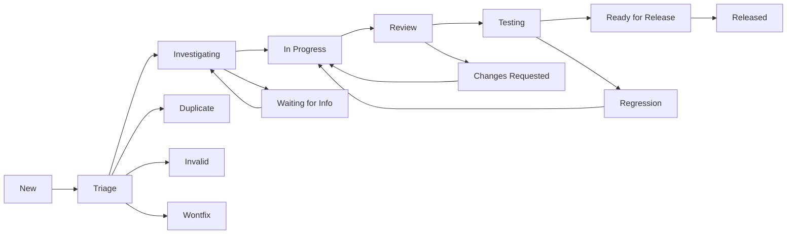

# Issue Reporting Templates and Bug Tracking

This document provides comprehensive templates and guidelines for reporting issues, requesting features, and tracking bugs in the MultiOS project. Using these templates ensures clear communication, efficient triage, and effective resolution of issues.

## 📋 Table of Contents

- [Issue Types](#issue-types)
- [Bug Report Template](#bug-report-template)
- [Feature Request Template](#feature-request-template)
- [Enhancement Template](#enhancement-template)
- [Documentation Issue Template](#documentation-issue-template)
- [Performance Issue Template](#performance-issue-template)
- [Security Issue Template](#security-issue-template)
- [Question Template](#question-template)
- [Bug Triage Process](#bug-triage-process)
- [Priority Levels](#priority-levels)
- [Component Labels](#component-labels)
- [Issue Lifecycle](#issue-lifecycle)

## 🎯 Issue Types

The MultiOS project uses the following issue types to categorize and track different kinds of work:

### Bug Reports
**Purpose**: Report software defects, crashes, or unexpected behavior
**Template**: `Bug Report`
**Priority**: High to Critical
**Response Time**: 24-72 hours

### Feature Requests
**Purpose**: Suggest new functionality or capabilities
**Template**: `Feature Request`
**Priority**: Medium to High
**Response Time**: 7-14 days

### Enhancements
**Purpose**: Improve existing features or functionality
**Template**: `Enhancement`
**Priority**: Low to Medium
**Response Time**: 14-30 days

### Documentation Issues
**Purpose**: Fix errors or gaps in documentation
**Template**: `Documentation Issue`
**Priority**: Low to Medium
**Response Time**: 7-14 days

### Performance Issues
**Purpose**: Report performance problems or request optimizations
**Template**: `Performance Issue`
**Priority**: Medium to High
**Response Time**: 3-7 days

### Security Issues
**Purpose**: Report security vulnerabilities or concerns
**Template**: `Security Issue`
**Priority**: Critical
**Response Time**: 24 hours

### Questions
**Purpose**: Seek help, clarification, or information
**Template**: `Question`
**Priority**: Low
**Response Time**: 3-7 days

## 🐛 Bug Report Template

### Bug Report: Software Defect

```markdown
## 🐛 Bug Report

### Description
A clear and concise description of what the bug is. Describe the expected behavior vs the actual behavior.

### Reproduction Steps
Steps to reproduce the behavior:
1. Go to '...'
2. Click on '....'
3. Scroll down to '....'
4. See error

**Expected behavior**: A clear description of what should happen.

**Actual behavior**: A clear description of what actually happens.

### Environment
- **MultiOS Version**: [e.g., v1.2.0, commit hash]
- **Architecture**: [e.g., x86_64, ARM64, RISC-V64]
- **Hardware**: [e.g., QEMU VM, physical hardware details]
- **Build Configuration**: [e.g., debug, release, custom config]
- **Memory Configuration**: [e.g., 4GB RAM, 8GB RAM]
- **Storage Configuration**: [e.g., virtio disk, NVMe]

### Context
Add any other context about the problem here. Include:
- Specific use case or scenario
- When the issue started occurring
- Any recent changes to the system
- Workarounds attempted

### Stack Trace
If applicable, include the complete stack trace:

```
thread 'main' panicked at 'assertion failed: `left == right`'
  --> src/kernel/memory/allocator.rs:45
     |
 45 | assert_eq!(allocated_size, requested_size);
     |                     ^^^^^^^^^^^^^^^^^^^
     |                   left: `8192`,
     |                  right: `4096`
```

### Logs
Include relevant log output:

```bash
[2024-11-03 10:15:32] INFO: Kernel boot sequence initiated
[2024-11-03 10:15:33] INFO: Memory manager initialized: 4GB available
[2024-11-03 10:15:34] WARN: Memory allocation failed for size 8192
[2024-11-03 10:15:35] ERROR: Kernel panic: failed to allocate memory
```

### Screenshot/Diagram
If applicable, add screenshots, diagrams, or ASCII art showing the issue:

```
[Memory Layout - Expected vs Actual]

Expected:
0x0000_0000 - 0x1000_0000  [Kernel Code      ]  RWX
0x1000_0000 - 0x2000_0000  [Kernel Data      ]  RW-
0x2000_0000 - 0x4000_0000  [User Space       ]  RW-
0x4000_0000 - 0x8000_0000  [Memory Mapped I/O]  RW-

Actual (Bug):
0x0000_0000 - 0x0FFF_FFFF  [Kernel Code      ]  RWX
0x1000_0000 - 0x1000_1000  [Kernel Data      ]  RW-  <- Wrong size
0x1000_1000 - 0x2000_0000  [Gap/Unused       ]  ---
0x2000_0000 - 0x4000_0000  [User Space       ]  RW-
0x4000_0000 - 0x8000_0000  [Memory Mapped I/O]  RW-
```

### Frequency
- [ ] This happens always
- [ ] This happens sometimes
- [ ] This happens rarely
- [ ] This is the first time I've seen this error

### Impact
- [ ] System crash (kernel panic)
- [ ] Data loss or corruption
- [ ] Feature doesn't work
- [ ] Performance degradation
- [ ] Minor inconvenience
- [ ] Cosmetic issue

### Workarounds
If you have found any workarounds, please describe them here:

**Workaround 1**: Reduce memory allocation size to 4KB
**Workaround 2**: Disable memory pooling feature
**Workaround 3**: Use different compiler optimization level

### Additional Information
Add any other information that might help debug the issue:
- System load during issue
- Other processes running
- Recent software updates
- Hardware specifications
- Network configuration (if relevant)

### Severity Assessment
Choose one:
- [ ] **P0 - Critical**: System unusable, data loss, security vulnerability
- [ ] **P1 - High**: Major feature broken, significant impact on users
- [ ] **P2 - Medium**: Feature partially broken, workaround exists
- [ ] **P3 - Low**: Minor issue, workaround available
- [ ] **P4 - Trivial**: Typo, cosmetic issue, documentation error

### Related Issues
Link to related issues:
- Related to #123 (Previous issue with similar symptoms)
- Related to #456 (Feature request that might address this)

### Contributors
Who has investigated this issue:
- [@contributor1]: Initial investigation, reproduction confirmed
- [@contributor2]: Provided memory dump analysis
```

### Bug Report Examples

#### Good Bug Report - Memory Allocation Failure

```markdown
## 🐛 Memory Allocation Failure on ARM64 Platform

### Description
Memory allocations fail randomly during system initialization on ARM64 hardware when using the new memory defragmentation feature. The issue does not occur on x86_64 platforms or when defragmentation is disabled.

### Reproduction Steps
1. Build MultiOS with `cargo build --target aarch64-unknown-none`
2. Deploy on ARM64 development board (Raspberry Pi 4B)
3. Boot system with 8GB RAM configuration
4. Enable memory defragmentation in kernel config
5. Run memory stress test: `multios-test memory --size=4GB --duration=300s`

**Expected behavior**: All memory allocations succeed, defragmentation runs in background

**Actual behavior**: 
- Random allocation failures with "Out of memory" error
- Kernel log shows: `ERROR: Failed to allocate 4096 bytes`
- System becomes unstable after ~2-3 minutes

### Environment
- **MultiOS Version**: v1.2.0-beta.3 (commit a1b2c3d)
- **Architecture**: aarch64-unknown-none
- **Hardware**: Raspberry Pi 4 Model B (4GB RAM), Pine64 RockPro64 (4GB RAM)
- **Build Configuration**: `cargo build --release --features defragmentation`
- **Compiler**: rustc 1.70.0 (stable)
- **Bootloader**: U-Boot 2023.04

### Context
This issue started occurring after merging PR #234 which introduced the memory defragmentation feature. The issue is specific to ARM64 platforms and only occurs when:
1. Memory defragmentation is enabled
2. System has more than 2GB of RAM
3. Under memory pressure (stress testing)

The issue does NOT occur on:
- x86_64 platforms (same code)
- ARM64 with defragmentation disabled
- ARM64 with less than 2GB RAM

### Stack Trace
```
thread 'memory_manager' panicked at 'assertion failed: self.is_valid_address(addr)', 
src/kernel/memory/defragment.rs:87
   |
87 |         assert!(self.is_valid_address(addr), "Invalid address: 0x{:x}", addr);
      |         ^^^^^^^^^^^^^^^^^^^^^^^^^^^^
88 |         let region = self.regions.get_mut(&addr).unwrap();
      |         83 | assert!(self.is_valid_address(addr), "Invalid address: 0x{:x}", addr);
   |      | 84 | 
   85 |     pub fn defragment(&mut self) -> Result<(), DefragmentError> {
   86 |         // Sort regions by address
   87 |         self.regions.sort_by_key(|r| r.start_address);
   88 |         
   89 |         let mut current_end = 0x0000_0000;
   90 |         for region in &mut self.regions {
   91 |             if region.start_address != current_end {
   92 |                 // Found gap, attempt consolidation
   93 |                 if !self.consolidate_gaps()? {
   94 |                     return Err(DefragmentError::ConsolidationFailed);
   95 |                 }
  96 |             }
   96 |             current_end = region.start_address + region.size;
   97 |         }
   97 |         
   98 |         Ok(())
   99 |     }
   |
```

### Logs
```bash
[2024-11-03 14:22:15] INFO: Memory manager initialized: 8589934592 bytes available
[2024-11-03 14:22:16] INFO: Memory defragmentation thread started (interval: 60s)
[2024-11-03 14:22:17] INFO: Created memory pool: 2048 pages (8MB)
[2024-11-03 14:22:18] INFO: Allocated 4096 bytes at address 0x1000_2000
[2024-11-03 14:22:19] INFO: Allocated 8192 bytes at address 0x1000_3000
[2024-11-03 14:22:20] INFO: Starting defragmentation cycle
[2024-11-03 14:22:20] ERROR: Failed to defragment memory: Invalid address: 0x1000_2000
[2024-11-03 14:22:21] WARN: Memory allocation failed for size 4096
[2024-11-03 14:22:22] ERROR: Out of memory during allocation
[2024-11-03 14:22:23] WARN: System stability degraded due to allocation failures
```

### Analysis
I've investigated the issue and suspect it's related to how defragmentation handles memory regions on ARM64:

1. **Memory Alignment**: ARM64 has stricter alignment requirements (16-byte alignment for some operations)
2. **Address Space Layout**: ARM64 uses different virtual address space layout
3. **Memory Translation**: The page table operations might be corrupting region metadata

**Root Cause Hypothesis**: The defragmentation algorithm doesn't account for ARM64-specific alignment constraints when moving memory regions.

### Impact
- **Severity**: P1 - High (Major feature broken on ARM64)
- **User Impact**: ARM64 users cannot use memory defragmentation feature
- **Workaround**: Disable defragmentation feature (acceptable for most use cases)

### Additional Information
- Reproduced on multiple ARM64 hardware platforms
- Issue does not occur with ARM64 + defragmentation disabled
- Memory dump analysis shows corrupted region metadata after defragmentation cycle
- Similar issue might exist on RISC-V64 (requires testing)

### Testing Information
**Reproduced By**: 
- [@user1] on Raspberry Pi 4B
- [@user2] on Pine64 RockPro64
- [@dev1] in QEMU ARM64 emulation

**Test Commands**:
```bash
# Enable defragmentation
echo "CONFIG_MEMORY_DEFRAGMENTATION=y" >> .config
make menuconfig  # Enable defragmentation feature

# Build and test
cargo build --release --target aarch64-unknown-none --features defragmentation
multios-test memory --size=4GB --duration=300s --verbose
```

### Contributors
- [@investigator1]: Initial reproduction, root cause analysis
- [@memory-expert]: Provided memory layout review
- [@arm64-specialist]: Confirmed ARM64-specific nature of issue
```

## 💡 Feature Request Template

### Feature Request: New Functionality

```markdown
## 💡 Feature Request

### Summary
A clear and concise summary of the feature request in one sentence.

### Problem Description
Describe the problem or pain point this feature would solve. Include:
- Current limitation or inconvenience
- Impact on users
- Frequency of the problem
- Workarounds currently used

### Proposed Solution
Describe the feature you would like to see implemented. Include:
- How the feature would work
- Key functionality and behavior
- User interface changes (if applicable)
- Technical approach (if known)

### Alternatives Considered
List alternative solutions or workarounds that have been considered:
- Alternative 1: Description and why it doesn't fully solve the problem
- Alternative 2: Description and limitations
- Current workaround: How users currently solve the problem

### Implementation Details
Provide technical details about the implementation:

#### Core Components
- **Kernel Changes**: What kernel modifications are needed
- **User Library Changes**: Required userland API changes
- **Configuration**: New config options or settings
- **Dependencies**: External libraries or tools required

#### API Design
```rust
// Proposed API design
pub struct MemoryProfiler {
    // Fields
}

impl MemoryProfiler {
    /// Create a new memory profiler
    pub fn new() -> Self;
    
    /// Start profiling memory usage
    pub fn start_profiling(&mut self) -> Result<(), ProfilerError>;
    
    /// Get current memory statistics
    pub fn get_stats(&self) -> MemoryStats;
    
    /// Generate memory usage report
    pub fn generate_report(&self) -> String;
}
```

#### Configuration
```toml
# Example configuration changes
[memory.profiling]
enabled = true
interval = 1000  # milliseconds
output_format = "json"
report_file = "/var/log/multios/memory-profile.json"

[memory.profiling.alerts]
threshold_warning = 80  # % memory usage
threshold_critical = 95 # % memory usage
```

### User Stories
Describe the feature from a user's perspective:

**As a** system administrator,
**I want** to monitor memory usage patterns over time,
**So that** I can optimize memory allocation and detect memory leaks.

**As a** developer,
**I want** to profile memory usage of my applications,
**So that** I can optimize memory consumption and improve performance.

**As a** MultiOS user,
**I want** automatic memory optimization recommendations,
**So that** the system performs optimally without manual intervention.

### Success Criteria
Define what success looks like:

#### Functional Requirements
- [ ] Feature can be enabled/disabled via configuration
- [ ] Memory usage data is collected without significant performance impact (<5% CPU)
- [ ] Data is stored in efficient format (compressed time-series)
- [ ] API provides real-time access to current memory statistics
- [ ] Historical data can be queried and analyzed

#### Non-Functional Requirements
- **Performance**: <5% CPU overhead when enabled, <1% when disabled
- **Memory**: <10MB additional memory usage when active
- **Storage**: Efficient compression of time-series data (10:1 ratio)
- **Reliability**: No memory leaks in profiler itself
- **Security**: No exposure of sensitive memory contents

#### Compatibility
- [ ] Works with all supported architectures (x86_64, ARM64, RISC-V64)
- [ ] Backward compatible with existing memory management APIs
- [ ] Integration with existing logging and monitoring tools

### Testing Plan
Describe how this feature should be tested:

#### Unit Tests
- Memory profiling data collection accuracy
- Configuration validation
- Error handling and edge cases
- Performance impact measurement

#### Integration Tests
- Memory profiler with different memory managers
- Integration with logging system
- API compatibility with existing tools

#### User Acceptance Tests
- System administrator workflow testing
- Developer tooling integration
- Performance benchmarking

### Documentation Needs
List what documentation would need to be updated:

- [ ] API documentation for new profiling interface
- [ ] User guide section on memory optimization
- [ ] Administrator guide for configuration
- [ ] Performance tuning guide
- [ ] Migration guide for existing tools

### Migration/Compatibility
If this feature affects existing functionality:

#### Backward Compatibility
- All existing memory management APIs continue to work
- No breaking changes to public interfaces
- Optional feature (disabled by default initially)

#### Migration Steps
Users don't need to do anything - feature is additive only.

### Examples
Provide concrete examples of how this feature would be used:

#### CLI Usage
```bash
# View current memory usage
$ multios memory profile
Memory Usage: 2.1GB / 8GB (26%)
Peak Usage: 3.4GB (at 14:32:15)
Allocations/sec: 156
Fragmentation: 12%

# Generate detailed report
$ multios memory profile --format=html --output=report.html
Memory profiling report generated: report.html
```

#### API Usage
```rust
use multios::memory::MemoryProfiler;

let mut profiler = MemoryProfiler::new();
profiler.start_profiling()?;

loop {
    let stats = profiler.get_stats();
    println!("Memory usage: {}%", stats.utilization_percentage());
    
    if stats.is_fragmented() {
        println!("Memory is fragmented, consider running defragmenter");
    }
    
    std::thread::sleep(Duration::from_secs(60));
}
```

### Priority Assessment
Choose one:
- [ ] **P0 - Critical**: Essential feature for project goals
- [ ] **P1 - High**: Significant value, widely requested
- [ ] **P2 - Medium**: Useful enhancement, some demand
- [ ] **P3 - Low**: Nice-to-have, limited immediate need
- [ ] **P4 - Trivial**: Minor convenience feature

### Effort Estimation
Rough estimate of development effort:
- **Small** (1-2 weeks): Simple feature, minimal testing
- **Medium** (1-2 months): Complex feature, moderate testing
- **Large** (3-6 months): Major feature, extensive testing
- **Epic** (6+ months): Major architectural change, extensive coordination

### Dependencies
What other work this feature depends on:
- Memory management subsystem refactoring (PR #123)
- Time-series database integration (PR #456)
- New kernel configuration system (planned for v1.3)

### Risks and Concerns
Potential issues or concerns:
- **Performance Impact**: Profiling might slow down memory operations
- **Storage Requirements**: Long-term data storage could consume significant space
- **Privacy**: Memory profiling might expose sensitive information
- **Complexity**: Feature might make memory management more complex

### Alternatives
Other approaches that were considered:
- **External Profiling Tool**: Less integrated, separate tool
- **Simple Statistics**: Less detailed, but lower overhead
- **User-Space Only**: Kernel remains unchanged, limited capabilities

### Community Interest
How many community members have expressed interest:
- 👍 23 reactions on GitHub discussions
- 📧 5 emails requesting this feature
- 💬 15 Discord messages asking about memory profiling
- 📊 89% of survey respondents want memory profiling (based on 156 responses)

### Related Work
Link to related issues and PRs:
- Related to #789 (Memory optimization initiative)
- Blocks #321 (Performance monitoring dashboard)
- Depends on #654 (New logging system)
```

### Feature Request Examples

#### Good Feature Request - Memory Analytics

```markdown
## 💡 Memory Analytics and Visualization Dashboard

### Summary
Add a web-based dashboard for visualizing memory usage patterns, fragmentation analysis, and system optimization recommendations.

### Problem Description
Currently, MultiOS users have no easy way to visualize memory usage patterns or understand system memory health. Developers need tools to:
- Identify memory leaks in applications
- Visualize fragmentation patterns over time
- Get actionable optimization recommendations
- Monitor memory usage trends across system restarts

Users currently rely on command-line tools and log analysis, which is:
- Difficult for non-technical users
- Time-consuming to analyze manually
- Lacks visual context for patterns
- No historical trending or baseline comparison

### Proposed Solution
Implement a comprehensive memory analytics dashboard that provides:

1. **Real-time Memory Visualization**
   - Live memory usage charts
   - Allocation/deallocation rates
   - Fragmentation timeline
   - Per-process memory breakdown

2. **Historical Analysis**
   - Memory usage trends over days/weeks
   - Peak usage analysis
   - Fragmentation correlation analysis
   - Capacity planning insights

3. **Optimization Recommendations**
   - Automatic detection of memory inefficiencies
   - Suggested configuration changes
   - Memory allocation pattern improvements
   - Defragmentation scheduling recommendations

4. **Integration Points**
   - WebSocket real-time updates
   - REST API for external tools
   - Export to common formats (JSON, CSV, Grafana)
   - Alert system for threshold violations

### Implementation Details

#### Core Components
- **Web Server**: Lightweight HTTP server for dashboard hosting
- **Data Collector**: Background service for memory metrics collection
- **Analytics Engine**: Pattern analysis and recommendation generation
- **Database**: Time-series storage for historical data

#### Architecture
```
┌─────────────────┐    ┌─────────────────┐    ┌─────────────────┐
│   Web Dashboard │◄──►│ Analytics Engine│◄──►│ Memory Manager  │
│   (React/TS)    │    │ (Rust)          │    │ (Rust)          │
└─────────────────┘    └─────────────────┘    └─────────────────┘
         │                       │                       │
         ▼                       ▼                       ▼
┌─────────────────┐    ┌─────────────────┐    ┌─────────────────┐
│   WebSocket     │    │ Time-Series DB  │    │ Metrics Buffer  │
│   (Real-time)   │    │ (RocksDB)       │    │ (In-memory)     │
└─────────────────┘    └─────────────────┘    └─────────────────┘
```

#### API Design
```rust
pub struct MemoryAnalytics {
    pub dashboard_enabled: bool,
    pub data_retention_days: u32,
    pub update_interval_ms: u32,
}

impl MemoryAnalytics {
    /// Start the analytics dashboard server
    pub async fn start_dashboard(&mut self, port: u16) -> Result<(), AnalyticsError> {
        // Implementation
    }
    
    /// Get current memory analytics summary
    pub fn get_summary(&self) -> AnalyticsSummary {
        AnalyticsSummary {
            current_usage: self.calculate_usage(),
            trend: self.calculate_trend(),
            fragmentation: self.get_fragmentation_level(),
            recommendations: self.generate_recommendations(),
        }
    }
    
    /// Get historical data for visualization
    pub async fn get_historical_data(
        &self,
        time_range: TimeRange,
    ) -> Result<Vec<AnalyticsPoint>, AnalyticsError> {
        // Implementation
    }
}
```

#### Configuration
```toml
# memory_analytics.toml
[dashboard]
enabled = true
port = 8080
host = "0.0.0.0"
ssl_enabled = false
ssl_cert = "/etc/multios/ssl/cert.pem"
ssl_key = "/etc/multios/ssl/key.pem"

[data_collection]
enabled = true
interval = 1000  # milliseconds
buffer_size = 10000
retention_days = 30
compression = true

[analytics]
auto_recommendations = true
fragmentation_threshold = 30  # percentage
memory_leak_detection = true
alert_thresholds = {
    warning = 80,    # % memory usage
    critical = 95,   # % memory usage
}

[security]
authentication = "basic"  # none, basic, oauth2
allowed_hosts = ["localhost", "192.168.1.0/24"]
```

### User Stories
**As a** system administrator,
**I want** to see real-time memory usage trends across all applications,
**So that** I can proactively address memory issues before they cause problems.

**As a** application developer,
**I want** to identify memory allocation patterns in my code,
**So that** I can optimize memory usage and improve performance.

**As a** DevOps engineer,
**I want** to integrate MultiOS memory metrics with existing monitoring tools,
**So that** I can include system health in operational dashboards.

**As a** end user,
**I want** simple visual indicators of system memory health,
**So that** I know when my system needs attention.

### Success Criteria
- [ ] Dashboard loads in <2 seconds on standard hardware
- [ ] Real-time updates with <500ms latency
- [ ] Supports visualization of 30+ days of historical data
- [ ] Provides actionable recommendations with >80% accuracy
- [ ] Integrates with Grafana/Prometheus via standard protocols
- [ ] Works on all supported architectures
- [ ] No measurable impact on system performance when enabled
- [ ] Memory usage <50MB for analytics service

### Priority Assessment
**P1 - High** - Significant value, widely requested feature

### Effort Estimation
**Medium** (6-10 weeks) - Complex feature requiring:
- Frontend development (React/TypeScript dashboard)
- Backend analytics engine (Rust)
- Database integration (time-series storage)
- Security implementation
- Comprehensive testing across platforms
```

## 🔧 Enhancement Template

### Enhancement: Improve Existing Feature

```markdown
## 🔧 Enhancement Request

### Summary
Brief description of the enhancement and its expected benefits.

### Current State
Describe how the feature currently works:

### Proposed Enhancement
Describe the improvements you want to see:

### Benefits
- Benefit 1: Description
- Benefit 2: Description
- Benefit 3: Description

### Implementation Approach
Technical details about how this could be implemented.

### Breaking Changes
Will this enhancement require any breaking changes?
- [ ] No breaking changes
- [ ] Minor breaking changes (deprecated features)
- [ ] Major breaking changes (API redesign)

### Testing Strategy
How would this enhancement be tested?

### Priority
Choose priority level:
- [ ] P1 - High: Significant improvement, many users affected
- [ ] P2 - Medium: Good improvement, moderate user benefit
- [ ] P3 - Low: Minor improvement, limited immediate impact
```

## 📚 Documentation Issue Template

### Documentation Issue

```markdown
## 📚 Documentation Issue

### Issue Type
- [ ] **Incorrect Information**: Documentation contains wrong/obsolete information
- [ ] **Missing Information**: Important information is not documented
- [ ] **Unclear Documentation**: Documentation is confusing or hard to understand
- [ ] **Outdated Information**: Documentation needs updating for new versions
- [ ] **Broken Links**: Links in documentation don't work
- [ ] **Formatting Issues**: Problems with markdown, code blocks, etc.

### Page/Location
Where is the issue located?

**File Path**: `docs/architecture/memory-management.md`
**Section**: "Memory Allocation Algorithms"
**Line/Anchor**: "#buddy-allocator"

### Current Content
```markdown
Current documentation text here that has the issue...
```

### Issue Description
Describe the problem with the current documentation:

### Proposed Fix
What should the documentation say instead:

```markdown
Corrected documentation text here...
```

### Additional Context
Any other relevant information about this documentation issue.

### Priority
- [ ] P0 - Critical: Incorrect information could cause system damage
- [ ] P1 - High: Important missing information
- [ ] P2 - Medium: Documentation improvement
- [ ] P3 - Low: Minor clarification needed
```

## ⚡ Performance Issue Template

### Performance Issue

```markdown
## ⚡ Performance Issue

### Performance Problem
Brief description of the performance issue.

### Expected Performance
What performance should be achieved:

### Actual Performance
What performance is currently observed:

### Measurement Details
How was performance measured?

**Test Environment**:
- Hardware: [specifications]
- Build: [release/debug, optimization level]
- Configuration: [relevant settings]

**Test Method**:
```bash
# Command used for measurement
multios-benchmark memory --size=1GB --iterations=10000
```

**Results**:
- Operation: Memory allocation
- Expected: <1ms per operation
- Actual: 15ms per operation
- Regression: 15x slower than expected

### Impact Assessment
- [ ] System unusable
- [ ] Severe performance degradation
- [ ] Moderate performance impact
- [ ] Minor performance concern
- [ ] Performance optimization request

### Reproducibility
- [ ] Always reproducible
- [ ] Reproducible under specific conditions
- [ ] Intermittent/random
- [ ] Only on specific hardware
- [ ] Only under specific load conditions

### Proposed Solution
If you have ideas for fixing the performance issue:
```

## 🔒 Security Issue Template

### Security Issue

```markdown
## 🔒 Security Issue

### Security Problem
Brief description of the security vulnerability.

### Security Impact
What could an attacker do if this vulnerability is exploited?

### Vulnerability Details
Provide technical details about the vulnerability:

**Affected Component**: [kernel/memory/driver name]
**Vulnerability Type**: [buffer overflow/use-after-free/memory disclosure/etc.]
**Attack Vector**: How would an attacker exploit this?

### Reproduction Steps
Steps to reproduce the security issue:
1. [Step 1]
2. [Step 2]
3. [Step 3]

### Proof of Concept
If you have a proof of concept, describe it here:

### Suggested Fix
How should this vulnerability be fixed?

### Priority
- [ ] P0 - Critical: Remote code execution, privilege escalation
- [ ] P1 - High: Information disclosure, denial of service
- [ ] P2 - Medium: Security bypass, privilege escalation
- [ ] P3 - Low: Information disclosure, minor security issue

**Note**: Please follow responsible disclosure practices for security issues.
```

## ❓ Question Template

### Question

```markdown
## ❓ Question

### Question Summary
Brief summary of your question.

### Context
Provide context for your question:
- What are you trying to accomplish?
- What have you tried so far?
- What documentation have you read?

### Specific Question
Your specific question:

### Environment
- MultiOS Version: [version]
- Architecture: [arch]
- Hardware: [hardware details]

### Additional Information
Any other relevant information:

### Question Type
- [ ] **Technical Help**: Need help with implementation
- [ ] **Architecture Decision**: Guidance on design choices
- [ ] **Best Practices**: How to do something the right way
- [ ] **Compatibility**: Will this work with [X]?
- [ ] **General Inquiry**: General question about MultiOS
```

## 🏷️ Bug Triage Process

### Triage Workflow

1. **Initial Triage** (Within 24 hours)
   - Verify issue template completeness
   - Assign severity/priority level
   - Add appropriate component labels
   - Assign to triage team member

2. **Technical Triage** (Within 72 hours)
   - Reproduce the issue (if possible)
   - Validate severity assessment
   - Identify affected components
   - Assign to appropriate developer/team

3. **Development Planning**
   - Estimate effort required
   - Identify dependencies
   - Plan implementation approach
   - Set target milestone

4. **Resolution Tracking**
   - Track development progress
   - Monitor fix implementation
   - Verify fix effectiveness
   - Update issue status

### Triage Checklist

```markdown
## Triage Checklist

### Initial Review
- [ ] Issue template completed correctly
- [ ] Clear description provided
- [ ] Reproduction steps included (if bug)
- [ ] Environment information provided
- [ ] Severity assessed appropriately

### Technical Assessment
- [ ] Issue reproduced on target platform
- [ ] Root cause identified (初步)
- [ ] Impact scope determined
- [ ] Related issues/dependencies identified
- [ ] Fix complexity estimated

### Assignment
- [ ] Component owner identified
- [ ] Priority confirmed with team lead
- [ ] Target milestone assigned
- [ ] Estimated effort provided
- [ ] Dependencies documented

### Communication
- [ ] Reporter acknowledged
- [ ] Timeline expectations set
- [ ] Additional information requested (if needed)
- [ ] Community informed of status
```

## 📊 Priority Levels

### Priority Definitions

| Priority | Description | Response Time | Typical Issues |
|----------|-------------|---------------|----------------|
| **P0 - Critical** | System unusable, data loss, security vulnerability | 4 hours | Kernel panic, data corruption, RCE |
| **P1 - High** | Major feature broken, significant user impact | 24 hours | Core functionality broken, performance issues |
| **P2 - Medium** | Feature partially broken, workaround exists | 72 hours | Minor feature issues, documentation errors |
| **P3 - Low** | Minor issue, workaround available | 7 days | Cosmetic issues, minor bugs |
| **P4 - Trivial** | Typo, minor documentation issue | 30 days | Documentation fixes, small improvements |

### Priority Guidelines

#### P0 - Critical Issues
- **System Impact**: Kernel panic, system crash, data loss
- **Security Impact**: Remote code execution, privilege escalation
- **User Impact**: All users affected, no workaround available
- **Response**: Immediate response, fix within 24-48 hours

#### P1 - High Priority Issues
- **System Impact**: Major feature completely broken
- **User Impact**: Significant functionality unavailable
- **Workaround**: Complex or impractical workaround
- **Response**: Rapid response, fix within 1-2 weeks

#### P2 - Medium Priority Issues
- **System Impact**: Feature partially working
- **User Impact**: Moderate impact on user experience
- **Workaround**: Reasonable workaround available
- **Response**: Normal priority, fix within 1-2 months

#### P3 - Low Priority Issues
- **System Impact**: Minor feature issues
- **User Impact**: Minimal impact, mainly cosmetic
- **Workaround**: Simple workaround available
- **Response**: Lower priority, fix when resources available

## 🏷️ Component Labels

### Core System Labels
- `kernel/core` - Core kernel functionality
- `kernel/memory` - Memory management
- `kernel/scheduler` - Task scheduling
- `kernel/interrupts` - Interrupt handling
- `kernel/syscall` - System call interface
- `kernel/boot` - Boot process and initialization

### Hardware Support Labels
- `arch/x86_64` - x86_64 architecture support
- `arch/aarch64` - ARM64 architecture support
- `arch/riscv64` - RISC-V64 architecture support
- `hardware/graphics` - Graphics drivers and display
- `hardware/storage` - Storage drivers and filesystems
- `hardware/network` - Network drivers and stack
- `hardware/input` - Input device drivers

### Development Tools Labels
- `tools/build` - Build system and toolchain
- `tools/debugging` - Debugging and profiling tools
- `tools/testing` - Testing framework and utilities
- `tools/cli` - Command-line tools and utilities
- `tools/docs` - Documentation and generation

### Documentation Labels
- `docs/api` - API documentation
- `docs/user-guide` - User documentation
- `docs/developer` - Developer documentation
- `docs/tutorial` - Tutorial and learning materials
- `docs/architecture` - Architecture documentation

### Process Labels
- `good-first-issue` - Good starting point for new contributors
- `help-wanted` - Community assistance needed
- `documentation` - Documentation-related issues
- `question` - Questions requiring clarification
- `duplicate` - Duplicate of existing issue
- `wontfix` - Will not be addressed
- `invalid` - Issue is not valid

## 🔄 Issue Lifecycle

### Status Workflow



### Status Definitions

| Status | Definition | Criteria |
|--------|------------|----------|
| **New** | Initial issue submission | Complete issue template, awaiting triage |
| **Triage** | Issue under review for assignment | Triage team reviewing for completeness and priority |
| **Investigating** | Root cause analysis in progress | Reproducing issue, identifying scope |
| **In Progress** | Fix implementation underway | Developer actively working on solution |
| **Review** | Fix implementation complete, under review | Code review, testing verification |
| **Testing** | Fix being tested in various environments | Integration testing, regression testing |
| **Ready for Release** | Fix approved and tested, ready for release | All testing passed, review completed |
| **Released** | Fix available in release | Included in tagged release |
| **Waiting for Info** | More information needed from reporter | Reporter to provide additional details |
| **Changes Requested** | Review feedback requires modifications | Author needs to make requested changes |
| **Regression** | Issues introduced by the fix | Original fix caused new problems |
| **Duplicate** | Issue already exists | Link to existing issue provided |
| **Invalid** | Issue report is not valid | Not a MultiOS issue or insufficient detail |
| **Wontfix** | Issue will not be addressed | Won't be fixed (out of scope, obsolete, etc.) |

### Status Transitions

#### Good Status Transitions
```
New → Triage → Investigating → In Progress → Review → Testing → Ready for Release → Released
```

#### Alternative Transitions
```
New → Triage → Investigating → Waiting for Info → Investigating → In Progress → ...
New → Triage → Invalid (if not a valid issue)
New → Triage → Duplicate (if duplicate exists)
```

#### Common Issue Paths
```
Bug Reports:    New → Triage → Investigating → In Progress → Review → Testing → Released
Feature Requests: New → Triage → Investigating → In Progress → Review → Testing → Released
Documentation:   New → Triage → Investigating → In Progress → Review → Ready for Release → Released
Enhancements:    New → Triage → Investigating → In Progress → Review → Testing → Released
```

## 🏁 Conclusion

Using these templates and following the established processes ensures:

- **Clear Communication**: Consistent format and comprehensive information
- **Efficient Triage**: Quick assessment and appropriate assignment
- **Quality Tracking**: Comprehensive status tracking and progress monitoring
- **Community Engagement**: Structured feedback and collaboration

For questions about issue reporting or these templates, please use the "Question" template or reach out to the maintainers through our community channels.

*Last Updated: November 3, 2025*