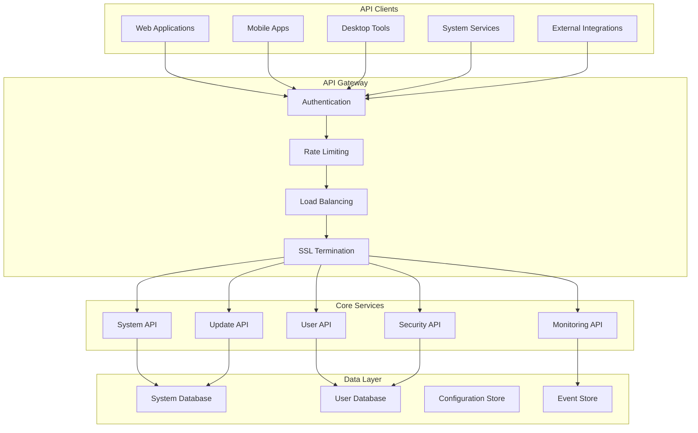

# MultiOS API Documentation

## Table of Contents
1. [Overview](#overview)
2. [Authentication & Security](#authentication--security)
3. [System Management APIs](#system-management-apis)
4. [User Management APIs](#user-management-apis)
5. [Update Management APIs](#update-management-apis)
6. [Security APIs](#security-apis)
7. [Monitoring & Logging APIs](#monitoring--logging-apis)
8. [File System APIs](#file-system-apis)
9. [Network APIs](#network-apis)
10. [Process Management APIs](#process-management-apis)
11. [Package Management APIs](#package-management-apis)
12. [Configuration Management APIs](#configuration-management-apis)
13. [Event System APIs](#event-system-apis)
14. [Hardware Abstraction APIs](#hardware-abstraction-apis)
15. [GUI APIs](#gui-apis)
16. [WebSocket APIs](#websocket-apis)
17. [Error Handling](#error-handling)
18. [Rate Limiting](#rate-limiting)
19. [Webhooks](#webhooks)
20. [SDKs & Client Libraries](#sdks--client-libraries)

---

## Overview

The MultiOS API provides comprehensive programmatic access to all system functionality through RESTful web services, WebSocket connections, and native library interfaces. All APIs are designed with security, performance, and developer experience in mind.

### API Architecture



### Base URL and Versioning

```
Production: https://api.multios.org/v1
Staging:    https://api-staging.multios.org/v1
Development: http://localhost:8080/v1
```

API versioning is handled through URL path versioning (`/v1/`, `/v2/`, etc.) to ensure backward compatibility.

### Response Format

All API responses follow a consistent JSON format:

```json
{
    "success": true,
    "data": { ... },
    "error": null,
    "meta": {
        "timestamp": "2024-11-05T03:01:55Z",
        "request_id": "req_123456789",
        "version": "v1",
        "execution_time_ms": 45
    }
}
```

### Request Format

#### Headers
```http
Content-Type: application/json
Authorization: Bearer <token>
Accept: application/json
User-Agent: <client_name>/<version>
```

#### Request Body
All POST/PUT/PATCH requests use JSON:
```json
{
    "param1": "value1",
    "param2": 123,
    "options": {
        "verbose": true,
        "timeout": 30
    }
}
```

---

## Authentication & Security

### API Authentication

#### Bearer Token Authentication
```http
POST /v1/auth/login
Content-Type: application/json

{
    "username": "john.doe",
    "password": "secure_password",
    "mfa_token": "123456"
}
```

**Response:**
```json
{
    "success": true,
    "data": {
        "access_token": "eyJhbGciOiJIUzI1NiIsInR5cCI6IkpXVCJ9...",
        "refresh_token": "def502003a...",
        "token_type": "Bearer",
        "expires_in": 3600,
        "scope": "system:read system:write user:manage",
        "user": {
            "id": "user_123",
            "username": "john.doe",
            "roles": ["admin", "developer"],
            "permissions": ["system:read", "system:write"]
        }
    }
}
```

#### API Key Authentication
```http
GET /v1/system/info
Authorization: ApiKey <api_key>
Accept: application/json
```

#### JWT Token Refresh
```http
POST /v1/auth/refresh
Content-Type: application/json

{
    "refresh_token": "def502003a..."
}
```

### Session Management

#### Create Session
```http
POST /v1/auth/session
Authorization: Bearer <token>

{
    "session_name": "api-session",
    "duration": 7200,
    "permissions": ["system:read", "monitoring:read"]
}
```

#### List Sessions
```http
GET /v1/auth/sessions
Authorization: Bearer <token>
```

**Response:**
```json
{
    "success": true,
    "data": {
        "sessions": [
            {
                "id": "session_123",
                "name": "api-session",
                "created_at": "2024-11-05T03:01:55Z",
                "last_accessed": "2024-11-05T03:15:30Z",
                "expires_at": "2024-11-05T05:01:55Z",
                "status": "active",
                "permissions": ["system:read", "monitoring:read"]
            }
        ],
        "total": 1
    }
}
```

#### Revoke Session
```http
DELETE /v1/auth/sessions/{session_id}
Authorization: Bearer <token>
```

### OAuth 2.0 Integration

#### Authorization Flow
```http
GET /v1/auth/oauth/authorize
    ?response_type=code
    &client_id=your_client_id
    &redirect_uri=https://yourapp.com/callback
    &scope=system:read user:manage
    &state=random_state_string
```

#### Token Exchange
```http
POST /v1/auth/oauth/token
Content-Type: application/x-www-form-urlencoded

grant_type=authorization_code&
client_id=your_client_id&
client_secret=your_client_secret&
code=authorization_code&
redirect_uri=https://yourapp.com/callback
```

---

## System Management APIs

### System Information

#### Get System Status
```http
GET /v1/system/status
Authorization: Bearer <token>
```

**Response:**
```json
{
    "success": true,
    "data": {
        "system": {
            "name": "MultiOS",
            "version": "1.2.0",
            "build": "20241105",
            "uptime": "15 days, 6 hours",
            "boot_time": "2024-10-21T01:15:30Z",
            "timezone": "UTC"
        },
        "resources": {
            "cpu": {
                "usage_percent": 23.5,
                "cores": 8,
                "model": "Intel Core i7-9700K"
            },
            "memory": {
                "total_gb": 32,
                "used_gb": 18.5,
                "free_gb": 13.5,
                "usage_percent": 57.8
            },
            "storage": {
                "total_gb": 1024,
                "used_gb": 456,
                "free_gb": 568,
                "usage_percent": 44.5
            }
        },
        "services": {
            "update_manager": "running",
            "security_service": "running",
            "monitoring_service": "running",
            "package_manager": "running"
        }
    }
}
```

#### System Configuration
```http
GET /v1/system/config
Authorization: Bearer <token>

PUT /v1/system/config
Content-Type: application/json

{
    "system": {
        "hostname": "multios-server-01",
        "timezone": "UTC",
        "locale": "en_US.UTF-8",
        "ntp_servers": [
            "0.pool.ntp.org",
            "1.pool.ntp.org"
        ]
    },
    "update_system": {
        "auto_check_enabled": true,
        "auto_install_enabled": true,
        "maintenance_window": {
            "start": "02:00",
            "end": "06:00",
            "timezone": "UTC"
        }
    }
}
```

#### Reboot/Shutdown
```http
POST /v1/system/reboot
Authorization: Bearer <token>

{
    "reason": "Required for security update",
    "delay_seconds": 300,
    "force": false,
    "notify_users": true
}

POST /v1/system/shutdown
Authorization: Bearer <token>

{
    "reason": "Scheduled maintenance",
    "delay_seconds": 1800,
    "force": false
}
```

### Hardware Information

#### Hardware Inventory
```http
GET /v1/system/hardware
Authorization: Bearer <token>
```

**Response:**
```json
{
    "success": true,
    "data": {
        "cpu": {
            "model": "Intel Core i7-9700K",
            "cores": 8,
            "threads": 8,
            "frequency_mhz": 3600,
            "features": ["sse4_2", "avx2", "vmx"]
        },
        "memory": {
            "total_size_gb": 32,
            "slots": [
                {
                    "size_gb": 16,
                    "type": "DDR4",
                    "speed_mhz": 3200,
                    "manufacturer": "Corsair"
                },
                {
                    "size_gb": 16,
                    "type": "DDR4",
                    "speed_mhz": 3200,
                    "manufacturer": "Corsair"
                }
            ]
        },
        "storage": [
            {
                "device": "/dev/sda",
                "type": "SSD",
                "capacity_gb": 1024,
                "model": "Samsung EVO 970",
                "interface": "NVMe"
            }
        ],
        "network": [
            {
                "interface": "eth0",
                "type": "ethernet",
                "speed_mbps": 1000,
                "mac_address": "00:1B:44:11:3A:B7"
            }
        ]
    }
}
```

---

## User Management APIs

### User Operations

#### List Users
```http
GET /v1/users
Authorization: Bearer <token>
Query Parameters:
    - page: 1 (default)
    - limit: 20 (default, max 100)
    - sort: username|email|created_at|last_login
    - order: asc|desc
    - search: search term
    - status: active|inactive|suspended
    - role: admin|user|developer
```

**Response:**
```json
{
    "success": true,
    "data": {
        "users": [
            {
                "id": "user_123",
                "username": "john.doe",
                "email": "john.doe@company.com",
                "full_name": "John Doe",
                "status": "active",
                "roles": ["admin", "developer"],
                "created_at": "2024-01-15T10:30:00Z",
                "last_login": "2024-11-05T02:45:30Z",
                "failed_login_attempts": 0,
                "mfa_enabled": true
            }
        ],
        "pagination": {
            "page": 1,
            "limit": 20,
            "total": 1,
            "pages": 1
        }
    }
}
```

#### Create User
```http
POST /v1/users
Authorization: Bearer <token>
Content-Type: application/json

{
    "username": "jane.smith",
    "email": "jane.smith@company.com",
    "password": "secure_password_123",
    "full_name": "Jane Smith",
    "roles": ["user"],
    "send_welcome_email": true,
    "force_password_change": false,
    "metadata": {
        "department": "Engineering",
        "employee_id": "EMP123"
    }
}
```

#### Update User
```http
PUT /v1/users/{user_id}
Authorization: Bearer <token>
Content-Type: application/json

{
    "email": "jane.smith.new@company.com",
    "full_name": "Jane Smith-Newman",
    "roles": ["user", "developer"],
    "status": "active"
}
```

#### Delete User
```http
DELETE /v1/users/{user_id}
Authorization: Bearer <token>
```

#### User Details
```http
GET /v1/users/{user_id}
Authorization: Bearer <token>
```

### Authentication Management

#### Change Password
```http
POST /v1/users/{user_id}/password
Authorization: Bearer <token>
Content-Type: application/json

{
    "current_password": "old_password",
    "new_password": "new_secure_password"
}
```

#### Reset Password
```http
POST /v1/users/{user_id}/password/reset
Authorization: Bearer <token>

{
    "method": "email",
    "send_email": true
}
```

#### MFA Management
```http
POST /v1/users/{user_id}/mfa/enable
Authorization: Bearer <token>

POST /v1/users/{user_id}/mfa/disable
Authorization: Bearer <token>
Content-Type: application/json

{
    "verification_code": "123456"
}
```

### Session Management

#### List User Sessions
```http
GET /v1/users/{user_id}/sessions
Authorization: Bearer <token>
```

#### Revoke User Session
```http
DELETE /v1/users/{user_id}/sessions/{session_id}
Authorization: Bearer <token>
```

#### Revoke All User Sessions
```http
DELETE /v1/users/{user_id}/sessions
Authorization: Bearer <token>
```

---

## Update Management APIs

### Update Operations

#### Check for Updates
```http
GET /v1/updates/check
Authorization: Bearer <token>
Query Parameters:
    - type: all|security|system|applications
    - include_descriptions: true|false
    - include_download_size: true|false
```

**Response:**
```json
{
    "success": true,
    "data": {
        "available_updates": [
            {
                "id": "update_123",
                "name": "kernel",
                "version": "1.2.3",
                "type": "security",
                "priority": 1,
                "description": "Security patches for kernel vulnerabilities",
                "download_size_mb": 150,
                "install_size_mb": 500,
                "reboot_required": true,
                "release_date": "2024-11-01T00:00:00Z",
                "release_notes": "Fixed CVE-2024-12345...",
                "dependencies": ["module-kvm"],
                "conflicts": [],
                "safety_score": 95
            }
        ],
        "system_info": {
            "current_version": "1.2.2",
            "architecture": "x86_64",
            "last_check": "2024-11-05T03:01:55Z"
        }
    }
}
```

#### Schedule Update
```http
POST /v1/updates/schedule
Authorization: Bearer <token>
Content-Type: application/json

{
    "update_id": "update_123",
    "execute_at": "2024-11-06T02:00:00Z",
    "priority": "normal",
    "options": {
        "backup_before": true,
        "require_rollback": true,
        "notification_enabled": true,
        "retry_on_failure": true,
        "max_retries": 3
    },
    "approval": {
        "required": true,
        "approvers": ["admin@company.com"],
        "auto_approve": false,
        "approval_timeout_hours": 24
    }
}
```

#### Install Update
```http
POST /v1/updates/{update_id}/install
Authorization: Bearer <token>
Content-Type: application/json

{
    "options": {
        "backup": true,
        "validation": true,
        "rollback_on_failure": true,
        "force": false
    },
    "notification": {
        "email": true,
        "webhook": "https://hooks.company.com/updates"
    }
}
```

#### Cancel Update
```http
DELETE /v1/updates/{update_id}/schedule
Authorization: Bearer <token>
```

#### Rollback Update
```http
POST /v1/updates/{update_id}/rollback
Authorization: Bearer <token>
Content-Type: application/json

{
    "reason": "Installation failed",
    "preserve_user_data": true,
    "force": false
}
```

### Update Status

#### Get Update Status
```http
GET /v1/updates/{update_id}/status
Authorization: Bearer <token>
```

**Response:**
```json
{
    "success": true,
    "data": {
        "update_id": "update_123",
        "status": "installing",
        "progress": 45,
        "stage": "downloading",
        "started_at": "2024-11-05T03:05:00Z",
        "estimated_completion": "2024-11-05T03:15:00Z",
        "logs": [
            {
                "timestamp": "2024-11-05T03:05:01Z",
                "level": "info",
                "message": "Starting update installation"
            },
            {
                "timestamp": "2024-11-05T03:05:30Z",
                "level": "info",
                "message": "Creating backup"
            }
        ],
        "current_operation": {
            "name": "downloading",
            "progress": 30,
            "eta_seconds": 600
        }
    }
}
```

#### List All Updates
```http
GET /v1/updates
Authorization: Bearer <token>
Query Parameters:
    - status: pending|downloading|installing|completed|failed|cancelled
    - type: security|system|application
    - date_from: ISO 8601 date
    - date_to: ISO 8601 date
    - limit: 50 (default)
    - offset: 0 (default)
```

### Update History

#### Get Update History
```http
GET /v1/updates/history
Authorization: Bearer <token>
Query Parameters:
    - user_id: filter by user
    - status: filter by completion status
    - date_from: filter by date
    - date_to: filter by date
    - limit: 20
    - offset: 0
```

**Response:**
```json
{
    "success": true,
    "data": {
        "updates": [
            {
                "id": "update_456",
                "name": "security-patch",
                "version": "2024.11.001",
                "status": "completed",
                "started_at": "2024-11-04T02:00:00Z",
                "completed_at": "2024-11-04T02:15:00Z",
                "duration_seconds": 900,
                "initiated_by": "auto-scheduler",
                "installed_by": "system",
                "rollback_info": null
            }
        ],
        "statistics": {
            "total_updates": 156,
            "successful_updates": 148,
            "failed_updates": 5,
            "rolled_back_updates": 3,
            "last_update": "2024-11-04T02:15:00Z"
        }
    }
}
```

---

## Security APIs

### RBAC Management

#### List Roles
```http
GET /v1/security/roles
Authorization: Bearer <token>
```

**Response:**
```json
{
    "success": true,
    "data": {
        "roles": [
            {
                "id": "role_123",
                "name": "system_admin",
                "description": "System Administrator",
                "permissions": [
                    "system:read",
                    "system:write",
                    "system:admin",
                    "user:manage"
                ],
                "security_level": "high",
                "created_at": "2024-01-15T10:00:00Z",
                "updated_at": "2024-11-01T15:30:00Z"
            }
        ]
    }
}
```

#### Create Role
```http
POST /v1/security/roles
Authorization: Bearer <token>
Content-Type: application/json

{
    "name": "project_manager",
    "description": "Project Management Role",
    "permissions": [
        "project:read",
        "project:write",
        "team:manage"
    ],
    "security_level": "medium"
}
```

#### Assign Role to User
```http
POST /v1/security/users/{user_id}/roles
Authorization: Bearer <token>
Content-Type: application/json

{
    "role_id": "role_123",
    "effective_date": "2024-11-05T03:00:00Z",
    "expiration_date": "2024-12-31T23:59:59Z"
}
```

### Access Control

#### Check Permissions
```http
GET /v1/security/permissions/check
Authorization: Bearer <token>
Query Parameters:
    - user_id: user to check
    - resource: resource identifier
    - action: required action
    - context: optional context
```

**Response:**
```json
{
    "success": true,
    "data": {
        "allowed": true,
        "permissions": [
            {
                "resource": "/api/data",
                "action": "read",
                "granted": true,
                "reason": "explicit_permission",
                "granted_by": "role_assignment"
            }
        ],
        "effective_permissions": [
            "system:read",
            "data:read",
            "user:manage"
        ]
    }
}
```

#### Get User Permissions
```http
GET /v1/security/users/{user_id}/permissions
Authorization: Bearer <token>
```

### Audit Logging

#### List Audit Events
```http
GET /v1/security/audit
Authorization: Bearer <token>
Query Parameters:
    - user_id: filter by user
    - action: filter by action type
    - resource: filter by resource
    - date_from: ISO 8601 date
    - date_to: ISO 8601 date
    - level: info|warning|error|critical
    - limit: 50
    - offset: 0
```

**Response:**
```json
{
    "success": true,
    "data": {
        "events": [
            {
                "id": "audit_789",
                "timestamp": "2024-11-05T03:01:55Z",
                "user_id": "user_123",
                "user_agent": "MultiOS API Client/1.0",
                "ip_address": "192.168.1.100",
                "action": "user_login",
                "resource": "/auth/login",
                "result": "success",
                "details": {
                    "method": "password",
                    "mfa_used": true
                },
                "risk_score": 10
            }
        ],
        "statistics": {
            "total_events": 15678,
            "failed_logins": 23,
            "suspicious_activities": 2,
            "compliance_violations": 0
        }
    }
}
```

#### Create Audit Event
```http
POST /v1/security/audit
Authorization: Bearer <token>
Content-Type: application/json

{
    "action": "custom_action",
    "resource": "/api/custom",
    "result": "success",
    "details": {
        "custom_data": "value"
    }
}
```

---

## Monitoring & Logging APIs

### System Monitoring

#### Get Metrics
```http
GET /v1/monitoring/metrics
Authorization: Bearer <token>
Query Parameters:
    - metric: cpu|memory|disk|network|process
    - start_time: ISO 8601 timestamp
    - end_time: ISO 8601 timestamp
    - interval: 1m|5m|15m|1h|1d
```

**Response:**
```json
{
    "success": true,
    "data": {
        "metric": "cpu",
        "start_time": "2024-11-05T00:00:00Z",
        "end_time": "2024-11-05T03:00:00Z",
        "interval": "15m",
        "data_points": [
            {
                "timestamp": "2024-11-05T00:00:00Z",
                "value": 25.5,
                "unit": "percent"
            },
            {
                "timestamp": "2024-11-05T00:15:00Z",
                "value": 23.1,
                "unit": "percent"
            }
        ]
    }
}
```

#### Real-time Metrics
```http
GET /v1/monitoring/metrics/realtime
Authorization: Bearer <token>
```

**Response:**
```json
{
    "success": true,
    "data": {
        "cpu": {
            "usage_percent": 23.5,
            "load_average": {
                "1min": 1.25,
                "5min": 1.18,
                "15min": 1.12
            }
        },
        "memory": {
            "total_gb": 32,
            "used_gb": 18.5,
            "free_gb": 13.5,
            "usage_percent": 57.8
        },
        "disk": {
            "/": {
                "total_gb": 100,
                "used_gb": 45,
                "free_gb": 55,
                "usage_percent": 45
            }
        },
        "network": {
            "eth0": {
                "rx_bytes_per_sec": 1024000,
                "tx_bytes_per_sec": 512000,
                "rx_packets_per_sec": 1250,
                "tx_packets_per_sec": 890
            }
        }
    }
}
```

#### System Health
```http
GET /v1/monitoring/health
Authorization: Bearer <token>
```

**Response:**
```json
{
    "success": true,
    "data": {
        "overall_status": "healthy",
        "components": {
            "cpu": "healthy",
            "memory": "healthy", 
            "disk": "healthy",
            "network": "healthy",
            "services": {
                "update_manager": "healthy",
                "security_service": "healthy",
                "monitoring_service": "healthy"
            }
        },
        "alerts": [],
        "warnings": []
    }
}
```

### Alerting

#### Create Alert
```http
POST /v1/monitoring/alerts
Authorization: Bearer <token>
Content-Type: application/json

{
    "name": "High CPU Usage",
    "description": "CPU usage exceeded 80%",
    "metric": "cpu.usage_percent",
    "condition": "greater_than",
    "threshold": 80,
    "duration_seconds": 300,
    "severity": "warning",
    "actions": [
        {
            "type": "email",
            "recipients": ["admin@company.com"]
        },
        {
            "type": "webhook",
            "url": "https://hooks.company.com/alerts"
        }
    ]
}
```

#### List Alerts
```http
GET /v1/monitoring/alerts
Authorization: Bearer <token>
Query Parameters:
    - status: active|resolved|silenced
    - severity: info|warning|error|critical
    - limit: 50
    - offset: 0
```

#### Acknowledge Alert
```http
POST /v1/monitoring/alerts/{alert_id}/acknowledge
Authorization: Bearer <token>
Content-Type: application/json

{
    "comment": "Investigating issue"
}
```

### Log Management

#### Get Logs
```http
GET /v1/logs
Authorization: Bearer <token>
Query Parameters:
    - service: filter by service name
    - level: debug|info|warn|error
    - start_time: ISO 8601 timestamp
    - end_time: ISO 8601 timestamp
    - search: search term
    - limit: 100
    - offset: 0
```

**Response:**
```json
{
    "success": true,
    "data": {
        "logs": [
            {
                "id": "log_123",
                "timestamp": "2024-11-05T03:01:55Z",
                "service": "update_manager",
                "level": "info",
                "message": "Update installation completed successfully",
                "metadata": {
                    "update_id": "update_123",
                    "duration_seconds": 900
                }
            }
        ],
        "total": 1250,
        "has_more": true
    }
}
```

#### Search Logs
```http
POST /v1/logs/search
Authorization: Bearer <token>
Content-Type: application/json

{
    "query": "update failed AND error",
    "start_time": "2024-11-05T00:00:00Z",
    "end_time": "2024-11-05T03:00:00Z",
    "services": ["update_manager", "security_service"],
    "levels": ["error", "warn"],
    "limit": 100,
    "sort": "timestamp",
    "order": "desc"
}
```

#### Stream Logs
```http
GET /v1/logs/stream?service=update_manager&level=info
Authorization: Bearer <token>
```

This endpoint provides Server-Sent Events for real-time log streaming.

---

## File System APIs

### File Operations

#### List Directory
```http
GET /v1/filesystem/directory/{path}
Authorization: Bearer <token>
Query Parameters:
    - recursive: true|false
    - include_metadata: true|false
    - sort: name|size|mtime
    - order: asc|desc
```

**Response:**
```json
{
    "success": true,
    "data": {
        "path": "/home/user/documents",
        "items": [
            {
                "name": "report.pdf",
                "path": "/home/user/documents/report.pdf",
                "type": "file",
                "size": 1048576,
                "modified": "2024-11-05T02:30:00Z",
                "permissions": "rw-r--r--",
                "owner": "user",
                "group": "users"
            },
            {
                "name": "subfolder",
                "path": "/home/user/documents/subfolder",
                "type": "directory",
                "size": 4096,
                "modified": "2024-11-05T01:15:00Z",
                "permissions": "rwxr-xr-x",
                "owner": "user",
                "group": "users"
            }
        ]
    }
}
```

#### Upload File
```http
POST /v1/filesystem/upload
Authorization: Bearer <token>
Content-Type: multipart/form-data

Path: /path/to/file
File: <binary file data>
Overwrite: true|false
```

#### Download File
```http
GET /v1/filesystem/download/{path}
Authorization: Bearer <token>
```

#### Create Directory
```http
POST /v1/filesystem/directory
Authorization: Bearer <token>
Content-Type: application/json

{
    "path": "/home/user/new_folder",
    "permissions": "rwxr-xr-x",
    "recursive": false
}
```

#### Delete File/Directory
```http
DELETE /v1/filesystem/{path}
Authorization: Bearer <token>
Query Parameters:
    - recursive: true|false
    - force: true|false
```

### File Permissions

#### Get Permissions
```http
GET /v1/filesystem/permissions/{path}
Authorization: Bearer <token>
```

#### Set Permissions
```http
PUT /v1/filesystem/permissions/{path}
Authorization: Bearer <token>
Content-Type: application/json

{
    "permissions": "rw-r--r--",
    "owner": "user",
    "group": "users",
    "recursive": false
}
```

#### Set ACL
```http
PUT /v1/filesystem/acl/{path}
Authorization: Bearer <token>
Content-Type: application/json

{
    "entries": [
        {
            "type": "user",
            "id": "user_123",
            "permissions": ["read", "write"],
            "effective": true
        },
        {
            "type": "group",
            "id": "developers",
            "permissions": ["read", "execute"],
            "effective": true
        }
    ]
}
```

---

## Network APIs

### Interface Management

#### List Network Interfaces
```http
GET /v1/network/interfaces
Authorization: Bearer <token>
```

**Response:**
```json
{
    "success": true,
    "data": {
        "interfaces": [
            {
                "name": "eth0",
                "type": "ethernet",
                "state": "up",
                "mac_address": "00:1B:44:11:3A:B7",
                "mtu": 1500,
                "speed_mbps": 1000,
                "addresses": [
                    {
                        "family": "ipv4",
                        "address": "192.168.1.100",
                        "netmask": "255.255.255.0",
                        "gateway": "192.168.1.1",
                        "dns": ["192.168.1.1", "8.8.8.8"]
                    }
                ],
                "statistics": {
                    "rx_bytes": 1024000000,
                    "tx_bytes": 512000000,
                    "rx_packets": 1250000,
                    "tx_packets": 890000
                }
            }
        ]
    }
}
```

#### Configure Interface
```http
PUT /v1/network/interfaces/{interface_name}
Authorization: Bearer <token>
Content-Type: application/json

{
    "state": "up",
    "addresses": [
        {
            "family": "ipv4",
            "address": "192.168.1.101",
            "netmask": "255.255.255.0",
            "gateway": "192.168.1.1",
            "dns": ["192.168.1.1", "8.8.8.8"]
        }
    ]
}
```

### Network Connections

#### Active Connections
```http
GET /v1/network/connections
Authorization: Bearer <token>
```

**Response:**
```json
{
    "success": true,
    "data": {
        "connections": [
            {
                "local_address": "192.168.1.100:22",
                "remote_address": "192.168.1.50:54321",
                "state": "established",
                "protocol": "tcp",
                "pid": 1234,
                "process": "sshd"
            }
        ]
    }
}
```

#### Network Statistics
```http
GET /v1/network/statistics
Authorization: Bearer <token>
Query Parameters:
    - interface: specific interface
    - protocol: tcp|udp
    - period: 1h|24h|7d|30d
```

### WiFi Management

#### Scan for Networks
```http
GET /v1/network/wifi/scan
Authorization: Bearer <token>
```

#### Connect to WiFi
```http
POST /v1/network/wifi/connect
Authorization: Bearer <token>
Content-Type: application/json

{
    "ssid": "MyNetwork",
    "password": "network_password",
    "security": "WPA2"
}
```

---

## Process Management APIs

### Process Operations

#### List Processes
```http
GET /v1/processes
Authorization: Bearer <token>
Query Parameters:
    - user: filter by user
    - state: running|sleeping|zombie|stopped
    - sort: pid|cpu|memory|name
    - order: asc|desc
    - limit: 50
    - offset: 0
```

**Response:**
```json
{
    "success": true,
    {
        "processes": [
            {
                "pid": 1234,
                "ppid": 1,
                "name": "nginx",
                "user": "www-data",
                "state": "running",
                "cpu_percent": 2.5,
                "memory_mb": 128,
                "start_time": "2024-11-05T01:00:00Z",
                "command": "/usr/sbin/nginx"
            }
        ]
    }
}
```

#### Get Process Details
```http
GET /v1/processes/{pid}
Authorization: Bearer <token>
```

#### Terminate Process
```http
DELETE /v1/processes/{pid}
Authorization: Bearer <token>
Content-Type: application/json

{
    "signal": "TERM",
    "force": false
}
```

### Service Management

#### List Services
```http
GET /v1/services
Authorization: Bearer <token>
```

**Response:**
```json
{
    "success": true,
    "data": {
        "services": [
            {
                "name": "nginx",
                "state": "running",
                "enabled": true,
                "pid": 1234,
                "memory_mb": 128,
                "cpu_percent": 2.5,
                "restart_count": 0,
                "last_restart": null
            }
        ]
    }
}
```

#### Start Service
```http
POST /v1/services/{service_name}/start
Authorization: Bearer <token>
```

#### Stop Service
```http
POST /v1/services/{service_name}/stop
Authorization: Bearer <token>
```

#### Restart Service
```http
POST /v1/services/{service_name}/restart
Authorization: Bearer <token>
```

#### Enable/Disable Service
```http
POST /v1/services/{service_name}/enable
Authorization: Bearer <token>

POST /v1/services/{service_name}/disable
Authorization: Bearer <token>
```

---

## Package Management APIs

### Repository Management

#### List Repositories
```http
GET /v1/packages/repositories
Authorization: Bearer <token>
```

**Response:**
```json
{
    "success": true,
    "data": {
        "repositories": [
            {
                "id": "repo_123",
                "name": "primary-stable",
                "url": "https://releases.multios.org/stable",
                "enabled": true,
                "priority": 100,
                "components": ["main", "restricted"],
                "last_update": "2024-11-05T01:00:00Z",
                "status": "active"
            }
        ]
    }
}
```

#### Add Repository
```http
POST /v1/packages/repositories
Authorization: Bearer <token>
Content-Type: application/json

{
    "name": "company-repo",
    "url": "https://repo.company.com/multios",
    "enabled": true,
    "priority": 200,
    "components": ["custom", "enterprise"]
}
```

#### Update Repository
```http
PUT /v1/packages/repositories/{repository_id}
Authorization: Bearer <token>
```

### Package Operations

#### Search Packages
```http
GET /v1/packages/search
Authorization: Bearer <token>
Query Parameters:
    - query: search term
    - category: filter by category
    - repository: filter by repository
    - sort: name|version|size|popularity
    - order: asc|desc
    - limit: 20
    - offset: 0
```

#### Install Package
```http
POST /v1/packages/install
Authorization: Bearer <token>
Content-Type: application/json

{
    "packages": ["nginx", "mysql-server"],
    "options": {
        "clean_install": false,
        "allow_untrusted": false,
        "skip_dependencies": false
    }
}
```

#### Remove Package
```http
DELETE /v1/packages/{package_name}
Authorization: Bearer <token>
```

#### Update Package
```http
PUT /v1/packages/{package_name}/update
Authorization: Bearer <token>
```

#### List Installed Packages
```http
GET /v1/packages/installed
Authorization: Bearer <token>
```

---

## Configuration Management APIs

### System Configuration

#### Get Configuration
```http
GET /v1/config
Authorization: Bearer <token>
Query Parameters:
    - section: specific configuration section
    - include_sensitive: true|false
```

#### Update Configuration
```http
PUT /v1/config
Authorization: Bearer <token>
Content-Type: application/json

{
    "system": {
        "hostname": "multios-server-01",
        "timezone": "UTC"
    },
    "update_system": {
        "auto_check_enabled": true,
        "maintenance_window": {
            "start": "02:00",
            "end": "06:00"
        }
    }
}
```

#### Reset Configuration
```http
POST /v1/config/reset
Authorization: Bearer <token>
Content-Type: application/json

{
    "section": "update_system",
    "backup": true
}
```

### Configuration Profiles

#### List Profiles
```http
GET /v1/config/profiles
Authorization: Bearer <token>
```

#### Create Profile
```http
POST /v1/config/profiles
Authorization: Bearer <token>
Content-Type: application/json

{
    "name": "office-desktop",
    "description": "Office desktop configuration",
    "config": {
        "update_system": {
            "auto_install_security": true,
            "auto_install_important": false
        },
        "security": {
            "require_mfa": true
        }
    }
}
```

#### Apply Profile
```http
POST /v1/config/profiles/{profile_id}/apply
Authorization: Bearer <token>
```

---

## Event System APIs

### Event Subscription

#### Create Subscription
```http
POST /v1/events/subscriptions
Authorization: Bearer <token>
Content-Type: application/json

{
    "name": "Update Notifications",
    "event_types": ["update.started", "update.completed", "update.failed"],
    "endpoint": "https://hooks.company.com/events",
    "secret": "webhook_secret",
    "filter": {
        "priority": ["security", "important"]
    }
}
```

#### List Subscriptions
```http
GET /v1/events/subscriptions
Authorization: Bearer <token>
```

#### Update Subscription
```http
PUT /v1/events/subscriptions/{subscription_id}
Authorization: Bearer <token>
```

#### Delete Subscription
```http
DELETE /v1/events/subscriptions/{subscription_id}
Authorization: Bearer <token>
```

### Event Publishing

#### Publish Event
```http
POST /v1/events/publish
Authorization: Bearer <token>
Content-Type: application/json

{
    "event_type": "custom.alert",
    "data": {
        "message": "Custom alert message",
        "severity": "warning"
    },
    "source": "application",
    "timestamp": "2024-11-05T03:01:55Z"
}
```

### WebSocket API

#### Connect to WebSocket
```javascript
const ws = new WebSocket('wss://api.multios.org/v1/events/ws?token=Bearer_token');

ws.onmessage = function(event) {
    const message = JSON.parse(event.data);
    console.log('Received event:', message);
};
```

#### Subscribe to Events via WebSocket
```javascript
ws.send(JSON.stringify({
    "action": "subscribe",
    "event_types": ["update.completed", "security.alert"],
    "filters": {
        "severity": ["high", "critical"]
    }
}));
```

---

## Hardware Abstraction APIs

### Device Management

#### List Devices
```http
GET /v1/hardware/devices
Authorization: Bearer <token>
```

**Response:**
```json
{
    "success": true,
    "data": {
        "devices": [
            {
                "id": "device_123",
                "type": "storage",
                "name": "/dev/sda",
                "model": "Samsung SSD 970 EVO 1TB",
                "manufacturer": "Samsung",
                "vendor_id": "144d",
                "product_id": "a802",
                "status": "active",
                "capabilities": ["read", "write", "trim"],
                "metadata": {
                    "capacity": "1000204886016",
                    "interface": "nvme"
                }
            }
        ]
    }
}
```

#### Device Information
```http
GET /v1/hardware/devices/{device_id}
Authorization: Bearer <token>
```

#### Device Control
```http
POST /v1/hardware/devices/{device_id}/control
Authorization: Bearer <token>
Content-Type: application/json

{
    "action": "reset",
    "parameters": {
        "force": false
    }
}
```

### Driver Management

#### List Drivers
```http
GET /v1/hardware/drivers
Authorization: Bearer <token>
```

#### Load Driver
```http
POST /v1/hardware/drivers/{driver_name}/load
Authorization: Bearer <token>
```

#### Unload Driver
```http
DELETE /v1/hardware/drivers/{driver_name}/load
Authorization: Bearer <token>
```

---

## GUI APIs

### Window Management

#### Create Window
```http
POST /v1/gui/window
Authorization: Bearer <token>
Content-Type: application/json

{
    "title": "My Application",
    "width": 800,
    "height": 600,
    "x": 100,
    "y": 100,
    "resizable": true,
    "decorated": true
}
```

#### Get Windows
```http
GET /v1/gui/windows
Authorization: Bearer <token>
```

#### Close Window
```http
DELETE /v1/gui/windows/{window_id}
Authorization: Bearer <token>
```

### Application Management

#### Launch Application
```http
POST /v1/gui/applications/launch
Authorization: Bearer <token>
Content-Type: application/json

{
    "command": "firefox",
    "arguments": ["https://example.com"],
    "working_directory": "/home/user",
    "environment": {
        "DISPLAY": ":0",
        "HOME": "/home/user"
    }
}
```

#### List Running Applications
```http
GET /v1/gui/applications
Authorization: Bearer <token>
```

#### Terminate Application
```http
DELETE /v1/gui/applications/{process_id}
Authorization: Bearer <token>
```

### System UI

#### Show Notification
```http
POST /v1/gui/notifications
Authorization: Bearer <token>
Content-Type: application/json

{
    "title": "Update Complete",
    "message": "System update completed successfully",
    "icon": "success",
    "timeout": 5000
}
```

#### Capture Screen
```http
POST /v1/gui/screenshot
Authorization: Bearer <token>
Content-Type: application/json

{
    "format": "png",
    "region": {
        "x": 0,
        "y": 0,
        "width": 1920,
        "height": 1080
    }
}
```

---

## WebSocket APIs

### Real-time Events

#### System Events WebSocket
```javascript
// Connect to system events
const ws = new WebSocket('wss://api.multios.org/v1/ws/system?token=Bearer_token');

ws.onopen = () => {
    console.log('Connected to system events');
    
    // Subscribe to update events
    ws.send(JSON.stringify({
        action: 'subscribe',
        event: 'update.status'
    }));
};

ws.onmessage = (event) => {
    const data = JSON.parse(event.data);
    console.log('System event:', data);
    
    if (data.event === 'update.status') {
        console.log('Update status:', data.data);
    }
};
```

#### Monitoring Events WebSocket
```javascript
const monitorWS = new WebSocket('wss://api.multios.org/v1/ws/monitoring?token=Bearer_token');

monitorWS.onmessage = (event) => {
    const data = JSON.parse(event.data);
    console.log('Monitoring event:', data);
};
```

### Real-time Updates

#### Subscribe to Updates
```javascript
ws.send(JSON.stringify({
    action: 'subscribe',
    stream: 'updates',
    filter: {
        status: ['installing', 'completed']
    }
}));
```

#### Command Execution
```javascript
ws.send(JSON.stringify({
    action: 'execute',
    command: 'ls -la',
    timeout: 30000
}));
```

---

## Error Handling

### HTTP Status Codes

| Code | Meaning | Description |
|------|---------|-------------|
| 200 | OK | Request successful |
| 201 | Created | Resource created successfully |
| 400 | Bad Request | Invalid request format |
| 401 | Unauthorized | Authentication required |
| 403 | Forbidden | Insufficient permissions |
| 404 | Not Found | Resource not found |
| 409 | Conflict | Resource conflict |
| 422 | Unprocessable Entity | Validation failed |
| 429 | Too Many Requests | Rate limit exceeded |
| 500 | Internal Server Error | Server error |
| 503 | Service Unavailable | Service temporarily unavailable |

### Error Response Format

```json
{
    "success": false,
    "data": null,
    "error": {
        "code": "VALIDATION_ERROR",
        "message": "The provided data is invalid",
        "details": {
            "field": "username",
            "issue": "Username is required",
            "constraints": {
                "min_length": 3,
                "max_length": 50
            }
        },
        "request_id": "req_123456789",
        "timestamp": "2024-11-05T03:01:55Z"
    },
    "meta": {
        "timestamp": "2024-11-05T03:01:55Z",
        "request_id": "req_123456789",
        "version": "v1"
    }
}
```

### Error Codes

| Error Code | HTTP Status | Description |
|------------|-------------|-------------|
| AUTHENTICATION_FAILED | 401 | Invalid credentials |
| AUTHORIZATION_FAILED | 403 | Insufficient permissions |
| VALIDATION_ERROR | 422 | Request validation failed |
| RESOURCE_NOT_FOUND | 404 | Resource doesn't exist |
| RESOURCE_CONFLICT | 409 | Resource already exists or conflicts |
| RATE_LIMIT_EXCEEDED | 429 | Too many requests |
| SYSTEM_BUSY | 503 | System temporarily unavailable |
| INVALID_REQUEST | 400 | Malformed request |
| INTERNAL_ERROR | 500 | Unexpected server error |

### Error Handling Best Practices

#### Client-Side Error Handling
```javascript
async function apiCall(url, options = {}) {
    try {
        const response = await fetch(url, options);
        const data = await response.json();
        
        if (!response.ok) {
            throw new APIError(data.error);
        }
        
        return data;
    } catch (error) {
        if (error instanceof APIError) {
            // Handle API-specific errors
            console.error('API Error:', error.message);
            throw error;
        } else {
            // Handle network errors
            console.error('Network Error:', error.message);
            throw new Error('Network connection failed');
        }
    }
}

class APIError extends Error {
    constructor(error) {
        super(error.message);
        this.code = error.code;
        this.details = error.details;
        this.requestId = error.request_id;
    }
}
```

#### Retry Logic
```javascript
async function apiCallWithRetry(url, options = {}, maxRetries = 3) {
    let lastError;
    
    for (let i = 0; i <= maxRetries; i++) {
        try {
            const response = await fetch(url, options);
            
            if (response.ok) {
                return await response.json();
            }
            
            // Don't retry on client errors (4xx)
            if (response.status >= 400 && response.status < 500) {
                const errorData = await response.json();
                throw new APIError(errorData.error);
            }
            
            // Retry on server errors (5xx) or rate limits
            if (response.status >= 500 || response.status === 429) {
                const errorData = await response.json();
                lastError = new APIError(errorData.error);
                
                if (i === maxRetries) {
                    throw lastError;
                }
                
                // Exponential backoff
                await new Promise(resolve => setTimeout(resolve, Math.pow(2, i) * 1000));
                continue;
            }
            
        } catch (error) {
            if (error instanceof APIError) {
                lastError = error;
            } else {
                lastError = new Error(`Network error: ${error.message}`);
            }
            
            if (i === maxRetries) {
                throw lastError;
            }
            
            await new Promise(resolve => setTimeout(resolve, Math.pow(2, i) * 1000));
        }
    }
    
    throw lastError;
}
```

---

## Rate Limiting

### Rate Limit Headers

All API responses include rate limit information:

```http
HTTP/1.1 200 OK
X-RateLimit-Limit: 1000
X-RateLimit-Remaining: 999
X-RateLimit-Reset: 1635734400
X-RateLimit-Window: 3600
```

### Rate Limit Tiers

| Tier | Requests/Hour | Burst Limit | Included Features |
|------|---------------|-------------|-------------------|
| Free | 100 | 10 | Read operations, basic features |
| Standard | 1,000 | 100 | Full API access, real-time features |
| Premium | 10,000 | 1,000 | Priority support, advanced features |
| Enterprise | Unlimited | Custom | Dedicated support, SLA |

### Rate Limit Exceeded Response

```json
{
    "success": false,
    "error": {
        "code": "RATE_LIMIT_EXCEEDED",
        "message": "Rate limit exceeded. Please try again later.",
        "details": {
            "limit": 1000,
            "window": 3600,
            "reset_at": "2024-11-05T04:00:00Z",
            "retry_after": 300
        },
        "request_id": "req_123456789",
        "timestamp": "2024-11-05T03:01:55Z"
    }
}
```

### Rate Limit Management

#### Check Current Usage
```http
GET /v1/user/rate-limit
Authorization: Bearer <token>
```

**Response:**
```json
{
    "success": true,
    "data": {
        "tier": "standard",
        "limit_per_hour": 1000,
        "requests_used": 250,
        "requests_remaining": 750,
        "window_reset": "2024-11-05T04:00:00Z",
        "burst_limit": 100,
        "burst_used": 5
    }
}
```

#### Increase Rate Limits
```http
POST /v1/user/rate-limit/upgrade
Authorization: Bearer <token>
Content-Type: application/json

{
    "tier": "premium",
    "duration": "monthly"
}
```

---

## Webhooks

### Webhook Configuration

#### Create Webhook
```http
POST /v1/webhooks
Authorization: Bearer <token>
Content-Type: application/json

{
    "name": "Update Notifications",
    "url": "https://hooks.company.com/updates",
    "events": ["update.completed", "update.failed", "update.started"],
    "secret": "webhook_secret_key",
    "active": true,
    "filters": {
        "severity": ["high", "critical"]
    }
}
```

#### List Webhooks
```http
GET /v1/webhooks
Authorization: Bearer <token>
```

#### Test Webhook
```http
POST /v1/webhooks/{webhook_id}/test
Authorization: Bearer <token>
Content-Type: application/json

{
    "event": "update.completed",
    "data": {
        "update_id": "test_123",
        "status": "completed"
    }
}
```

#### Delete Webhook
```http
DELETE /v1/webhooks/{webhook_id}
Authorization: Bearer <token>
```

### Webhook Payload Format

#### Update Event Payload
```json
{
    "event": "update.completed",
    "timestamp": "2024-11-05T03:15:00Z",
    "data": {
        "update_id": "update_123",
        "name": "kernel",
        "version": "1.2.3",
        "status": "completed",
        "duration_seconds": 900,
        "initiated_by": "auto-scheduler",
        "result": "success"
    },
    "webhook_id": "webhook_456",
    "delivery_attempt": 1
}
```

#### Security Alert Payload
```json
{
    "event": "security.alert",
    "timestamp": "2024-11-05T03:01:55Z",
    "data": {
        "alert_id": "alert_789",
        "type": "intrusion_attempt",
        "severity": "high",
        "source_ip": "192.168.1.100",
        "description": "Multiple failed login attempts detected",
        "affected_user": "admin"
    },
    "webhook_id": "webhook_456",
    "delivery_attempt": 1
}
```

### Webhook Security

#### Signature Verification
Webhooks are signed using HMAC-SHA256. The signature is included in the `X-MultiOS-Signature` header:

```javascript
const crypto = require('crypto');

function verifyWebhookSignature(payload, signature, secret) {
    const computedSignature = crypto
        .createHmac('sha256', secret)
        .update(payload, 'utf8')
        .digest('hex');
    
    return signature === `sha256=${computedSignature}`;
}
```

#### Retry Logic
Failed webhook deliveries are retried with exponential backoff:
- 1st retry: immediate
- 2nd retry: 1 minute
- 3rd retry: 5 minutes
- 4th retry: 15 minutes
- 5th retry: 1 hour
- Final attempt: 4 hours

---

## SDKs & Client Libraries

### Official SDKs

#### JavaScript/TypeScript SDK

**Installation:**
```bash
npm install @multios/api-client
```

**Usage:**
```typescript
import { MultiOSClient } from '@multios/api-client';

const client = new MultiOSClient({
    apiKey: 'your_api_key',
    baseURL: 'https://api.multios.org/v1',
    timeout: 30000
});

// Get system status
const status = await client.system.getStatus();
console.log('System status:', status);

// Schedule update
const update = await client.updates.schedule({
    updateId: 'kernel-1.2.3',
    executeAt: '2024-11-06T02:00:00Z',
    priority: 'normal'
});

// Listen to real-time events
client.events.on('update.completed', (event) => {
    console.log('Update completed:', event.data);
});
```

#### Python SDK

**Installation:**
```bash
pip install multios-api-client
```

**Usage:**
```python
from multios_client import MultiOSClient

client = MultiOSClient(
    api_key='your_api_key',
    base_url='https://api.multios.org/v1',
    timeout=30
)

# Get system status
status = client.system.get_status()
print(f"System status: {status}")

# Install update
update = client.updates.install(
    update_id='kernel-1.2.3',
    backup=True,
    rollback_on_failure=True
)

# Stream logs
for log_entry in client.logs.stream():
    print(log_entry.message)
```

#### Rust SDK

**Installation:**
Add to `Cargo.toml`:
```toml
[dependencies]
multios-api = "1.0.0"
tokio = { version = "1", features = ["full"] }
```

**Usage:**
```rust
use multios_api::{Client, SystemClient};

#[tokio::main]
async fn main() -> Result<(), Box<dyn std::error::Error>> {
    let client = Client::new("your_api_key")
        .base_url("https://api.multios.org/v1")
        .timeout(Duration::from_secs(30));
    
    // Get system status
    let status = client.system().get_status().await?;
    println!("System status: {:?}", status);
    
    // Install update
    let update_result = client.updates()
        .install("kernel-1.2.3")
        .backup(true)
        .rollback_on_failure(true)
        .execute()
        .await?;
    
    println!("Update result: {:?}", update_result);
    
    Ok(())
}
```

#### Go SDK

**Installation:**
```bash
go get github.com/multios/go-sdk
```

**Usage:**
```go
package main

import (
    "context"
    "log"
    
    "github.com/multios/go-sdk"
)

func main() {
    client := multios.NewClient("your_api_key")
    client.SetBaseURL("https://api.multios.org/v1")
    
    // Get system status
    status, err := client.System.GetStatus(context.Background())
    if err != nil {
        log.Fatal(err)
    }
    log.Printf("System status: %+v", status)
    
    // Install update
    result, err := client.Updates.Install(context.Background(), multios.InstallOptions{
        UpdateID: "kernel-1.2.3",
        Backup: true,
        RollbackOnFailure: true,
    })
    if err != nil {
        log.Fatal(err)
    }
    log.Printf("Update result: %+v", result)
}
```

### Community SDKs

#### .NET SDK
- Package: `MultOS.Api.Client`
- Repository: https://github.com/multios/dotnet-sdk

#### Java SDK
- Package: `com.multios:api-client`
- Repository: https://github.com/multios/java-sdk

#### Ruby SDK
- Gem: `multios_api`
- Repository: https://github.com/multios/ruby-sdk

### CLI Tools

#### MultiOS CLI
**Installation:**
```bash
# Download from releases
curl -L https://github.com/multios/cli/releases/latest/download/multios-cli -o multios
chmod +x multios
sudo mv multios /usr/local/bin/
```

**Configuration:**
```bash
multios config set api-key your_api_key
multios config set base-url https://api.multios.org/v1
```

**Usage:**
```bash
# Get system status
multios system status

# Check for updates
multios updates check

# Schedule update
multios updates schedule kernel-1.2.3 --execute-at="2024-11-06T02:00:00Z"

# List users
multios users list

# Get logs
multios logs --service=update_manager --level=info
```

---

## Appendices

### A. API Rate Limits by Endpoint
[Detailed rate limits for each API endpoint]

### B. Webhook Event Types
[Complete list of webhook event types and payloads]

### C. Error Code Reference
[Comprehensive error code dictionary]

### D. SDK Examples
[Complete examples for all SDKs]

### E. Migration Guide
[Guide for migrating between API versions]

### F. OpenAPI Specification
[Complete OpenAPI/Swagger specification]

---

**Document Version**: 1.0  
**Last Updated**: 2025-11-05  
**API Version**: v1  
**Maintainer**: MultiOS API Team

For API support and questions:
- **API Support**: api-support@multios.org
- **Developer Portal**: https://developers.multios.org
- **Status Page**: https://status.multios.org
- **Community Forum**: https://forum.multios.org/category/api