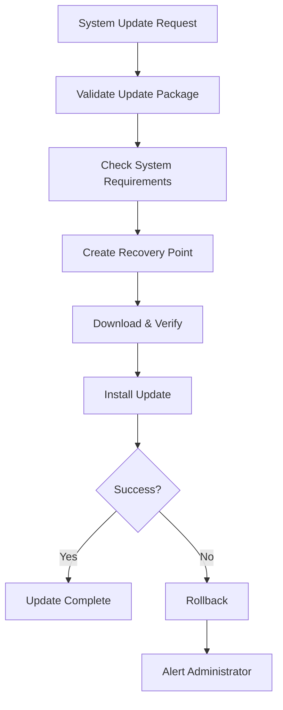
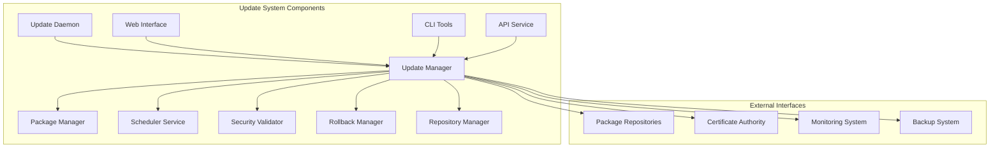

# MultiOS Update System Guide

## Table of Contents
1. [Update System Overview](#update-system-overview)
2. [Architecture & Components](#architecture--components)
3. [Update Package Management](#update-package-management)
4. [Security & Validation](#security--validation)
5. [Update Scheduling](#update-scheduling)
6. [Rollback & Recovery](#rollback--recovery)
7. [Package Repository Management](#package-repository-management)
8. [Delta Updates & Efficiency](#delta-updates--efficiency)
9. [Update System Configuration](#update-system-configuration)
10. [Monitoring & Logging](#monitoring--logging)
11. [Enterprise Deployment](#enterprise-deployment)
12. [Troubleshooting](#troubleshooting)
13. [Best Practices](#best-practices)

---

## Update System Overview

The MultiOS Update System is a comprehensive, enterprise-grade update management platform designed to provide secure, reliable, and efficient system updates across all MultiOS deployments. The system incorporates advanced security measures, intelligent scheduling, automated validation, and robust rollback capabilities.

### Key Features

#### 🔒 Security-First Design
- **Cryptographic Signature Verification**: All updates are digitally signed and verified
- **Integrity Checking**: SHA-256/512 checksum validation prevents corrupted updates
- **Certificate Authority Integration**: PKI-based trust management
- **Malware Detection**: Automated scanning for malicious code
- **Secure Transport**: TLS 1.3 encrypted update distribution

#### 🧠 Intelligent Automation
- **Priority-Based Scheduling**: Critical updates execute immediately
- **Usage Pattern Analysis**: Updates scheduled during low-usage periods
- **Resource-Aware Execution**: Considers system load and available resources
- **Smart Retry Logic**: Exponential backoff prevents system overload
- **Dependency Resolution**: Automatic handling of update dependencies

#### 🔄 Comprehensive Rollback
- **Automatic Recovery Points**: Pre-update system snapshots
- **Granular Rollback**: Rollback individual components or full system
- **Rollback Validation**: Verify rollback integrity before execution
- **Emergency Rollback**: Fast rollback during critical failures
- **Data Preservation**: Ensure user data safety during rollback

#### 📦 Advanced Package Management
- **Delta Updates**: Download only changed portions (95% bandwidth savings)
- **Multi-format Support**: RPM, DEB, tar.gz, MultiOS native packages
- **Local Caching**: Reduce network traffic with intelligent caching
- **Parallel Processing**: Concurrent update installation
- **Atomic Operations**: All-or-nothing update execution

### Update Categories

#### System Updates


#### Update Priority Matrix
| Priority | Type | Response Time | Auto-Install | Description |
|----------|------|---------------|--------------|-------------|
| 0 | Critical Security | Immediate | Yes | Active exploits, vulnerabilities |
| 1 | Security | 24 hours | Yes | Security patches, bug fixes |
| 2 | Important | 1 week | Conditional | System improvements |
| 3 | Optional | Flexible | No | Feature updates, enhancements |
| 4 | Low | Best effort | No | Documentation, translations |

---

## Architecture & Components

### System Architecture



### Core Components

#### Update Manager
```rust
// Central orchestration component
pub struct UpdateManager {
    package_manager: Arc<PackageManager>,
    scheduler: Arc<UpdateScheduler>,
    validator: Arc<UpdateValidator>,
    rollback_manager: Arc<RollbackManager>,
    security_manager: Arc<SecurityManager>,
}

impl UpdateManager {
    // Process update requests
    pub async fn process_update(&self, update: UpdatePackage) -> Result<UpdateResult>;
    
    // Schedule update for later execution
    pub async fn schedule_update(&self, update: UpdatePackage, schedule: ScheduleConfig) -> Result<String>;
    
    // Check for available updates
    pub async fn check_updates(&self) -> Result<Vec<AvailableUpdate>>;
    
    // Rollback to previous version
    pub async fn rollback(&self, target_version: &str) -> Result<RollbackResult>;
}
```

#### Security Validator
```rust
// Comprehensive validation system
pub struct UpdateValidator {
    crypto_manager: Arc<CryptoManager>,
    policy_manager: Arc<PolicyManager>,
    trust_store: TrustStore,
}

impl UpdateValidator {
    // Validate update package signature
    pub fn validate_signature(&self, package: &UpdatePackage) -> Result<SignatureValidation>;
    
    // Verify package integrity
    pub fn verify_integrity(&self, package: &UpdatePackage) -> Result<IntegrityCheck>;
    
    // Analyze update safety
    pub fn analyze_safety(&self, package: &UpdatePackage) -> Result<SafetyAnalysis>;
    
    // Check compatibility
    pub fn check_compatibility(&self, package: &UpdatePackage) -> Result<CompatibilityCheck>;
}
```

#### Update Scheduler
```rust
// Intelligent scheduling system
pub struct UpdateScheduler {
    usage_analyzer: UsageAnalyzer,
    resource_monitor: ResourceMonitor,
    priority_manager: PriorityManager,
}

impl UpdateScheduler {
    // Analyze system usage patterns
    pub fn analyze_usage_patterns(&self) -> Result<UsagePattern>;
    
    // Determine optimal update window
    pub fn find_optimal_window(&self, update: &UpdatePackage) -> Result<TimeWindow>;
    
    // Schedule update with intelligence
    pub fn schedule_update(&self, update: UpdatePackage) -> Result<ScheduledUpdate>;
}
```

### Configuration Files

#### Update System Configuration
```yaml
# /etc/multios/update-system.yml
update_system:
  enabled: true
  auto_check_interval: 3600  # 1 hour
  
  security:
    require_signature: true
    require_integrity_check: true
    trust_level: high
    allowed_signature_algorithms:
      - RSA-4096-SHA256
      - ECC-P384-SHA384
    max_package_size: 2GB
  
  scheduling:
    auto_install: true
    maintenance_window:
      start: "02:00"
      end: "06:00"
      timezone: "UTC"
      allowed_days:
        - sunday
        - wednesday
    priority_handling:
      critical: immediate
      security: within_24h
      important: within_week
      optional: manual
  
  rollback:
    auto_rollback_on_failure: true
    recovery_point_retention: 30d
    maximum_rollback_points: 10
  
  repository:
    sources:
      - name: "primary"
        url: "https://releases.multios.org/stable"
        enabled: true
        priority: 100
      - name: "security"
        url: "https://security.multios.org"
        enabled: true
        priority: 50
    cache:
      enabled: true
      location: "/var/cache/multios/updates"
      max_size: 10GB
      cleanup_policy: lru
  
  notifications:
    enabled: true
    email:
      enabled: true
      recipients:
        - admin@company.com
      smtp_server: "smtp.company.com"
    webhooks:
      enabled: true
      endpoints:
        - url: "https://monitoring.company.com/webhooks/updates"
```

---

## Update Package Management

### Package Format

#### MultiOS Package Structure
```
package.multos (or .mos)
├── metadata/
│   ├── manifest.json         # Package metadata
│   ├── signature.json        # Digital signature
│   └── checksums.json        # File integrity checksums
├── content/
│   ├── files/                # Actual files
│   ├── scripts/              # Installation scripts
│   └── configs/              # Configuration templates
├── dependencies/             # Required dependencies
└── metadata/
    └── version.json          # Version information
```

#### Package Manifest
```json
{
  "package_info": {
    "name": "kernel",
    "version": "1.2.3",
    "release": "1",
    "architecture": "x86_64",
    "type": "kernel",
    "description": "MultiOS Kernel with security patches"
  },
  "update_info": {
    "priority": 1,
    "reboot_required": true,
    "category": "security",
    "replaces": ["kernel-1.2.2"],
    "conflicts": [],
    "provides": []
  },
  "system_requirements": {
    "minimum_version": "1.0.0",
    "maximum_version": "1.9.9",
    "required_features": ["uefi", "secure_boot"],
    "prohibited_features": ["legacy_boot"]
  },
  "installation": {
    "backup_strategy": "full_system",
    "rollback_support": true,
    "atomic_install": true,
    "verification_required": true
  },
  "security": {
    "signature_algorithm": "RSA-4096-SHA256",
    "signer": "MultiOS Security Team",
    "certificate_fingerprint": "SHA256:ABC123...",
    "validity_period": {
      "not_before": "2024-01-01T00:00:00Z",
      "not_after": "2025-01-01T00:00:00Z"
    }
  }
}
```

### Package Operations

#### Creating Packages
```bash
# Create a simple package
multios-package create \
  --name=myapp \
  --version=1.0.0 \
  --type=application \
  --input-directory=/path/to/app \
  --output=myapp-1.0.0.mos

# Create with scripts and metadata
multios-package create \
  --name=webserver \
  --version=2.1.0 \
  --type=service \
  --input-directory=/path/to/webserver \
  --scripts=/path/to/install-scripts \
  --metadata=/path/to/metadata.json \
  --output=webserver-2.1.0.mos

# Create delta package (only changed files)
multios-package create-delta \
  --base-version=1.0.0 \
  --new-version=1.1.0 \
  --input-directory=/path/to/app \
  --output=myapp-1.1.0-delta.mos
```

#### Package Information
```bash
# Show package information
multios-package info package-1.2.3.mos

# List package contents
multios-package list-contents package-1.2.3.mos

# Verify package integrity
multios-package verify package-1.2.3.mos

# Check package dependencies
multios-package check-deps package-1.2.3.mos
```

#### Package Installation
```bash
# Install package with validation
multios-package install package-1.2.3.mos \
  --validate \
  --backup \
  --atomic

# Install multiple packages
multios-package install-batch \
  package1.mos \
  package2.mos \
  package3.mos

# Install with custom configuration
multios-package install \
  package-1.2.3.mos \
  --config=/path/to/config.yml \
  --target-directory=/opt/custom \
  --preserve-config
```

#### Package Removal
```bash
# Remove package
multios-package remove myapp

# Remove with cleanup
multios-package remove \
  myapp \
  --remove-config \
  --remove-data \
  --backup-data

# List removable packages
multios-package list-orphaned
```

### Dependency Management

#### Dependency Resolution
```bash
# Install with automatic dependency resolution
multios-package install \
  application-package.mos \
  --resolve-dependencies \
  --install-recommended

# Check for dependency conflicts
multios-package check-conflicts \
  package1.mos \
  package2.mos \
  package3.mos

# Show dependency tree
multios-package show-dependencies application-package.mos
```

#### Dependency Strategies
```yaml
# /etc/multios/dependency-policy.yml
dependency_policy:
  resolution_strategy: prefer_distros
  
  conflict_handling:
    package_conflicts:
      - action: "ask_user"
        severity: "medium"
      - action: "skip_conflicting"
        severity: "low"
      - action: "force_install"
        severity: "critical"
  
  version_constraints:
    minimum_similarity: 0.8
    prefer_newer: true
    allow_downgrade: false
  
  resolution_methods:
    - "dependency_graph"
    - "constraint_satisfaction"
    - "backtrack_search"
```

---

## Security & Validation

### Security Framework

#### Cryptographic Validation
```rust
pub struct SecurityValidator {
    certificate_manager: Arc<CertificateManager>,
    signature_verifier: Arc<SignatureVerifier>,
    integrity_checker: Arc<IntegrityChecker>,
    policy_manager: Arc<SecurityPolicyManager>,
}

impl SecurityValidator {
    pub fn validate_update_package(&self, package: &UpdatePackage) -> Result<ValidationResult> {
        // 1. Check package format and structure
        self.validate_package_format(package)?;
        
        // 2. Verify digital signature
        self.verify_signature(package)?;
        
        // 3. Verify certificate chain
        self.verify_certificate_chain(package)?;
        
        // 4. Check integrity
        self.verify_integrity(package)?;
        
        // 5. Validate security policy compliance
        self.validate_security_policy(package)?;
        
        Ok(ValidationResult::Success)
    }
}
```

#### Trust Management
```bash
# Add trusted certificate authority
multios-update trust add-ca \
  --name="MultiOS Security Team" \
  --certificate=/path/to/ca-cert.pem \
  --fingerprint=sha256:ABC123...

# List trusted authorities
multios-update trust list-cas

# Remove trusted authority
multios-update trust remove-ca --id=ca-123

# Verify update with trust store
multios-update verify-trust \
  --package=kernel-1.2.3.mos \
  --strict-mode
```

### Security Policies

#### Security Configuration
```yaml
# /etc/multios/security-policy.yml
security_policy:
  update_validation:
    required_signature: true
    require_strong_signature: true
    allowed_signature_algorithms:
      - "RSA-4096-SHA256"
      - "ECC-P384-SHA384"
      - "RSA-2048-SHA256"
    
    integrity_checking:
      enabled: true
      algorithms: ["SHA-256", "SHA-512", "BLAKE2b"]
      verify_embedded_checksums: true
      verify_package_size: true
    
    trust_requirements:
      minimum_trust_level: "high"
      require_certified_publisher: true
      allow_untrusted_publisher: false
    
  installation_safety:
    require_backup: true
    require_rollback_support: true
    maximum_package_size: "2GB"
    allow_unsigned_packages: false
    
    risk_assessment:
      enabled: true
      factors:
        - "security_vulnerabilities"
        - "system_stability"
        - "data_loss_risk"
        - "compatibility_issues"
      maximum_acceptable_risk: 30
```

#### Automated Security Analysis
```bash
# Analyze package security
multios-update analyze-security \
  --package=kernel-1.2.3.mos \
  --output=security-analysis.json

# Check for known vulnerabilities
multios-update check-vulnerabilities \
  --package=package.mos \
  --cve-database=/var/lib/cve.db

# Generate safety score
multios-update calculate-safety-score \
  --package=kernel-1.2.3.mos \
  --format=json
```

### Risk Assessment

#### Safety Analysis
```rust
pub struct SafetyAnalyzer {
    vulnerability_scanner: Arc<VulnerabilityScanner>,
    compatibility_analyzer: Arc<CompatibilityAnalyzer>,
    impact_assessor: Arc<ImpactAssessor>,
}

pub struct SafetyAnalysis {
    pub overall_risk_score: u8, // 0-100 (lower is safer)
    pub risk_breakdown: RiskBreakdown,
    pub recommendations: Vec<SafetyRecommendation>,
    pub warnings: Vec<SafetyWarning>,
    pub estimated_installation_time: Duration,
    pub resource_requirements: ResourceRequirements,
}

impl SafetyAnalyzer {
    pub fn analyze_package(&self, package: &UpdatePackage) -> Result<SafetyAnalysis> {
        let mut analysis = SafetyAnalysis::new();
        
        // Analyze security risks
        analysis.add_security_analysis(self.scan_vulnerabilities(package)?);
        
        // Analyze stability risks
        analysis.add_stability_analysis(self.assess_stability_impact(package)?);
        
        // Analyze compatibility
        analysis.add_compatibility_analysis(self.check_compatibility(package)?);
        
        // Calculate overall risk score
        analysis.calculate_overall_score();
        
        Ok(analysis)
    }
}
```

#### Risk Factors
| Risk Category | Factors | Weight | Mitigation |
|---------------|---------|--------|------------|
| Security | Known CVEs, Zero-day exploits | 40% | Emergency patches, isolation |
| Stability | System crashes, service failures | 30% | Thorough testing, rollback |
| Performance | CPU/memory impact, slowdown | 20% | Load balancing, scheduling |
| Data Integrity | File corruption, data loss | 10% | Backup, atomic operations |

---

## Update Scheduling

### Intelligent Scheduling System

#### Usage Pattern Analysis
```rust
pub struct UsageAnalyzer {
    metrics_collector: Arc<MetricsCollector>,
    pattern_analyzer: Arc<PatternAnalyzer>,
    prediction_model: Arc<PredictionModel>,
}

impl UsageAnalyzer {
    pub fn analyze_usage_patterns(&self) -> Result<UsagePattern> {
        let metrics = self.metrics_collector.collect_metrics(TimeRange::LastWeek)?;
        
        let pattern = UsagePattern {
            peak_hours: self.identify_peak_hours(&metrics),
            low_usage_windows: self.identify_low_usage_windows(&metrics),
            resource_availability: self.calculate_resource_availability(&metrics),
            user_activity_patterns: self.analyze_user_activity(&metrics),
            workload_characteristics: self.characterize_workload(&metrics),
        };
        
        Ok(pattern)
    }
}
```

#### Scheduling Configuration
```yaml
# /etc/multios/scheduling-policy.yml
scheduling_policy:
  # Automatic scheduling settings
  auto_scheduling:
    enabled: true
    respect_user_activity: true
    consider_system_load: true
    prefer_maintenance_windows: true
  
  # Maintenance windows
  maintenance_windows:
    - name: "primary"
      start_time: "02:00"
      end_time: "06:00"
      timezone: "UTC"
      days:
        - sunday
        - wednesday
      allowed_update_types:
        - security
        - important
        - optional
      
  # Resource constraints
  resource_awareness:
    cpu_threshold: 80  # Don't schedule if CPU > 80%
    memory_threshold: 90  # Don't schedule if memory > 90%
    disk_io_threshold: 70  # Don't schedule if disk IO > 70%
    active_sessions_threshold: 50  # Don't schedule if > 50 active sessions
  
  # Priority-based scheduling
  priority_handling:
    critical:
      schedule_immediately: true
      override_constraints: true
      notification_level: "urgent"
    
    security:
      schedule_within: "24h"
      allow_maintenance_window: true
      notification_level: "important"
    
    important:
      schedule_within: "7d"
      require_maintenance_window: false
      notification_level: "standard"
    
    optional:
      schedule_within: "30d"
      require_low_system_load: true
      notification_level: "info"
```

### Scheduling Operations

#### Manual Scheduling
```bash
# Schedule update for specific time
multios-update schedule \
  --package=kernel-1.2.3.mos \
  --execute-at="2024-01-15 02:30:00" \
  --priority=security \
  --notification=email \
  --backup-required

# Schedule with conditions
multios-update schedule-conditional \
  --package=security-patch.mos \
  --conditions="cpu_usage<50,no_active_sessions,maintenance_window" \
  --timeout="24h" \
  --auto-cancel

# Schedule batch update
multios-update schedule-batch \
  --packages="pkg1.mos,pkg2.mos,pkg3.mos" \
  --strategy=parallel \
  --max-concurrent=2 \
  --stop-on-error=false
```

#### Automatic Scheduling
```bash
# Enable automatic scheduling
multios-update auto-schedule enable \
  --policy=default \
  --max-concurrent-updates=3

# Configure scheduling policy
multios-update auto-schedule configure \
  --maintenance-window="02:00-06:00" \
  --preferred-days="sunday,wednesday" \
  --user-approval-required=false \
  --auto-approval-security=true

# View scheduled updates
multios-update schedule list \
  --filter=pending \
  --format=table
```

#### Priority Management
```bash
# Change update priority
multios-update priority set \
  --update-id=update-123 \
  --priority=critical \
  --reason="Security vulnerability"

# List updates by priority
multios-update priority list \
  --sort-by=priority \
  --group-by=category
```

### Retry Logic

#### Retry Configuration
```yaml
retry_policy:
  max_attempts: 3
  base_delay: 300s  # 5 minutes
  backoff_multiplier: 2.0
  max_delay: 3600s  # 1 hour
  
  # Exponential backoff calculation
  # delay_n = base_delay * (backoff_multiplier ^ (attempt - 1))
  # delay_1 = 300s
  # delay_2 = 600s
  # delay_3 = 1200s
  
  error_categories:
    network_error:
      retry: true
      max_attempts: 5
      backoff_multiplier: 1.5
    
    package_corruption:
      retry: false
      action: "immediate_failure"
    
    system_requirements:
      retry: true
      max_attempts: 2
      backoff_multiplier: 3.0
```

#### Retry Operations
```bash
# Manual retry
multios-update retry --update-id=update-123

# Retry with different parameters
multios-update retry \
  --update-id=update-123 \
  --max-attempts=5 \
  --force-download

# Cancel pending retries
multios-update retry cancel --update-id=update-123
```

---

## Rollback & Recovery

### Recovery Point System

#### Automatic Recovery Points
```rust
pub struct RecoveryManager {
    snapshot_manager: Arc<SnapshotManager>,
    storage_manager: Arc<StorageManager>,
    validation_service: Arc<ValidationService>,
}

impl RecoveryManager {
    pub fn create_recovery_point(&self, update: &UpdatePackage) -> Result<RecoveryPoint> {
        // 1. Determine scope of recovery point
        let scope = self.determine_recovery_scope(update)?;
        
        // 2. Create system snapshot
        let snapshot = self.snapshot_manager.create_snapshot(scope)?;
        
        // 3. Verify snapshot integrity
        self.validation_service.verify_snapshot(&snapshot)?;
        
        // 4. Store recovery metadata
        let recovery_point = RecoveryPoint {
            id: Uuid::new_v4(),
            snapshot_id: snapshot.id,
            update_info: update.metadata.clone(),
            created_at: SystemTime::now(),
            estimated_size: snapshot.size,
            validation_hash: snapshot.validation_hash,
        };
        
        // 5. Save recovery point metadata
        self.save_recovery_point(&recovery_point)?;
        
        Ok(recovery_point)
    }
}
```

#### Recovery Point Operations
```bash
# List recovery points
multios-update recovery list \
  --filter=last-30-days \
  --format=table

# Show recovery point details
multios-update recovery info \
  --recovery-point=rp-12345 \
  --details

# Create manual recovery point
multios-update recovery create \
  --description="Before software installation" \
  --scope=full-system \
  --tags="manual,pre-install"

# Cleanup old recovery points
multios-update recovery cleanup \
  --older-than="90 days" \
  --keep-minimum=5 \
  --simulate
```

### Rollback Operations

#### Automatic Rollback
```bash
# Enable automatic rollback on failure
multios-update rollback auto-enable \
  --on-failure=true \
  --on-timeout=true \
  --on-installation-error=true

# Configure rollback criteria
multios-update rollback criteria \
  --failure-threshold=100 \
  --timeout-threshold=3600s \
  --error-categories="installation,dependency,signature"

# View rollback history
multios-update rollback history \
  --format=json \
  --include-reason
```

#### Manual Rollback
```bash
# Rollback to specific version
multios-update rollback \
  --target-version=1.2.2 \
  --recovery-point=rp-12345 \
  --preserve-user-data

# Rollback to last working state
multios-update rollback last-good

# Emergency rollback (fastest method)
multios-update rollback emergency \
  --keep-system-functional

# Interactive rollback
multios-update rollback interactive \
  --show-options \
  --confirm-before-execute
```

#### Granular Rollback
```bash
# Rollback specific package
multios-update rollback package \
  --package=kernel \
  --version=1.2.2

# Rollback configuration only
multios-update rollback config \
  --component=network \
  --backup-point=before-update

# Rollback with conflict resolution
multios-update rollback \
  --target-version=1.2.2 \
  --resolve-conflicts \
  --merge-strategy=prefer-newer
```

### Data Protection

#### Data Preservation
```rust
pub struct DataProtectionManager {
    backup_coordinator: Arc<BackupCoordinator>,
    data_classifier: Arc<DataClassifier>,
    preservation_strategy: PreservationStrategy,
}

impl DataProtectionManager {
    pub fn preserve_user_data(&self, rollback_scope: &RollbackScope) -> Result<PreservationResult> {
        // 1. Classify data by importance
        let classified_data = self.data_classifier.classify_data(rollback_scope)?;
        
        // 2. Create backups for critical data
        let backup_jobs = classified_data.into_iter()
            .filter(|(_, data)| data.criticality >= Criticality::High)
            .map(|(_, data)| self.create_backup_job(data))
            .collect::<Result<Vec<_>>>()?;
        
        // 3. Execute backups in parallel
        let backup_results = self.backup_coordinator.execute_parallel(backup_jobs)?;
        
        // 4. Verify backup integrity
        for result in &backup_results {
            self.verify_backup_integrity(result)?;
        }
        
        Ok(PreservationResult {
            backed_up_items: backup_results.len(),
            backup_locations: backup_results.iter().map(|r| r.location.clone()).collect(),
            verification_status: VerificationStatus::AllPassed,
        })
    }
}
```

#### Data Recovery
```bash
# List protected data
multios-update data-protection list-protected \
  --filter=critical,important

# Backup specific directory
multios-update data-protection backup \
  --path=/home/user \
  --destination=/backup/home \
  --compression=gzip

# Restore user data after rollback
multios-update data-protection restore \
  --source=/backup/home \
  --destination=/home/user \
  --interactive \
  --preserve-permissions

# Validate data integrity
multios-update data-protection verify-integrity \
  --backup-id=backup-123 \
  --detailed
```

---

## Package Repository Management

### Repository Configuration

#### Repository Types
```yaml
# /etc/multios/repositories.yml
repositories:
  - name: "primary-stable"
    type: "remote"
    url: "https://releases.multios.org/stable"
    enabled: true
    priority: 100
    components:
      - "main"
      - "restricted"
      - "universe"
      - "multiverse"
    
  - name: "security-updates"
    type: "remote"
    url: "https://security.multios.org/updates"
    enabled: true
    priority: 50
    components:
      - "security"
    
  - name: "local-company"
    type: "local"
    path: "/var/lib/multios/local"
    enabled: true
    priority: 200
    mirror_of: null
    
  - name: "enterprise-mirror"
    type: "mirror"
    source: "primary-stable"
    url: "https://mirror.company.com/multios"
    enabled: true
    priority: 150
    sync_schedule: "0 */6 * * *"  # Every 6 hours
```

#### Repository Operations
```bash
# Add repository
multios-repo add \
  --name=enterprise-repo \
  --url=https://repo.company.com/multios \
  --priority=100 \
  --components="enterprise,custom" \
  --enabled=true

# Enable/disable repository
multios-repo disable --name=unstable-repo
multios-repo enable --name=enterprise-repo

# Update repository metadata
multios-repo update --name=primary-stable

# Remove repository
multios-repo remove --name=old-repo

# Verify repository
multios-repo verify --name=primary-stable \
  --check-signatures \
  --strict-mode
```

### Local Repository Management

#### Creating Local Mirrors
```bash
# Create local mirror
multios-repo mirror create \
  --source=https://releases.multios.org/stable \
  --destination=/var/lib/multios/mirror \
  --components="main,restricted,universe" \
  --architectures="x86_64,arm64" \
  --incremental=true

# Sync mirror
multios-repo mirror sync \
  --mirror=primary-mirror \
  --incremental=true \
  --verify-freshness

# Mirror health check
multios-repo mirror health-check \
  --mirror=primary-mirror
```

#### Publishing Packages
```bash
# Publish package to local repository
multios-repo publish \
  --package=myapp-1.0.0.mos \
  --repository=local-company \
  --component=custom \
  --sign-package

# Publish batch packages
multios-repo publish-batch \
  --packages="*.mos" \
  --repository=local-company \
  --component=enterprise \
  --replace-existing

# Generate repository metadata
multios-repo generate-metadata \
  --repository=local-company \
  --formats=["deb","rpm","multios"] \
  --sign-metadata
```

### Repository Security

#### Certificate Management
```bash
# Generate repository signing key
multios-repo key generate \
  --type=rsa \
  --key-size=4096 \
  --name=company-repo-key \
  --export=/etc/multios/keys/repo-key.gpg

# Sign repository metadata
multios-repo sign-metadata \
  --repository=local-company \
  --key=/etc/multios/keys/repo-key.gpg

# Verify repository signatures
multios-repo verify-signatures \
  --repository=primary-stable \
  --strict-mode
```

#### Access Control
```yaml
# /etc/multios/repo-access.yml
repository_access:
  local-company:
    read_access:
      users: ["admin", "developer", "qa"]
      groups: ["company-users"]
      networks: ["192.168.1.0/24"]
    
    write_access:
      users: ["publisher"]
      groups: ["repo-maintainers"]
    
    policies:
      require_ssl: true
      require_authentication: true
      rate_limit: 1000  # requests per hour
```

---

## Delta Updates & Efficiency

### Delta Update System

#### Binary Delta Algorithm
```rust
pub struct BinaryDelta {
    diff_engine: Arc<DiffEngine>,
    compression_engine: Arc<CompressionEngine>,
    validator: Arc<DeltaValidator>,
}

impl BinaryDelta {
    pub fn create_delta(&self, old_file: &Path, new_file: &Path) -> Result<BinaryDelta> {
        // 1. Read both files
        let old_data = fs::read(old_file)?;
        let new_data = fs::read(new_file)?;
        
        // 2. Generate binary diff
        let diff = self.diff_engine.generate_diff(&old_data, &new_data)?;
        
        // 3. Compress delta
        let compressed_delta = self.compression_engine.compress(&diff)?;
        
        // 4. Create delta package
        let delta_package = DeltaPackage {
            source_version: self.get_file_version(old_file)?,
            target_version: self.get_file_version(new_file)?,
            delta_data: compressed_delta,
            validation_info: self.calculate_validation_info(&diff)?,
        };
        
        Ok(delta_package)
    }
}
```

#### Delta Update Statistics
| File Type | Typical Delta Size | Compression Ratio | Generation Time |
|-----------|-------------------|-------------------|-----------------|
| Text files | 5-15% of original | 70-90% | 1-5 seconds |
| Binaries | 10-30% of original | 50-80% | 5-20 seconds |
| Images | 15-40% of original | 30-70% | 10-60 seconds |
| Archives | 5-25% of original | 60-85% | 2-10 seconds |

### Efficient Update Strategies

#### Bandwidth Optimization
```bash
# Configure delta update settings
multios-update config set \
  --section=delta_updates \
  --enable-delta=true \
  --delta-threshold=100KB \
  --max-delta-size=500MB

# Force delta update
multios-update install \
  package-1.1.0.mos \
  --force-delta \
  --bandwidth-limit=10MB/s

# Check delta availability
multios-update check-delta \
  --current-version=1.0.0 \
  --target-version=1.1.0 \
  --package-name=kernel
```

#### Caching Strategy
```bash
# Configure update cache
multios-update cache configure \
  --location=/var/cache/multios/updates \
  --max-size=10GB \
  --retention=30d \
  --compression=lz4

# Pre-cache updates
multios-update cache pre-cache \
  --packages="kernel-*.mos,security-*.mos" \
  --bandwidth-limit=off-peak

# Clean cache
multios-update cache clean \
  --older-than="7 days" \
  --remove-unused=true \
  --simulate
```

#### Concurrent Updates
```bash
# Configure parallel installation
multios-update config set \
  --max-concurrent-updates=4 \
  --max-concurrent-downloads=2 \
  --max-concurrent-installations=2

# Install with parallel processing
multios-update install-batch \
  pkg1.mos pkg2.mos pkg3.mos pkg4.mos \
  --parallel-install=true \
  --stop-on-error=false
```

### Update Size Optimization

#### File Deduplication
```rust
pub struct FileDeduplicator {
    hash_calculator: Arc<HashCalculator>,
    storage_manager: Arc<StorageManager>,
}

impl FileDeduplicator {
    pub fn deduplicate_files(&self, files: &[FileInfo]) -> Result<DeduplicationResult> {
        // 1. Calculate file hashes
        let hashes = self.calculate_file_hashes(files)?;
        
        // 2. Group identical files
        let file_groups = self.group_files_by_hash(&hashes)?;
        
        // 3. Create deduplication map
        let mut dedup_map = HashMap::new();
        for group in file_groups {
            if group.files.len() > 1 {
                let canonical_file = &group.files[0];
                for duplicate in &group.files[1..] {
                    dedup_map.insert(duplicate.path.clone(), canonical_file.path.clone());
                }
            }
        }
        
        Ok(DeduplicationResult { map: dedup_map })
    }
}
```

#### Compression Strategies
```yaml
# /etc/multios/compression.yml
compression:
  strategies:
    # For different file types
    text_files:
      algorithm: "gzip"
      level: 6
      threshold: "1KB"
    
    binary_files:
      algorithm: "lz4"
      level: 1
      threshold: "10KB"
    
    image_files:
      algorithm: "zstd"
      level: 3
      threshold: "100KB"
    
    archive_files:
      algorithm: "zstd"
      level: 6
      threshold: "1KB"
  
  # Compression heuristics
  heuristics:
    minimum_compression_ratio: 0.8
    compression_time_limit: 30s
    memory_limit: 512MB
```

---

## Update System Configuration

### System Configuration

#### Main Configuration
```yaml
# /etc/multios/update-system.yml
update_system:
  # Global settings
  version: "2.0"
  debug: false
  log_level: "info"
  log_rotation:
    max_size: "100MB"
    max_files: 10
    compress: true
  
  # Core services
  services:
    update_manager:
      enabled: true
      port: 8080
      workers: 4
      max_concurrent_updates: 3
    
    scheduler:
      enabled: true
      check_interval: 3600s
      scheduling_precision: 300s
    
    validator:
      enabled: true
      threads: 2
      cache_size: "1GB"
    
    repository:
      enabled: true
      cache_location: "/var/cache/multios/repo"
      mirror_timeout: 300s
  
  # Feature toggles
  features:
    delta_updates: true
    parallel_downloads: true
    auto_cleanup: true
    pre_update_checks: true
    post_update_verification: true
    user_notifications: true
    emergency_updates: true
```

#### Component Configuration
```bash
# Update system-wide settings
multios-update config set \
  --auto-check-enabled=true \
  --auto-check-interval=3600s \
  --require-root-permission=false \
  --allow-downgrade=true

# Configure logging
multios-update log configure \
  --level=info \
  --file=/var/log/multios/update.log \
  --max-size=100MB \
  --max-files=10 \
  --console-output=true

# Configure network settings
multios-update network configure \
  --timeout=300s \
  --retry-count=3 \
  --proxy-url=http://proxy.company.com:8080 \
  --bandwidth-limit=10MB/s \
  --concurrent-downloads=4
```

### User Configuration

#### Per-User Settings
```bash
# Set user preferences
multios-update user-config set \
  --user=john \
  --auto-install-security=false \
  --notification-level=normal \
  --backup-required=true

# View user configuration
multios-update user-config get --user=john

# Reset user configuration
multios-update user-config reset --user=john --confirm
```

#### Policy Templates
```bash
# Create custom policy template
multios-update policy create \
  --name=office-environment \
  --description="Office desktop environment policy" \
  --auto-install-security=true \
  --auto-install-important=false \
  --maintenance-window="18:00-08:00" \
  --backup-required=true

# Apply policy template
multios-update policy apply \
  --template=office-environment \
  --target-systems=desktop-*

# List available templates
multios-update policy list-templates
```

### Environment-Specific Configuration

#### Development Environment
```yaml
# /etc/multios/environments/development.yml
development:
  update_policy:
    auto_install: false
    require_approval: true
    allow_testing_packages: true
  
  repository:
    sources:
      - name: "development"
        url: "https://dev-repo.multios.org"
        enabled: true
        priority: 50
  
  notifications:
    email: "dev-team@company.com"
    slack: "dev-updates"
  
  testing:
    enable_testing: true
    test_environment: true
    validate_before_install: true
```

#### Production Environment
```yaml
# /etc/multios/environments/production.yml
production:
  update_policy:
    auto_install: true
    require_approval: false
    safety_validation_required: true
    rollback_required: true
  
  repository:
    sources:
      - name: "stable"
        url: "https://releases.multios.org/stable"
        enabled: true
        priority: 100
      - name: "security"
        url: "https://security.multios.org"
        enabled: true
        priority: 50
  
  monitoring:
    enable_monitoring: true
    alerting: true
    logging: "verbose"
```

---

## Monitoring & Logging

### System Monitoring

#### Real-time Monitoring
```bash
# Start monitoring dashboard
multios-update monitoring dashboard start \
  --port=8080 \
  --ssl-enabled=true \
  --authentication=basic \
  --admin-user=admin

# Monitor update progress
multios-update monitoring progress \
  --update-id=update-123 \
  --real-time=true \
  --detailed

# System health check
multios-update monitoring health-check \
  --comprehensive=true \
  --output=health-report.json
```

#### Metrics Collection
```rust
pub struct MetricsCollector {
    update_metrics: Arc<RwLock<UpdateMetrics>>,
    performance_metrics: Arc<RwLock<PerformanceMetrics>>,
    system_metrics: Arc<RwLock<SystemMetrics>>,
}

#[derive(Debug, Clone)]
pub struct UpdateMetrics {
    pub total_updates: u64,
    pub successful_updates: u64,
    pub failed_updates: u64,
    pub average_install_time: Duration,
    pub rollback_count: u64,
    pub user_approved_updates: u64,
    pub auto_installed_updates: u64,
}

impl MetricsCollector {
    pub fn collect_update_metrics(&self) -> Result<UpdateMetrics> {
        let metrics = self.update_metrics.read().unwrap();
        Ok(metrics.clone())
    }
    
    pub fn record_update_completion(&self, result: &UpdateResult) {
        let mut metrics = self.update_metrics.write().unwrap();
        metrics.total_updates += 1;
        
        match result.status {
            UpdateStatus::Success => metrics.successful_updates += 1,
            UpdateStatus::Failed => metrics.failed_updates += 1,
            UpdateStatus::RolledBack => metrics.rollback_count += 1,
        }
    }
}
```

#### Alert Configuration
```yaml
# /etc/multios/alerting.yml
alerting:
  enabled: true
  
  channels:
    email:
      enabled: true
      smtp_server: "smtp.company.com"
      recipients:
        - "admin@company.com"
        - "ops-team@company.com"
      severity_mapping:
        critical: ["admin@company.com"]
        high: ["ops-team@company.com"]
        medium: ["team-lead@company.com"]
        low: ["ops@company.com"]
    
    slack:
      enabled: true
      webhook_url: "https://hooks.slack.com/services/..."
      channel: "#system-updates"
    
    pagerduty:
      enabled: true
      integration_key: "YOUR_PD_KEY"
      escalation_policy: "update-system-escalation"
  
  rules:
    - name: "update_failure"
      condition: "failed_updates > 0"
      severity: "high"
      channels: ["email", "slack"]
      cooldown: 300s
    
    - name: "rollback_triggered"
      condition: "rollback_count > 0"
      severity: "critical"
      channels: ["email", "slack", "pagerduty"]
      immediate: true
```

### Logging System

#### Log Configuration
```yaml
# /etc/multios/logging.yml
logging:
  root_level: "info"
  
  handlers:
    file:
      type: "file"
      path: "/var/log/multios/update.log"
      level: "info"
      rotation:
        max_size: "100MB"
        max_files: 10
        compress: true
    
    console:
      type: "console"
      level: "warn"
      format: "timestamp,level,message"
    
    syslog:
      type: "syslog"
      facility: "local0"
      level: "error"
  
  loggers:
    update_manager:
      level: "debug"
      handlers: ["file", "console"]
    
    security_validator:
      level: "info"
      handlers: ["file", "syslog"]
    
    scheduler:
      level: "info"
      handlers: ["file"]
```

#### Log Analysis
```bash
# View recent logs
multios-update logs view \
  --last="1 hour" \
  --level=info \
  --format=json

# Search logs for errors
multios-update logs search \
  --pattern="error|failed" \
  --time-range="today" \
  --interactive

# Generate log report
multios-update logs report \
  --start="2024-01-01" \
  --end="2024-01-31" \
  --format=html \
  --output=update-logs-report.html

# Real-time log tail
multios-update logs tail \
  --follow \
  --level=info \
  --filter="update_id:*"
```

### Performance Monitoring

#### Performance Metrics
```bash
# Collect performance metrics
multios-update performance collect \
  --duration=1h \
  --interval=60s \
  --metrics="cpu,memory,network,disk" \
  --output=performance-metrics.json

# Generate performance report
multios-update performance report \
  --input=performance-metrics.json \
  --format=html \
  --output=performance-report.html \
  --include-charts

# Benchmark update process
multios-update performance benchmark \
  --package=kernel-1.2.3.mos \
  --iterations=5 \
  --detailed
```

#### Resource Usage
```bash
# Monitor update resource usage
multios-update resource monitor \
  --update-id=update-123 \
  --metrics=cpu,memory,disk_io,network_io \
  --real-time=true

# Set resource limits
multios-update resource limits \
  --max-cpu=80% \
  --max-memory=2GB \
  --max-disk-io=100MB/s \
  --max-network=10MB/s

# Report resource consumption
multios-update resource report \
  --time-range="last-week" \
  --group-by=update-type \
  --format=csv
```

---

## Enterprise Deployment

### Large-Scale Deployment

#### Cluster Configuration
```yaml
# /etc/multios/cluster.yml
cluster:
  name: "production-cluster"
  nodes:
    - name: "node-01"
      role: "primary"
      ip: "192.168.1.10"
      tags: ["web", "primary"]
    
    - name: "node-02"
      role: "secondary"
      ip: "192.168.1.11"
      tags: ["web", "secondary"]
    
    - name: "node-03"
      role: "worker"
      ip: "192.168.1.12"
      tags: ["worker", "background"]
  
  coordination:
    leader_election: true
    heartbeat_interval: 5s
    election_timeout: 15s
    consensus_backend: "raft"
  
  load_balancing:
    strategy: "round_robin"
    health_check_interval: 30s
    failure_threshold: 3
    recovery_threshold: 2
```

#### Distributed Scheduling
```bash
# Configure cluster scheduling
multios-update cluster configure \
  --nodes=node-01,node-02,node-03 \
  --coordinator=node-01 \
  --election-timeout=15s

# Distribute update across cluster
multios-update cluster distribute \
  --update=kernel-1.2.3.mos \
  --strategy=rolling \
  --batch-size=1 \
  --delay-between-batches=300s \
  --stop-on-error=true

# Monitor cluster update
multios-update cluster monitor \
  --update-id=cluster-update-123 \
  --real-time=true
```

### Configuration Management

#### Policy-Based Updates
```yaml
# /etc/multios/enterprise-policies.yml
enterprise_policies:
  default_policy:
    auto_install_security: true
    auto_install_important: false
    require_approval: true
    maintenance_window: "02:00-06:00"
    allow_downgrade: false
    backup_required: true
  
  environment_policies:
    production:
      inherit_from: "default_policy"
      auto_install_security: true
      require_approval: false
      testing_environment: false
    
    staging:
      inherit_from: "default_policy"
      auto_install_security: true
      require_approval: false
      testing_environment: true
    
    development:
      inherit_from: "default_policy"
      auto_install_security: false
      require_approval: true
      allow_testing_packages: true
  
  department_policies:
    engineering:
      inherit_from: "development"
      allow_testing_packages: true
      priority_overrides:
        development_tools: "important"
    
    operations:
      inherit_from: "production"
      notification_email: "ops@company.com"
      emergency_contact: "oncall@company.com"
    
    hr:
      inherit_from: "default_policy"
      auto_install_important: false
      require_approval: true
```

#### Centralized Configuration
```bash
# Deploy configuration to cluster
multios-update config deploy \
  --config-file=enterprise-policies.yml \
  --target-nodes=production-* \
  --validate-config=true

# Update policy across departments
multios-update policy deploy \
  --policy-name=engineering \
  --target-groups=engineering-laptops,engineering-servers \
  --schedule="maintenance-window"

# Validate deployed configuration
multios-update config validate \
  --nodes=production-* \
  --comprehensive=true
```

### High Availability

#### HA Configuration
```yaml
# /etc/multios/high-availability.yml
high_availability:
  enabled: true
  
  failover:
    primary_server: "update-server-01"
    backup_servers:
      - "update-server-02"
      - "update-server-03"
    
    health_check:
      interval: 30s
      timeout: 5s
      failure_threshold: 3
    
    failover_strategy:
      automatic: true
      validation_required: true
      pre_failover_checks: true
  
  load_balancing:
    algorithm: "least_connections"
    health_checks: true
    sticky_sessions: false
    session_affinity: "source_ip"
  
  data_replication:
    method: "synchronous"
    quorum: 2
    consistency_level: "strong"
    replication_factor: 3
```

#### HA Operations
```bash
# Initialize HA cluster
multios-update ha init \
  --cluster-name=production-updates \
  --nodes=server-01,server-02,server-03 \
  --consensus-method=raft

# Promote backup server
multios-update ha promote \
  --server=server-02 \
  --reason="primary-failure"

# Monitor HA cluster
multios-update ha monitor \
  --cluster-name=production-updates \
  --real-time=true

# Test failover
multios-update ha test-failover \
  --cluster-name=production-updates \
  --simulate-primary-failure
```

### Compliance & Auditing

#### Compliance Framework
```yaml
# /etc/multios/compliance.yml
compliance:
  frameworks:
    - name: "CIS"
      version: "1.0"
      requirements:
        - "automated_updates_enabled"
        - "security_updates_installed_24h"
        - "update_logging_enabled"
        - "rollback_capability_verified"
    
    - name: "SOX"
      version: "2013"
      requirements:
        - "update_approval_required"
        - "change_control_process"
        - "audit_trail_maintained"
        - "segregation_of_duties"
    
    - name: "HIPAA"
      version: "2024"
      requirements:
        - "encryption_required"
        - "access_controls_enforced"
        - "audit_logging_comprehensive"
        - "data_backup_verified"
  
  reporting:
    scheduled_reports:
      - framework: "CIS"
        frequency: "monthly"
        recipients: ["compliance@company.com"]
      - framework: "SOX"
        frequency: "quarterly"
        recipients: ["sox-compliance@company.com"]
```

#### Audit Trail
```bash
# Generate compliance report
multios-update compliance report \
  --framework=CIS \
  --period=last-month \
  --format=pdf \
  --output=compliancereport.pdf

# Audit update activities
multios-update audit trail \
  --time-range="2024-01-01..2024-01-31" \
  --events="update_installed,update_rolledback,approval_granted" \
  --format=json

# Verify compliance controls
multios-update compliance verify \
  --framework=SOX \
  --controls="change_control,audit_trail,access_controls" \
  --detailed
```

---

## Troubleshooting

### Common Issues

#### Update Failures
```bash
# Diagnose update failure
multios-update troubleshoot failure \
  --update-id=update-123 \
  --diagnosis-level=detailed \
  --include-logs=true

# Common failure scenarios and solutions
```

| Error Code | Issue | Solution |
|------------|-------|----------|
| E001 | Package signature invalid | Update trust store, verify certificate |
| E002 | Dependency resolution failed | Check package dependencies, update repositories |
| E003 | Insufficient disk space | Clean cache, free disk space, resize partition |
| E004 | Network timeout | Check network connectivity, adjust timeout |
| E005 | System requirements not met | Verify system compatibility |
| E006 | Update conflicts detected | Resolve conflicts, use force flag |
| E007 | Backup creation failed | Check storage, increase backup space |

#### System Recovery
```bash
# Emergency system recovery
multios-update emergency recovery \
  --mode=safe \
  --preserve-data=true \
  --validate-system=true

# Check system integrity after failed update
multios-update system verify \
  --comprehensive=true \
  --check-dependencies=true \
  --verify-signatures=true

# Force system to stable state
multios-update system restore-stable \
  --last-known-good \
  --interactive
```

### Debugging Tools

#### Debug Mode
```bash
# Enable debug logging
multios-update debug enable \
  --level=verbose \
  --components="all" \
  --output-file=/var/log/multios/debug.log

# Run update in debug mode
multios-update install \
  package-1.2.3.mos \
  --debug \
  --verbose \
  --no-silent-errors

# Capture system state
multios-update debug capture-state \
  --include-memory=true \
  --include-processes=true \
  --include-network=true \
  --output=system-state.tar.gz
```

#### Log Analysis
```bash
# Analyze error patterns
multios-update logs analyze-errors \
  --time-range="last-week" \
  --group-by=error-code \
  --find-patterns=true

# Extract relevant logs
multios-update logs extract \
  --update-id=update-123 \
  --time-range="update-window" \
  --log-levels="error,warn" \
  --output=relevant-logs.log

# Real-time monitoring
multios-update monitor real-time \
  --update-id=update-123 \
  --events="progress,errors,completion" \
  --alert-on-error=true
```

### System Diagnostics

#### Health Checks
```bash
# Comprehensive system health check
multios-update system health-check \
  --comprehensive=true \
  --check-services=true \
  --check-dependencies=true \
  --check-repositories=true \
  --output=health-report.json

# Check update system services
multios-update services status
multios-update services validate \
  --services="update-manager,scheduler,validator"

# Test repository connectivity
multios-update repository test-connectivity \
  --repositories="primary-stable,security-updates" \
  --timeout=30s
```

#### Performance Issues
```bash
# Performance diagnosis
multios-update performance diagnose \
  --symptom="slow-downloads" \
  --collect-metrics=true \
  --time-range="last-hour"

# Check system resources
multios-update resources check \
  --available-space \
  --available-memory \
  --network-bandwidth \
  --cpu-usage

# Optimize update performance
multios-update performance optimize \
  --parallel-downloads=true \
  --compression-level=6 \
  --bandwidth-throttling=auto
```

### Recovery Procedures

#### Emergency Recovery
```bash
# Emergency rollback
multios-update emergency rollback \
  --keep-system-functional \
  --preserve-user-data \
  --fast-mode=true

# System recovery mode
multios-update recovery mode \
  --safe-mode=true \
  --disable-non-critical-services \
  --validate-only

# Full system restoration
multios-update system restore \
  --from-backup=/backup/2024-01-01 \
  --validate-checksums \
  --preserve-recent-data
```

---

## Best Practices

### Security Best Practices

#### Update Security Checklist
- [ ] Enable signature verification for all updates
- [ ] Use strong cryptographic algorithms (RSA-4096, ECC-384)
- [ ] Maintain up-to-date certificate trust store
- [ ] Implement proper access controls
- [ ] Enable audit logging for all update activities
- [ ] Regularly review and update security policies
- [ ] Test security controls in staging environment
- [ ] Implement defense-in-depth security measures

#### Secure Update Process
```bash
# Enable strict security mode
multios-update security configure \
  --require-signature=true \
  --require-integrity-check=true \
  --minimum-trust-level=high \
  --strict-validation=true

# Configure secure update repository
multios-update repository configure \
  --require-ssl=true \
  --verify-certificates=true \
  --certificate-pinning=true \
  --tls-version=1.3
```

### Operational Best Practices

#### Update Management
1. **Testing Strategy**
   - Always test updates in staging environment first
   - Use canary deployments for production systems
   - Implement blue-green deployment for critical services
   - Validate updates before production deployment

2. **Maintenance Windows**
   - Schedule updates during low-usage periods
   - Coordinate with business operations
   - Consider timezone differences for global deployments
   - Allow sufficient time for testing and rollback

3. **Communication**
   - Notify users of scheduled maintenance
   - Provide clear communication during updates
   - Document all changes and decisions
   - Maintain incident response procedures

#### Automation Guidelines
```yaml
# Recommended automation settings
automation:
  safety_controls:
    pre_update_checks: true
    backup_creation: true
    rollback_capability: true
    validation_required: true
  
  approval_workflows:
    critical_updates: auto_approved
    security_updates: supervisor_approval
    feature_updates: manager_approval
  
  notification_channels:
    success: email
    failure: email,slack,pagerduty
    warnings: email
    completion: email,webhook
```

### Performance Optimization

#### Resource Management
- Monitor system resources during updates
- Implement throttling to avoid resource exhaustion
- Use delta updates to reduce bandwidth usage
- Optimize concurrent update limits based on system capacity

#### Bandwidth Optimization
```bash
# Configure bandwidth management
multios-update bandwidth configure \
  --peak-throttling=50MB/s \
  --off-peak-throttling=unlimited \
  --throttling-schedule="09:00-17:00" \
  --emergency-bypass=true
```

### Compliance Management

#### Audit Trail Maintenance
- Enable comprehensive logging for all update activities
- Maintain logs according to regulatory requirements
- Regular review and analysis of update logs
- Implement automated compliance reporting

#### Change Management
```bash
# Document change
multios-update change document \
  --update-id=update-123 \
  --change-type=security_patch \
  --risk-level=medium \
  --approval-required=true \
  --testing-completed=true

# Track change lifecycle
multios-update change track \
  --change-id=change-456 \
  --status="approved-for-deployment" \
  --next-step="deploy-to-production"
```

### Disaster Recovery

#### Backup Strategy
- Maintain multiple recovery points
- Test backup and recovery procedures regularly
- Store backups in geographically distributed locations
- Implement automated backup verification

#### Recovery Planning
```bash
# Test disaster recovery procedures
multios-update disaster-recovery test \
  --scenario="complete-system-failure" \
  --include-data-recovery=true \
  --validate-procedures=true

# Create disaster recovery plan
multios-update disaster-recovery plan \
  --rto=4h \
  --rpo=1h \
  --backup-location="offsite" \
  --test-frequency=quarterly
```

---

## Appendices

### A. Command Reference
[Complete command reference with syntax and examples]

### B. Configuration File Reference
[Detailed reference for all configuration files]

### C. API Reference
[Programmatic API documentation]

### D. Error Code Reference
[Complete error code dictionary]

### E. Package Format Specification
[Technical specification for MultiOS packages]

### F. Security Implementation Details
[Detailed security implementation documentation]

### G. Performance Benchmarks
[Performance metrics and benchmarks]

---

**Document Version**: 1.0  
**Last Updated**: 2025-11-05  
**MultiOS Version**: 1.2.0  
**Maintainer**: MultiOS Update System Team

For support and additional information:
- **Update System Support**: updates@multios.org
- **Emergency Updates**: emergency@multios.org
- **Documentation Portal**: https://docs.multios.org/updates
- **Community Forum**: https://forum.multios.org/category/updates